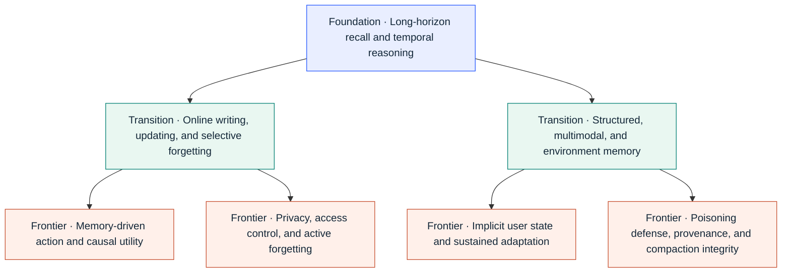
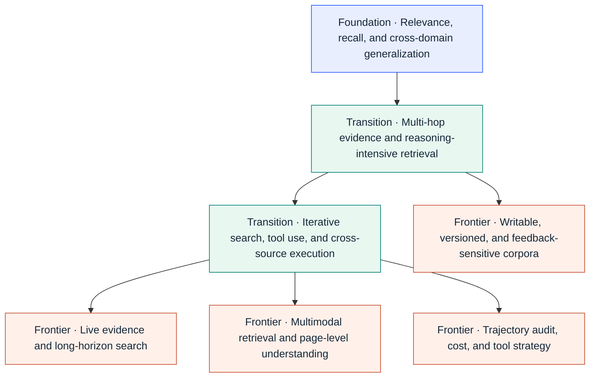
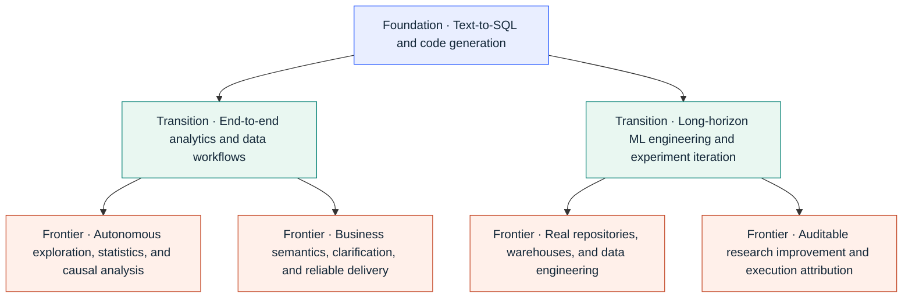

<!-- ONBOARDING:START -->

<h1>Agent Benchmark Radar</h1>

<strong>Start with benchmark chronology, then inspect evaluation design and result evidence.</strong>

131 benchmarks organized by time and area：<b>Agent Memory</b> · <b>RAG / Agentic Retrieval</b> · <b>Data Agents</b>

[中文](README.md) · English · <a href="https://h20zhang.github.io/Agent-Benchmark-Radar/en/">Website</a>

[Last six months](#release-timeline) · [All benchmarks](#all-benchmarks) · [Evaluation suites](#evaluation-recipes) · [Research observations](#frontier-signals)

| Area | Capability map | Evaluation suite | Full registry |
|---|---|---|---|
| Agent Memory | [Map](#benchmark-memory) | [Recipes](#recipe-memory) | [Registry](#registry-memory) |
| RAG / Agentic Retrieval | [Map](#benchmark-rag) | [Recipes](#recipe-rag) | [Registry](#registry-rag) |
| Data Agents | [Map](#benchmark-data) | [Recipes](#recipe-data) | [Registry](#registry-data) |

> Date events and sources are tracked separately; month precision does not imply an invented day. Stages, suites, and opportunities are editorial interpretations, not objective rankings. Results describe recorded sources, not current SOTA.

[Curation policy](CURATION.md) · [Date and evidence schema](SCHEMA.md)

<!-- ONBOARDING:END -->

## Benchmark Timeline: Last Six Months

Discovery window：**2026-03-05 — 2026-09-05** · 76 records

Date annotations distinguish earliest public versions, publications, and historical dates whose event type remains unclassified. Month-precision intervals are included when they overlap the window; conference publication does not relaunch an already public benchmark.

<!-- TABLE-FIRST:RECENT:START -->

| Time | Area | Benchmark | What it measures |
|---|---|---|---|
| 2026-09-01 Recorded date · event type unclassified · [source](https://arxiv.org/abs/2609.01836) | Agent Memory | [EAL-Bench](https://arxiv.org/abs/2609.01836) <!-- benchmark-id:eal-bench --> | Tests whether persistent agent memory preserves evolving authorization state and whether false permissions propagate into unauthorized downstream actions. |
| 2026-09-01 Recorded date · event type unclassified · [source](https://arxiv.org/abs/2609.01852) | Agent Memory | [The Memory Trust Gap](https://arxiv.org/abs/2609.01852) <!-- benchmark-id:memory-trust-gap --> | Measures when persistent-memory agents over-trust stale stored facts over current authoritative evidence and how that failure changes with model capability. |
| 2026-08-26 Earliest verified public version · [source](https://arxiv.org/abs/2608.25655) | Agent Memory | [SCALE-QA](https://arxiv.org/abs/2608.25655) <!-- benchmark-id:scale-qa --> | Evaluates whether memory systems reconstruct the causally relevant earlier episode from flat, unsegmented, mixed-topic conversational threads when a later task decision depends on dormant local constraints. |
| 2026-08-24 Earliest verified public version · [source](https://arxiv.org/abs/2608.23471) | Agent Memory | [InjecMEM](https://arxiv.org/abs/2608.23471) <!-- benchmark-id:injecmem --> | Benchmarks whether one unprivileged interaction can persistently steer later topic-related answers through memory injection. |
| 2026-08-24 Earliest verified public version · [source](https://arxiv.org/abs/2608.22856) | RAG / Agentic Retrieval | [Snapshot Compatibility Audit](https://arxiv.org/abs/2608.22856) <!-- benchmark-id:snapshot-compatibility-audit --> | Audits answer compatibility across nested corpus snapshots while subtracting within-snapshot stochastic disagreement. |
| 2026-08-24 Earliest verified public version · [source](https://arxiv.org/abs/2608.22752) | Agent Memory | [The Compaction Cliff](https://arxiv.org/abs/2608.22752) <!-- benchmark-id:compaction-cliff --> | Tests whether safety constraints survive repeated compaction, decomposition, and retrieval under bounded agent-context budgets. |
| 2026-08-22 Earliest verified public version · [source](https://github.com/GiulioDER/agent-memory-bench) | Agent Memory | [Agent Memory Bench (coding agents)](https://github.com/GiulioDER/agent-memory-bench) <!-- benchmark-id:agent-memory-bench-coding --> | Executable benchmark for whether a pluggable memory layer causally helps Claude Code reuse prior repository-task experience under neutral feeds and proof-of-treatment gates. |
| 2026-08-22 Earliest verified public version · [source](https://arxiv.org/abs/2608.21829) | RAG / Agentic Retrieval | [KBGym / Training a Knowledge Base](https://arxiv.org/abs/2608.21829) <!-- benchmark-id:kbgym --> | Evaluates a supervised curator that edits a persistent document store before a frozen reader is tested on coverage-stratified questions. |
| 2026-08-22 Earliest verified public version · [source](https://github.com/Ps23102004/membench) | Agent Memory | [membench (staleness)](https://github.com/Ps23102004/membench) <!-- benchmark-id:membench-staleness --> | Small executable diagnostic for whether a memory store ranks the current fact above a forbidden superseded fact while resisting abstention and label leakage. |
| 2026-08-22 Earliest verified public version · [source](https://arxiv.org/abs/2608.22118) | RAG / Agentic Retrieval | [RAG Collapse](https://arxiv.org/abs/2608.22118) <!-- benchmark-id:rag-collapse --> | Diagnoses recursive retrieval feedback when model-authored sources displace independent evidence across rounds. |
| 2026-08-21 Earliest verified public version · [source](https://github.com/JaysonRawlins/agent-memory-bakeoff) | Agent Memory | [Agent Memory Bakeoff](https://github.com/JaysonRawlins/agent-memory-bakeoff) <!-- benchmark-id:agent-memory-bakeoff --> | Component-level benchmark for cross-vocabulary retrieval from synthetic organizational memories, with a controlled write-time enrichment intervention. |
| 2026-08-21 Earliest verified public version · [source](https://arxiv.org/abs/2608.20664) | Agent Memory | [DreamBench-SWE](https://arxiv.org/abs/2608.20664) <!-- benchmark-id:dreambench-swe --> | Multi-session software-agent benchmark where later coding tasks require non-inferable earlier-session evidence and hidden executable oracles test memory hygiene across retention, staleness, scope, authority, composition, source-of-truth, spurious-lesson rejection, and abstention. |
| 2026-08-21 Earliest verified public version · [source](https://arxiv.org/abs/2608.21230) | Agent Memory | [Utility Under Attack](https://arxiv.org/abs/2608.21230) <!-- benchmark-id:utility-under-attack --> | Measures benign LongMemEval utility retained under plain false-memory poisoning and provenance-based defenses. |
| 2026-08-20 Earliest verified public version · [source](https://arxiv.org/abs/2608.20318) | Data Agents | [AI4AI-Bench](https://arxiv.org/abs/2608.20318) <!-- benchmark-id:ai4ai-bench --> | Evaluates agents that diagnose and modify learning algorithms inside frozen research repositories, with proxy-only exploration and a clean-start formal run behind a source-patch boundary. |
| 2026-08-20 Earliest verified public version · [source](https://arxiv.org/abs/2608.19653) | Data Agents | [DeltaML-Bench](https://arxiv.org/abs/2608.19653) <!-- benchmark-id:deltaml-bench --> | Evaluates machine-learning agents that must improve published baselines inside imperfect research repositories under long compute budgets and explicit anti-gaming checks. |
| 2026-08-20 Earliest verified public version · [source](https://arxiv.org/abs/2608.20202) | Agent Memory | [MemTrapBench](https://arxiv.org/abs/2608.20202) <!-- benchmark-id:memtrapbench --> | Tests whether faithfully stored and semantically relevant memories harm current reasoning through reasoning fixation or belief distortion. |
| 2026-08-20 Earliest verified public version · [source](https://arxiv.org/abs/2608.19652) | Agent Memory | [StateMemBench](https://arxiv.org/abs/2608.19652) <!-- benchmark-id:statemembench --> | Isolates state tracking under cross-session revisions by scoring whether an answer uses the currently operative state, a superseded state, or fails for another reason. |
| 2026-08-18 Earliest verified public version · [source](https://arxiv.org/abs/2608.20317) | RAG / Agentic Retrieval | [BrowseComp-Plus_CM](https://arxiv.org/abs/2608.20317) <!-- benchmark-id:browsecomp-plus-cm --> | Projects BrowseComp-Plus onto the independently assembled 553-million-document ClimbMix corpus so agentic-search retrieval can be tested at web-like scale with fixed questions and question-level relevance judgments. |
| 2026-08-18 Earliest verified public version · [source](https://arxiv.org/abs/2608.17889) | RAG / Agentic Retrieval | [VisDocAgentBench](https://arxiv.org/abs/2608.17889) <!-- benchmark-id:visdocagentbench --> | Visual-document retrieval benchmark that compares static rankers and iterative visual/OCR agents under one ranked-page contract. |
| 2026-08-17 Recorded date · event type unclassified · [source](https://arxiv.org/abs/2608.16045) | Data Agents | [Data Exploration Benchmark](https://arxiv.org/abs/2608.16045) <!-- benchmark-id:data-exploration-benchmark --> | Evaluates whether an agent can first construct a structured, source-grounded understanding of a complex workbook before attempting downstream analysis. |
| 2026-08-17 Earliest verified public version · [source](https://arxiv.org/abs/2608.16551) | Agent Memory | [SP-Mem Privacy-Aware Memory Benchmark](https://arxiv.org/abs/2608.16551) <!-- benchmark-id:sp-mem --> | Privacy-aware memory benchmark that jointly measures response quality, personalization, consent handling, exact-value exposure, and cost. |
| 2026-08-17 Earliest verified public version · [source](https://arxiv.org/abs/2608.16096) | RAG / Agentic Retrieval | [The Commercial Tax](https://arxiv.org/abs/2608.16096) <!-- benchmark-id:commercial-tax --> | Retrieval reproducibility audit that binds raw embedder scores to licensing, query formatting, index construction, and deployment cost. |
| 2026-08-12 Earliest verified public version · [source](https://arxiv.org/abs/2608.28643) | RAG / Agentic Retrieval | [ClaimProbe](https://arxiv.org/abs/2608.28643) <!-- benchmark-id:claimprobe --> | Audits deep-research reports at claim-source granularity to distinguish unsupported claims, citation misattribution, uncited support, and missing necessary facts while holding retrieved evidence fixed for writer-side comparisons. |
| 2026-08-10 Earliest verified public version · [source](https://arxiv.org/abs/2608.14838) | RAG / Agentic Retrieval | [The Recall Trap](https://arxiv.org/abs/2608.14838) <!-- benchmark-id:recall-trap --> | Validity audit showing that higher file recall can reduce downstream repair success under a fixed-slot code-retrieval protocol. |
| 2026-08-10 Recorded date · event type unclassified · [source](https://arxiv.org/abs/2608.09254) | Data Agents | [WarehouseReliabilityBench](https://arxiv.org/abs/2608.09254) <!-- benchmark-id:warehouse-reliability-bench --> | Evaluates whether analytics agents return business-correct answers and appropriately clarify, abstain, or refuse under semantic ambiguity, unanswerability, schema drift, and adversarial prompts. |
| 2026-08-07 Earliest verified public version · [source](https://arxiv.org/abs/2608.18034) | RAG / Agentic Retrieval | [DAS-Bench / DAS-Eval](https://arxiv.org/abs/2608.18034) <!-- benchmark-id:das-bench --> | Academic-survey benchmark and evaluator that score literature coverage, taxonomy, claims, citations, discourse, and rendered artifact quality. |
| 2026-08-05 Recorded date · event type unclassified · [source](https://arxiv.org/abs/2608.05212) | RAG / Agentic Retrieval | [SearchAuditBench](https://arxiv.org/abs/2608.05212) <!-- benchmark-id:searchauditbench --> | Evaluates auditors that localize, attribute, and repair failures in long deep-search trajectories collected from multiple agents and benchmarks. |
| 2026-08-04 Earliest verified public version · [source](https://arxiv.org/abs/2608.15624) | RAG / Agentic Retrieval | [MAPLE](https://arxiv.org/abs/2608.15624) <!-- benchmark-id:maple --> | Scientific retrieval benchmark that measures whether one paper remains retrievable across motivation, method, and result aspects. |
| 2026-08-04 Earliest verified public version · [source](https://arxiv.org/abs/2608.04003) | Agent Memory | [PAST-Bench](https://arxiv.org/abs/2608.04003) <!-- benchmark-id:past-bench --> | Paired persistent-state benchmark that tests whether retained cross-episode experience causally improves later executable work. |
| 2026-08-03 Recorded date · event type unclassified · [source](https://arxiv.org/abs/2608.01679) | Agent Memory | [AuthMem-Bench](https://arxiv.org/abs/2608.01679) <!-- benchmark-id:authmem-bench --> | Paired evaluation of whether persistent-memory consolidation preserves source authority rather than laundering low-authority content into reusable instructions or user facts. |
| 2026-08 Recorded date · event type unclassified · [source](https://arxiv.org/abs/2608.03451) | Data Agents | [DataSpace](https://arxiv.org/abs/2608.03451) <!-- benchmark-id:dataspace --> | Evaluates verifiable analytics over heterogeneous workspaces where evidence spans databases, files, documents, and multimedia. |
| 2026-08 Recorded date · event type unclassified · [source](https://arxiv.org/abs/2608.10366) | Data Agents | [DSAgentBench](https://arxiv.org/abs/2608.10366) <!-- benchmark-id:dsagentbench --> | Evaluates agents on complete data-science workflows inside real computer environments using notebooks, IDEs, terminals, browsers, and databases. |
| 2026-08 Recorded date · event type unclassified · [source](https://arxiv.org/abs/2608.12282) | RAG / Agentic Retrieval | [VAKRA](https://arxiv.org/abs/2608.12282) <!-- benchmark-id:vakra --> | Evaluates agents that must compose executable APIs, document retrieval, multi-hop reasoning, and natural-language tool-use policies. |
| 2026-07-29 Earliest verified public version · [source](https://github.com/Snowflake-Labs/data-eng-bench) | Data Agents | [data-eng-bench](https://github.com/Snowflake-Labs/data-eng-bench) <!-- benchmark-id:data-eng-bench --> | Executable data-engineering benchmark for repository-scale dbt transformations with hidden row-level verification on DuckDB and Snowflake. |
| 2026-07-27 Recorded date · event type unclassified · [source](https://arxiv.org/abs/2607.24882) | RAG / Agentic Retrieval | [Agent Retrieval Bench](https://arxiv.org/abs/2607.24882) <!-- benchmark-id:agent-retrieval-bench --> | File-level context-acquisition benchmark for coding agents, where relevance is defined by the repository context an agent needs next rather than direct query–file semantic similarity. |
| 2026-07-27 Recorded date · event type unclassified · [source](https://arxiv.org/abs/2607.24368) | Agent Memory | [InMind](https://arxiv.org/abs/2607.24368) <!-- benchmark-id:inmind --> | Tests whether an agent retrieves a personal fact when its relevance to a later query is mediated by world knowledge rather than semantic similarity. |
| 2026-07-21 Earliest verified public version · [source](https://arxiv.org/abs/2608.18704) | Agent Memory | [MemFuseBench](https://arxiv.org/abs/2608.18704) <!-- benchmark-id:memfusebench --> | Cross-source memory benchmark for linking, causal fusion, conflict arbitration, and provenance over heterogeneous event streams. |
| 2026-07-14 Recorded date · event type unclassified · [source](https://arxiv.org/abs/2607.12385) | Agent Memory | [PM-Bench](https://arxiv.org/abs/2607.12385) <!-- benchmark-id:pm-bench --> | Prospective-memory benchmark testing whether agents maintain delayed user intentions and execute them at the correct future cue while continuing ongoing activities. |
| 2026-07-14 Earliest verified public version · [source](https://arxiv.org/abs/2608.14747) | RAG / Agentic Retrieval | [WANDR](https://arxiv.org/abs/2608.14747) <!-- benchmark-id:wandr --> | Live-web benchmark for wide-and-deep record collection with hierarchical tasks and reference-free record verification. |
| 2026-07-09 Recorded date · event type unclassified · [source](https://arxiv.org/abs/2607.08093) | Data Agents | [CausalDS](https://arxiv.org/abs/2607.08093) <!-- benchmark-id:causalds --> | Evaluates tool-using data-science agents on executable causal tasks across all three Pearl rungs, including identification, counterfactuals, uncertainty, and warranted abstention. |
| 2026-07-01 Earliest verified public version · [source](https://arxiv.org/abs/2608.21374) | RAG / Agentic Retrieval | [LitReview Arena / LitReviewBench / LitJudge](https://arxiv.org/abs/2608.21374) <!-- benchmark-id:litreview-arena --> | Evaluates literature-review drafts through topic-matched expert pairwise judgments and an expert-calibrated judge. |
| 2026-07 Recorded date · event type unclassified · [source](https://arxiv.org/abs/2607.01647) | Data Agents | [AgenticDataBench](https://arxiv.org/abs/2607.01647) <!-- benchmark-id:agenticdatabench --> | Benchmarks data agents across realistic data-science workflows using a skill taxonomy to quantify fine-grained coverage. |
| 2026-07 Recorded date · event type unclassified · [source](https://arxiv.org/abs/2601.19935) | Agent Memory | [Mem2ActBench](https://aclanthology.org/2026.acl-long.370/) <!-- benchmark-id:mem2actbench --> | Evaluates whether long-term memory is proactively used for tool selection and parameter grounding during tool-based assistant actions. |
| 2026-07 Recorded date · event type unclassified · [source](https://aclanthology.org/2026.findings-acl.320/) | Agent Memory | [PerMemSafe](https://aclanthology.org/2026.findings-acl.320/) <!-- benchmark-id:permemsafe --> | Evaluates whether evolving user memory makes an agent recognize implicit personalized risks and correctly track when those risks change or resolve. |
| 2026-06-23 Recorded date · event type unclassified · [source](https://arxiv.org/abs/2606.24595) | Agent Memory | [MEMPROBE](https://arxiv.org/abs/2606.24595) <!-- benchmark-id:memprobe --> | Audits the final memory artifact left after ordinary assistance by reconstructing a simulated user's hidden structured state. |
| 2026-06-22 Recorded date · event type unclassified · [source](https://arxiv.org/abs/2606.22877) | Agent Memory | [DynamicMem](https://arxiv.org/abs/2606.22877) <!-- benchmark-id:dynamicmem --> | Evaluates whether personal-assistant memory infers and updates attributes, habits, and preferences from months of distributed multi-application behavior. |
| 2026-06-22 Recorded date · event type unclassified · [source](https://arxiv.org/abs/2606.22977) | Data Agents | [StatABench](https://arxiv.org/abs/2606.22977) <!-- benchmark-id:statabench --> | Evaluates statistical knowledge, tool-grounded practical analysis, and end-to-end open statistical modeling and reporting in one suite. |
| 2026-06-17 Recorded date · event type unclassified · [source](https://arxiv.org/abs/2606.18829) | Agent Memory | [GateMem](https://arxiv.org/abs/2606.18829) <!-- benchmark-id:gatemem --> | Evaluates whether a shared-memory agent remains useful while enforcing contextual access boundaries and honoring deletion requests across multiple principals. |
| 2026-06-13 Recorded date · event type unclassified · [source](https://arxiv.org/abs/2606.15107) | Data Agents | [IRTS-ToolBench](https://arxiv.org/abs/2606.15107) <!-- benchmark-id:irts-toolbench --> | Evaluates tool-grounded question answering over irregularly sampled time series with asynchronous observations, informative observation gaps, and varying frequencies. |
| 2026-06-11 Recorded date · event type unclassified · [source](https://arxiv.org/abs/2606.13120) | RAG / Agentic Retrieval | [EvoBrowseComp](https://arxiv.org/abs/2606.13120) <!-- benchmark-id:evobrowsecomp --> | Provides bilingual live-web search questions generated by an automated multi-agent pipeline intended for periodic refresh against evolving knowledge. |
| 2026-06-11 Recorded date · event type unclassified · [source](https://arxiv.org/abs/2606.12837) | RAG / Agentic Retrieval | [LoHoSearch](https://arxiv.org/abs/2606.12837) <!-- benchmark-id:lohosearch --> | Evaluates long-horizon web search on questions constructed to have large candidate spaces and structurally complex constraint graphs. |
| 2026-06-03 Earliest verified public version · [source](https://arxiv.org/abs/2606.04329) | Agent Memory | [MPBench](https://arxiv.org/abs/2606.04329) <!-- benchmark-id:mpbench --> | Benchmarks six persistent-memory poisoning classes across write channels and later-session retrieval behavior. |
| 2026-06 Recorded date · event type unclassified · [source](https://arxiv.org/abs/2606.04660) | Agent Memory | [LifeSide](https://arxiv.org/abs/2606.04660) <!-- benchmark-id:lifeside --> | Benchmarks lifelong digital companions through multi-session memory, user understanding, privacy control, and emotional-environment dynamics. |
| 2026-05-28 Recorded date · event type unclassified · [source](https://arxiv.org/abs/2605.29341) | Agent Memory | [WorldMemArena](https://arxiv.org/abs/2605.29341) <!-- benchmark-id:worldmemarena --> | Evaluates multimodal memory over evolving action-world trajectories while separately inspecting writing, maintenance, retrieval, and use. |
| 2026-05-27 Recorded date · event type unclassified · [source](https://arxiv.org/abs/2605.28721) | RAG / Agentic Retrieval | [LiveBrowseComp](https://arxiv.org/abs/2605.28721) <!-- benchmark-id:livebrowsecomp --> | Tests deep-search agents on human-authored questions whose answers depend on low-salience facts published shortly before benchmark construction. |
| 2026-05-19 Recorded date · event type unclassified · [source](https://arxiv.org/abs/2606.20235) | RAG / Agentic Retrieval | [ScholarQuest](https://arxiv.org/abs/2606.20235) <!-- benchmark-id:scholarquest --> | Benchmarks iterative academic paper search as intent-conditioned set retrieval over a shared arXiv-scale backend and citation graph. |
| 2026-05-18 Recorded date · event type unclassified · [source](https://arxiv.org/abs/2605.18421) | Agent Memory | [EvoMemBench](https://arxiv.org/abs/2605.18421) <!-- benchmark-id:evomembench --> | Standardizes memory-system comparison across in-episode and cross-episode scope and across knowledge-oriented and execution-oriented content. |
| 2026-05-14 Recorded date · event type unclassified · [source](https://arxiv.org/abs/2605.14498) | Agent Memory | [GroupMemBench](https://arxiv.org/abs/2605.14498) <!-- benchmark-id:groupmembench --> | Evaluates memory in multi-party conversations where answers depend on speaker-grounded beliefs, group dynamics, and audience-specific language. |
| 2026-05-14 Recorded date · event type unclassified · [source](https://arxiv.org/abs/2605.15128) | Agent Memory | [MemEye](https://arxiv.org/abs/2605.15128) <!-- benchmark-id:memeye --> | Benchmarks visual-centric agent memory across fine-grained visual evidence and temporal visual-state synthesis while checking whether visual evidence is genuinely necessary. |
| 2026-05-14 Recorded date · event type unclassified · [source](https://arxiv.org/abs/2605.14906) | Agent Memory | [MEMLENS](https://arxiv.org/abs/2605.14906) <!-- benchmark-id:memlens --> | Compares long-context vision-language models and memory-augmented agents on multimodal multi-session memory under controlled context lengths. |
| 2026-05-12 Recorded date · event type unclassified · [source](https://arxiv.org/abs/2605.11814) | Agent Memory | [MedMemoryBench](https://arxiv.org/abs/2605.11814) <!-- benchmark-id:medmemorybench --> | Evaluates streaming accumulation, clinical-state tracking, and memory saturation over long synthetic patient-assistant histories. |
| 2026-05-04 Recorded date · event type unclassified · [source](https://arxiv.org/abs/2605.02503) | Data Agents | [DataClawBench](https://arxiv.org/abs/2605.02503) <!-- benchmark-id:dataclawbench --> | Evaluates exploratory financial analysis when agents receive little prior guidance and must find, understand, and reason across unfamiliar noisy data before producing verifiable conclusions. |
| 2026-05 Recorded date · event type unclassified · [source](https://arxiv.org/abs/2605.12493) | Agent Memory | [LongMemEval-V2](https://arxiv.org/abs/2605.12493) <!-- benchmark-id:longmemeval-v2 --> | Evaluates whether memory systems internalize environment-specific experience from large web-agent trajectory histories. |
| 2026-05 Recorded date · event type unclassified · [source](https://arxiv.org/abs/2605.22219) | RAG / Agentic Retrieval | [SGR-Bench](https://arxiv.org/abs/2605.22219) <!-- benchmark-id:sgr-bench --> | Benchmarks search agents when answer-bearing evidence appears only after the agent establishes the correct site-specific retrieval state. |
| 2026-04-30 Recorded date · event type unclassified · [source](https://aclanthology.org/2026.acl-long.1705/) | RAG / Agentic Retrieval | [Bright-Pro](https://aclanthology.org/2026.acl-long.1705/) <!-- benchmark-id:bright-pro --> | Evaluates reasoning-intensive retrievers with expert-annotated reasoning aspects and evidence portfolios under both static ranking and retriever-in-the-loop agentic search. |
| 2026-04-19 Recorded date · event type unclassified · [source](https://arxiv.org/abs/2604.22239) | RAG / Agentic Retrieval | [MuDABench](https://aclanthology.org/2026.findings-acl.341/) <!-- benchmark-id:mudabench --> | Tests analytical question answering that requires extraction, aggregation, and quantitative reasoning across large collections of semi-structured financial documents. |
| 2026-04-17 Recorded date · event type unclassified · [source](https://arxiv.org/abs/2604.15774) | Agent Memory | [MemEvoBench](https://arxiv.org/abs/2604.15774) <!-- benchmark-id:memevobench --> | Evaluates safety degradation as misleading memories, noisy tool outputs, and biased feedback accumulate through repeated memory updates. |
| 2026-04-15 Recorded date · event type unclassified · [source](https://arxiv.org/abs/2604.13418) | RAG / Agentic Retrieval | [MERRIN](https://arxiv.org/abs/2604.13418) <!-- benchmark-id:merrin --> | Evaluates search agents that must infer the needed modality, retrieve noisy or conflicting multimodal web evidence, and perform multi-hop reasoning. |
| 2026-04-14 Recorded date · event type unclassified · [source](https://arxiv.org/abs/2605.05253) | RAG / Agentic Retrieval | [EnterpriseRAG-Bench](https://arxiv.org/abs/2605.05253) <!-- benchmark-id:enterpriserag-bench --> | Evaluates enterprise-style RAG over a coherent synthetic company corpus containing multiple source types, duplicates, noise, conflicts, and absent information. |
| 2026-04-09 Recorded date · event type unclassified · [source](https://aclanthology.org/2026.acl-long.1301/) | Agent Memory | [ImplicitMemBench](https://aclanthology.org/2026.acl-long.1301/) <!-- benchmark-id:implicitmembench --> | Evaluates whether learned procedures, priming, and conditioned associations automatically alter an agent's first behavior without an explicit recall request. |
| 2026-04-07 Recorded date · event type unclassified · [source](https://aclanthology.org/2026.findings-acl.287/) | RAG / Agentic Retrieval | [LeakDojo](https://aclanthology.org/2026.findings-acl.287/) <!-- benchmark-id:leakdojo --> | Provides a configurable diagnostic framework for measuring extraction of private RAG database content across attacks, models, corpora, pipeline choices, and defenses. |
| 2026-04-01 Recorded date · event type unclassified · [source](https://arxiv.org/abs/2604.25256) | RAG / Agentic Retrieval | [AutoResearchBench](https://arxiv.org/abs/2604.25256) <!-- benchmark-id:autoresearchbench --> | Evaluates autonomous scientific literature discovery through targeted paper finding and exhaustive set collection in a controlled full-text corpus. |
| 2026-03-12 Recorded date · event type unclassified · [source](https://arxiv.org/abs/2603.12483) | Data Agents | [AgentFuel](https://arxiv.org/abs/2603.12483) <!-- benchmark-id:agentfuel --> | Introduces customizable end-to-end functional evaluations for conversational time-series agents, emphasizing domain-specific, stateful, and incident-specific queries. |
| 2026-03-05 Recorded date · event type unclassified · [source](https://arxiv.org/abs/2603.05764) | Data Agents | [TML-Bench](https://arxiv.org/abs/2603.05764) <!-- benchmark-id:tml-bench --> | Evaluates whether coding agents can reliably produce valid, competitive tabular-ML submissions under fixed wall-clock budgets and hidden labels. |
| 2026-03 Recorded date · event type unclassified · [source](https://arxiv.org/abs/2603.20576) | Data Agents | [Data Agent Benchmark (DAB)](https://arxiv.org/abs/2603.20576) <!-- benchmark-id:data-agent-benchmark --> | Evaluates enterprise data agents on questions requiring integration, transformation, and analysis across multiple heterogeneous database systems. |
| 2026-03 Recorded date · event type unclassified · [source](https://arxiv.org/abs/2603.03781) | Agent Memory | [LifeBench](https://arxiv.org/abs/2603.03781) <!-- benchmark-id:lifebench --> | Evaluates long-horizon multi-source memory spanning declarative and non-declarative information such as habits and procedures. |

<!-- TABLE-FIRST:RECENT:END -->

<!-- EVALUATION-RECIPES:START -->

## Evaluation Recipes: Build the Suite from Your Claim

These editorial suggestions are not automatic experimental conclusions. Core and complementary measurements only support a claim under the complete protocol. Changing the selection requires revalidating its claim.

### Agent Memory

| Claim you want to support | Core | Complement | Next validation |
|---|---|---|---|
| **Long-term conversational memory and temporal reasoning** | [LoCoMo](https://aclanthology.org/2024.acl-long.747/) | [LongMemEval](https://arxiv.org/abs/2410.10813) | Pair with action-oriented evaluation to measure how retained experience improves future action. |
| **State update and stale-information handling** | [StateMemBench](https://arxiv.org/abs/2608.19652) | [LongMemEval](https://arxiv.org/abs/2410.10813) · [membench (staleness)](https://github.com/Ps23102004/membench) | Use component-level ablations to attribute gains to write, update, and retrieval. |
| **Memory improves later action** | [MemoryArena](https://arxiv.org/abs/2602.16313) | [PAST-Bench](https://arxiv.org/abs/2608.04003) · [Mem2ActBench](https://aclanthology.org/2026.acl-long.370/) | Validate general memory quality over broad personal long-term histories. |
| **Multimodal long-term memory** | [MemEye](https://arxiv.org/abs/2605.15128) | [Mem-Gallery](https://aclanthology.org/2026.acl-long.1892/) · [WorldMemArena](https://arxiv.org/abs/2605.29341) | Add lifecycle coverage for access control, poisoning, and compaction. |
| **Memory security and lifecycle governance** | [InjecMEM](https://arxiv.org/abs/2608.23471) | [Utility Under Attack](https://arxiv.org/abs/2608.21230) · [GateMem](https://arxiv.org/abs/2606.18829) · [The Compaction Cliff](https://arxiv.org/abs/2608.22752) | Pair with general utility, recall, and reasoning evaluation. |

### RAG / Agentic Retrieval

| Claim you want to support | Core | Complement | Next validation |
|---|---|---|---|
| **Reasoning-intensive retrieval quality** | [BRIGHT](https://arxiv.org/abs/2407.12883) | [BEIR](https://arxiv.org/abs/2104.08663) · [Bright-Pro](https://aclanthology.org/2026.acl-long.1705/) | Pair with live, iterative web-search evaluation. |
| **Deep / long-horizon web search** | [BrowseComp](https://arxiv.org/abs/2504.12516) | [LiveBrowseComp](https://arxiv.org/abs/2605.28721) · [LoHoSearch](https://arxiv.org/abs/2606.12837) | Add trajectory-level diagnostics to localize key failure stages. |
| **Search-trajectory diagnosis and tool policy** | [SearchAuditBench](https://arxiv.org/abs/2608.05212) | [AgenticRAGTracer](https://arxiv.org/abs/2602.19127) · [VAKRA](https://arxiv.org/abs/2608.12282) | Add broad live-web retrieval and corpus-robustness evaluation. |
| **Dynamic, writable, feedback-forming corpora** | [KBGym / Training a Knowledge Base](https://arxiv.org/abs/2608.21829) | [Snapshot Compatibility Audit](https://arxiv.org/abs/2608.22856) · [RAG Collapse](https://arxiv.org/abs/2608.22118) | Pair with conventional retrieval-quality evaluation on a static corpus. |
| **Multimodal search and visual-document retrieval** | [VisDocAgentBench](https://arxiv.org/abs/2608.17889) | [MC-Search](https://arxiv.org/abs/2603.00873) · [MERRIN](https://arxiv.org/abs/2604.13418) | Stratify results by modality and tool interface to produce comparable headline scores. |

### Data Agents

| Claim you want to support | Core | Complement | Next validation |
|---|---|---|---|
| **Text-to-SQL / warehouse task capability** | [Spider 2.0](https://arxiv.org/abs/2411.07763) | [Spider](https://aclanthology.org/D18-1425/) · [WarehouseReliabilityBench](https://arxiv.org/abs/2608.09254) | Extend evaluation to the full data-understanding, analysis, and delivery workflow. |
| **End-to-end data-science agent** | [DataSpace](https://arxiv.org/abs/2608.03451) | [DSAgentBench](https://arxiv.org/abs/2608.10366) · [DataClawBench](https://arxiv.org/abs/2605.02503) | Use component-level evaluation to validate statistical and modeling quality. |
| **Data understanding and autonomous exploration** | [Data Exploration Benchmark](https://arxiv.org/abs/2608.16045) | [DataClawBench](https://arxiv.org/abs/2605.02503) · [AgenticDataBench](https://arxiv.org/abs/2607.01647) | Pair with downstream model, causal, and business-decision quality evaluation. |
| **Statistical and causal analysis** | [CausalDS](https://arxiv.org/abs/2607.08093) | [StatABench](https://arxiv.org/abs/2606.22977) | Extend evaluation to real warehouse, repository, and data-engineering constraints. |
| **Long-horizon ML engineering / research improvement** | [MLE-bench](https://arxiv.org/abs/2410.07095) | [DeltaML-Bench](https://arxiv.org/abs/2608.19653) · [AI4AI-Bench](https://arxiv.org/abs/2608.20318) | Pair with BI, warehouse-semantics, and general analytics evaluation. |

<!-- EVALUATION-RECIPES:END -->

## Last 30 Days: Three Shifts

<!-- FRONTIER-SIGNALS:START -->
| Area | What actually changed | Representative benchmarks |
|---|---|---|
| **Agent Memory** | The newest signal moves beyond whether memory content is safe to **whether memory preserves authorization/source authority and whether bad memory changes actions**. EAL-Bench separates false-authority formation from unauthorized-action propagation; The Memory Trust Gap makes stale-memory conflict with current authoritative evidence a capability-controlled experiment. | [EAL-Bench](https://arxiv.org/abs/2609.01836) · [The Memory Trust Gap](https://arxiv.org/abs/2609.01852) · [AuthMem-Bench](https://arxiv.org/abs/2608.01679) |
| **RAG / Agentic Retrieval** | The corpus is becoming **trainable, versioned state that can form feedback loops**. KBGym freezes and coverage-audits a curator-edited store; Snapshot Compatibility Audit measures stable answer flips from corpus growth; RAG Collapse isolates recursive feedback from self-authored sources. | [KBGym](https://arxiv.org/abs/2608.21829) · [Snapshot Compatibility Audit](https://arxiv.org/abs/2608.22856) · [RAG Collapse](https://arxiv.org/abs/2608.22118) |
| **Data Agents** | The target keeps moving beyond “does SQL/code run?” toward **long-horizon ML improvement in real repositories with tighter score attribution**. AI4AI-Bench isolates algorithm changes through proxy exploration → source patch → clean-start final run; DeltaML-Bench joins published-baseline improvement with anti-gaming audits. | [AI4AI-Bench](https://arxiv.org/abs/2608.20318) · [DeltaML-Bench](https://arxiv.org/abs/2608.19653) · [data-eng-bench](https://github.com/Snowflake-Labs/data-eng-bench) |
<!-- FRONTIER-SIGNALS:END -->

Observations verified through：2026-09-05

> Editorial observations, not a complete window listing; use the timeline for the complete projection.

<!-- RESULT-SNAPSHOTS:START -->

### Recorded Result Snapshots

Structured result records cover **44 benchmarks**. The table shows the 6 most recently verified records, not a leaderboard. A single recorded baseline is not a current best; distance to a ceiling is not research headroom.

| Benchmark | Record scope | Result | Result verified | Source |
|---|---|---:|---|---|
| [AutoResearchBench](https://h20zhang.github.io/Agent-Benchmark-Radar/en/benchmarks/autoresearchbench/#results) | Best among recorded results · Paper snapshot · Unified ReAct + DeepXiv · Deep Research Accuracy | 9.39% | 2026-09-04 | [Source](https://arxiv.org/abs/2604.25256) |
| [DeepResearch Bench](https://h20zhang.github.io/Agent-Benchmark-Radar/en/benchmarks/deepresearch-bench/#results) | Best among recorded results · Paper snapshot · Deep Research Agent · RACE Overall | 48.88points | 2026-09-04 | [Source](https://arxiv.org/abs/2506.11763) |
| [AMA-Bench](https://h20zhang.github.io/Agent-Benchmark-Radar/en/benchmarks/ama-bench/#results) | Best among recorded results · Paper snapshot · Paper v4 · real-world trajectories · fixed Qwen3-32B backbone | 57.22% | 2026-09-03 | [Source](https://arxiv.org/abs/2602.22769) |
| [Bright-Pro](https://h20zhang.github.io/Agent-Benchmark-Radar/en/benchmarks/bright-pro/#results) | Best among recorded results · Paper snapshot · Static retrieval · Overall α-nDCG@25 | 68% | 2026-09-03 | [Source](https://arxiv.org/abs/2605.04018) |
| [EvoBrowseComp](https://h20zhang.github.io/Agent-Benchmark-Radar/en/benchmarks/evobrowsecomp/#results) | Best among recorded results · Paper snapshot · English · web tools enabled · Accuracy | 44.8% | 2026-09-03 | [Source](https://arxiv.org/abs/2606.13120) |
| [KILT](https://h20zhang.github.io/Agent-Benchmark-Radar/en/benchmarks/kilt/#results) | Best among recorded results · Paper snapshot · KILT · Natural Questions · KILT-EM | 40.44% | 2026-09-03 | [Source](https://aclanthology.org/2024.findings-eacl.27/) |

<!-- RESULT-SNAPSHOTS:END -->

## Benchmark Map

### Agent Memory
From cross-session factual recall toward online updating, structured and multimodal memory, action, implicit user state, and lifecycle integrity across writing, retrieval, and compaction.

<!-- CAPABILITY-MAP:agent-memory:START -->

<!-- CAPABILITY-MAP:agent-memory:END -->

**Full list:** [Agent Memory Benchmarks](#registry-memory)

### RAG / Agentic Retrieval
From document relevance toward multi-hop evidence, live search, cross-source execution, and trajectory audit, while the corpus itself becomes trainable, versioned, feedback-sensitive state.

<!-- CAPABILITY-MAP:rag:START -->

<!-- CAPABILITY-MAP:rag:END -->

**Full list:** [RAG / Agentic Retrieval Benchmarks](#registry-rag)

### Data Agents
From text-to-SQL / code generation into both complete analytics workflows and long-horizon ML engineering, then toward exploration, statistical/causal analysis, real research repositories, and business-semantic reliability.

<!-- CAPABILITY-MAP:data-agent:START -->

<!-- CAPABILITY-MAP:data-agent:END -->

**Full list:** [Data Agent Benchmarks](#registry-data)

## All Benchmarks by Area

All 126 registry benchmarks remain directly scannable in the README.

<!-- CITATION-META:START -->
Citation counts are from Semantic Scholar, last refreshed **2026-09-03**; `—` marks records led by a code or data entry while paper matching remains under verification. Counts provide adoption context; measurement evolution determines stage labels.
<!-- CITATION-META:END -->

### Agent Memory

<!-- TABLE-FIRST:AREA:agent-memory:START -->

| Stage (editorial) | Benchmark | Citations (S2) | Time | What it measures |
|---|---|---:|---|---|
| 🌱 Precursor | [Beyond Goldfish Memory](https://aclanthology.org/2022.acl-long.356/) <!-- benchmark-id:beyond-goldfish-memory --> | [382](https://www.semanticscholar.org/paper/88064de690af282dbdf222774f03ff070b9df22b) | 2022-05 | Benchmarks long-term open-domain conversation across multiple human-human chat sessions where partners must remember and remain consistent with prior interactions. |
| 🧱 Foundation | [LoCoMo](https://aclanthology.org/2024.acl-long.747/) <!-- benchmark-id:locomo --> | [794](https://www.semanticscholar.org/paper/0bf3a1867f7245b8a702093901c66b08b518eafc) | 2024-02-27 | Long-horizon conversational-memory benchmark spanning QA, event summarization, and multimodal dialogue generation over very long multi-session conversations. |
| 🧱 Foundation | [LongMemEval](https://arxiv.org/abs/2410.10813) <!-- benchmark-id:longmemeval --> | [585](https://www.semanticscholar.org/paper/fd48dc6b433cfcd220b6e769c6179d8ef6fcf862) | 2024-10 | Evaluates sustained chat-assistant memory across extraction, multi-session reasoning, temporal reasoning, knowledge updates, and abstention. |
| ↗ Transition | [MemBench](https://arxiv.org/abs/2506.21605) <!-- benchmark-id:membench --> | [83](https://www.semanticscholar.org/paper/ccdd3d4ba73aa28c538960f8ac91deba61cd670f) | 2025-06 | Broadens memory evaluation across factual and reflective memory, participation and observation scenarios, and effectiveness, efficiency, and capacity. |
| ↗ Transition | [MemoryAgentBench](https://arxiv.org/abs/2507.05257) <!-- benchmark-id:memoryagentbench --> | [207](https://www.semanticscholar.org/paper/dc7c687809737422a7e2ce870ad55746675d60f2) | 2025-07 | Evaluates memory agents under incremental multi-turn interaction across retrieval, test-time learning, long-range understanding, and selective forgetting. |
| ↗ Transition | [BEAM](https://arxiv.org/abs/2510.27246) <!-- benchmark-id:beam --> | [46](https://www.semanticscholar.org/paper/de7d68cf4796d23ffa562bcde4c4cbc903e16923) | 2025-10 | Tests long-term memory on coherent conversations extending from million-token to multi-million-token horizons. |
| 🔭 Frontier | [RealMem](https://aclanthology.org/2026.findings-acl.703/) <!-- benchmark-id:realmem --> | [14](https://www.semanticscholar.org/paper/0ae281ed1924a8f79642f0828927790e515f0142) | 2026-01 | Evaluates long-term memory over project-oriented cross-session interactions whose goals, artifacts, and relevant state evolve over time. |
| 🔭 Frontier | [Mem-Gallery](https://aclanthology.org/2026.acl-long.1892/) <!-- benchmark-id:mem-gallery --> | [35](https://www.semanticscholar.org/paper/c69c7ab705735b24903511d62fad8110699f708a) | 2026-01-07 | Evaluates multimodal long-term conversational memory across extraction and test-time adaptation, reasoning, and memory knowledge management. |
| 🔭 Frontier | [CAME-Bench](https://aclanthology.org/2026.findings-acl.584/) <!-- benchmark-id:came-bench --> | [5](https://www.semanticscholar.org/paper/9211f5e2e3c9bddd21a3fde10b946b9638352c4b) | 2026-01-15 | Evaluates context-aware retrieval when recurring entities and facts belong to different latent goals in long, interleaved trajectories. |
| 🔭 Frontier | [AMA-Bench](https://arxiv.org/abs/2602.22769) <!-- benchmark-id:ama-bench --> | [41](https://www.semanticscholar.org/paper/9fadf4b306ecf6195cd23e59e140afbc95f9334b) | 2026-02 | Evaluates long-horizon memory over real and synthetic agent-environment trajectories rather than dialogue-only histories. |
| 🔭 Frontier | [StructMemEval](https://arxiv.org/abs/2602.11243) <!-- benchmark-id:structmemeval --> | [9](https://www.semanticscholar.org/paper/2891780dd30f854b2ae3d9124d64ad729f71d068) | 2026-02 | Tests whether agents organize memory into task-appropriate structures such as ledgers, lists, and trees rather than only retrieving facts. |
| 🔭 Frontier | [MemGUI-Bench](https://arxiv.org/abs/2602.06075) <!-- benchmark-id:memgui-bench --> | [15](https://www.semanticscholar.org/paper/5b037191c54cab52e9df3aadba62c140fdf4a51d) | 2026-02-03 | Evaluates short-term retention and cross-session experience reuse through executable mobile GUI tasks spanning steps, applications, and repeated attempts. |
| 🔭 Frontier | [LoCoMo-Plus](https://aclanthology.org/2026.acl-long.1150/) <!-- benchmark-id:locomo-plus --> | [8](https://www.semanticscholar.org/paper/301809842a80f6231a8d00883f92290b62e65d97) | 2026-02-11 | Evaluates cognitive memory where agents must retain and apply latent user constraints even when later cues are semantically disconnected. |
| 🔭 Frontier | [MemoryArena](https://arxiv.org/abs/2602.16313) <!-- benchmark-id:memoryarena --> | [62](https://www.semanticscholar.org/paper/001da1314eb127dd40c6c7bf1f14081ec208978c) | 2026-02-18 | Evaluates memory inside multi-session Memory-Agent-Environment loops where earlier actions and feedback must be distilled and used to guide later actions. |
| 🔭 Frontier | [LifeBench](https://arxiv.org/abs/2603.03781) <!-- benchmark-id:lifebench --> | [7](https://www.semanticscholar.org/paper/33284572e05aa5a0426c54312abdbc26738a0255) | 2026-03 | Evaluates long-horizon multi-source memory spanning declarative and non-declarative information such as habits and procedures. |
| 🔭 Frontier | [ImplicitMemBench](https://aclanthology.org/2026.acl-long.1301/) <!-- benchmark-id:implicitmembench --> | [3](https://www.semanticscholar.org/paper/86a759efe844ee45c11a69226b1478fee2bf1238) | 2026-04-09 | Evaluates whether learned procedures, priming, and conditioned associations automatically alter an agent's first behavior without an explicit recall request. |
| 🔭 Frontier | [MemEvoBench](https://arxiv.org/abs/2604.15774) <!-- benchmark-id:memevobench --> | [0](https://www.semanticscholar.org/paper/e7fed24b1353cf82d465d68dbda87c2b7243c60a) | 2026-04-17 | Evaluates safety degradation as misleading memories, noisy tool outputs, and biased feedback accumulate through repeated memory updates. |
| 🔭 Frontier | [LongMemEval-V2](https://arxiv.org/abs/2605.12493) <!-- benchmark-id:longmemeval-v2 --> | [9](https://www.semanticscholar.org/paper/0a664e226ad908e615063af230a87cfeaeee5d94) | 2026-05 | Evaluates whether memory systems internalize environment-specific experience from large web-agent trajectory histories. |
| 🔭 Frontier | [MedMemoryBench](https://arxiv.org/abs/2605.11814) <!-- benchmark-id:medmemorybench --> | [1](https://www.semanticscholar.org/paper/916768bffc01cae15c7f4b913f0a0c6f66cf2fc7) | 2026-05-12 | Evaluates streaming accumulation, clinical-state tracking, and memory saturation over long synthetic patient-assistant histories. |
| 🔭 Frontier | [GroupMemBench](https://arxiv.org/abs/2605.14498) <!-- benchmark-id:groupmembench --> | [5](https://www.semanticscholar.org/paper/469cd86992948b1b4d4286d1bbf5a7e2a779ff33) | 2026-05-14 | Evaluates memory in multi-party conversations where answers depend on speaker-grounded beliefs, group dynamics, and audience-specific language. |
| 🔭 Frontier | [MemEye](https://arxiv.org/abs/2605.15128) <!-- benchmark-id:memeye --> | [9](https://www.semanticscholar.org/paper/e5766ec08844810e4772beb40fffd7c4cc3576e9) | 2026-05-14 | Benchmarks visual-centric agent memory across fine-grained visual evidence and temporal visual-state synthesis while checking whether visual evidence is genuinely necessary. |
| 🔭 Frontier | [MEMLENS](https://arxiv.org/abs/2605.14906) <!-- benchmark-id:memlens --> | [1](https://www.semanticscholar.org/paper/c868704871d238746bbb3b6c3b5549979558d41b) | 2026-05-14 | Compares long-context vision-language models and memory-augmented agents on multimodal multi-session memory under controlled context lengths. |
| 🔭 Frontier | [EvoMemBench](https://arxiv.org/abs/2605.18421) <!-- benchmark-id:evomembench --> | [6](https://www.semanticscholar.org/paper/7fd669266b5a08fcfbf2a5838c68e14590ac9eb0) | 2026-05-18 | Standardizes memory-system comparison across in-episode and cross-episode scope and across knowledge-oriented and execution-oriented content. |
| 🔭 Frontier | [WorldMemArena](https://arxiv.org/abs/2605.29341) <!-- benchmark-id:worldmemarena --> | [0](https://www.semanticscholar.org/paper/12e7f33a0cf266e4f76a57a206d76f26afda7ba3) | 2026-05-28 | Evaluates multimodal memory over evolving action-world trajectories while separately inspecting writing, maintenance, retrieval, and use. |
| 🔭 Frontier | [LifeSide](https://arxiv.org/abs/2606.04660) <!-- benchmark-id:lifeside --> | [0](https://www.semanticscholar.org/paper/4811050bc98910b84c48ee2092f959e70528de73) | 2026-06 | Benchmarks lifelong digital companions through multi-session memory, user understanding, privacy control, and emotional-environment dynamics. |
| ↗ Transition | [MPBench](https://arxiv.org/abs/2606.04329) <!-- benchmark-id:mpbench --> | [17](https://www.semanticscholar.org/paper/469d4b8f7660de4bf1651a92bbc1ced997e631ec) | 2026-06-03 | Benchmarks six persistent-memory poisoning classes across write channels and later-session retrieval behavior. |
| 🔭 Frontier | [GateMem](https://arxiv.org/abs/2606.18829) <!-- benchmark-id:gatemem --> | [1](https://www.semanticscholar.org/paper/a524f9cbffc89db36eb8afae61b3d4e3d33b0ccb) | 2026-06-17 | Evaluates whether a shared-memory agent remains useful while enforcing contextual access boundaries and honoring deletion requests across multiple principals. |
| 🔭 Frontier | [DynamicMem](https://arxiv.org/abs/2606.22877) <!-- benchmark-id:dynamicmem --> | [2](https://www.semanticscholar.org/paper/3ec6edd820d52abe3b15a6f25624be0997d2d39c) | 2026-06-22 | Evaluates whether personal-assistant memory infers and updates attributes, habits, and preferences from months of distributed multi-application behavior. |
| 🔭 Frontier | [MEMPROBE](https://arxiv.org/abs/2606.24595) <!-- benchmark-id:memprobe --> | [2](https://www.semanticscholar.org/paper/dcbc83076a37f6200d84d8815b7a6ba0aa309ef4) | 2026-06-23 | Audits the final memory artifact left after ordinary assistance by reconstructing a simulated user's hidden structured state. |
| 🔭 Frontier | [Mem2ActBench](https://aclanthology.org/2026.acl-long.370/) <!-- benchmark-id:mem2actbench --> | [26](https://www.semanticscholar.org/paper/c8e2417a59515b4f74dec06f631cc0a2280cbf60) | 2026-07 | Evaluates whether long-term memory is proactively used for tool selection and parameter grounding during tool-based assistant actions. |
| 🔭 Frontier | [PerMemSafe](https://aclanthology.org/2026.findings-acl.320/) <!-- benchmark-id:permemsafe --> | [0](https://www.semanticscholar.org/paper/e9ceaad85060375e02926322f959a6285a891cac) | 2026-07 | Evaluates whether evolving user memory makes an agent recognize implicit personalized risks and correctly track when those risks change or resolve. |
| 🔭 Frontier | [PM-Bench](https://arxiv.org/abs/2607.12385) <!-- benchmark-id:pm-bench --> | — | 2026-07-14 | Prospective-memory benchmark testing whether agents maintain delayed user intentions and execute them at the correct future cue while continuing ongoing activities. |
| 🔭 Frontier | [MemFuseBench](https://arxiv.org/abs/2608.18704) <!-- benchmark-id:memfusebench --> | [0](https://www.semanticscholar.org/paper/660441819b931d4b953873222bdc9c34c7641a9b) | 2026-07-21 | Cross-source memory benchmark for linking, causal fusion, conflict arbitration, and provenance over heterogeneous event streams. |
| 🔭 Frontier | [InMind](https://arxiv.org/abs/2607.24368) <!-- benchmark-id:inmind --> | [0](https://www.semanticscholar.org/paper/1654c6adad236d9cb98d8b2d76264a3c82962515) | 2026-07-27 | Tests whether an agent retrieves a personal fact when its relevance to a later query is mediated by world knowledge rather than semantic similarity. |
| 🔭 Frontier | [AuthMem-Bench](https://arxiv.org/abs/2608.01679) <!-- benchmark-id:authmem-bench --> | — | 2026-08-03 | Paired evaluation of whether persistent-memory consolidation preserves source authority rather than laundering low-authority content into reusable instructions or user facts. |
| 🔭 Frontier | [PAST-Bench](https://arxiv.org/abs/2608.04003) <!-- benchmark-id:past-bench --> | [2](https://www.semanticscholar.org/paper/86174fa6cbc829c87d1dae781e1282a751e9f6b5) | 2026-08-04 | Paired persistent-state benchmark that tests whether retained cross-episode experience causally improves later executable work. |
| 🔭 Frontier | [SP-Mem Privacy-Aware Memory Benchmark](https://arxiv.org/abs/2608.16551) <!-- benchmark-id:sp-mem --> | [0](https://www.semanticscholar.org/paper/5e223c2c94b112dda6df62c7a869d48cddd0e9f0) | 2026-08-17 | Privacy-aware memory benchmark that jointly measures response quality, personalization, consent handling, exact-value exposure, and cost. |
| 🔭 Frontier | [MemTrapBench](https://arxiv.org/abs/2608.20202) <!-- benchmark-id:memtrapbench --> | [0](https://www.semanticscholar.org/paper/736d61825a5afed4c85b227951a9880d01e2299f) | 2026-08-20 | Tests whether faithfully stored and semantically relevant memories harm current reasoning through reasoning fixation or belief distortion. |
| 🔭 Frontier | [StateMemBench](https://arxiv.org/abs/2608.19652) <!-- benchmark-id:statemembench --> | [0](https://www.semanticscholar.org/paper/98c0706a65d781a3b7b726811151d0176e1cefb6) | 2026-08-20 | Isolates state tracking under cross-session revisions by scoring whether an answer uses the currently operative state, a superseded state, or fails for another reason. |
| 🔭 Frontier | [Agent Memory Bakeoff](https://github.com/JaysonRawlins/agent-memory-bakeoff) <!-- benchmark-id:agent-memory-bakeoff --> | — | 2026-08-21 | Component-level benchmark for cross-vocabulary retrieval from synthetic organizational memories, with a controlled write-time enrichment intervention. |
| 🔭 Frontier | [DreamBench-SWE](https://arxiv.org/abs/2608.20664) <!-- benchmark-id:dreambench-swe --> | [0](https://www.semanticscholar.org/paper/b69469610ce26c20718cedca8389cc20a0b94ea8) | 2026-08-21 | Multi-session software-agent benchmark where later coding tasks require non-inferable earlier-session evidence and hidden executable oracles test memory hygiene across retention, staleness, scope, authority, composition, source-of-truth, spurious-lesson rejection, and abstention. |
| 🔭 Frontier | [Utility Under Attack](https://arxiv.org/abs/2608.21230) <!-- benchmark-id:utility-under-attack --> | [1](https://www.semanticscholar.org/paper/aff09b98f3ade8fd4296515e699e76b49c83406b) | 2026-08-21 | Measures benign LongMemEval utility retained under plain false-memory poisoning and provenance-based defenses. |
| 🔭 Frontier | [Agent Memory Bench (coding agents)](https://github.com/GiulioDER/agent-memory-bench) <!-- benchmark-id:agent-memory-bench-coding --> | — | 2026-08-22 | Executable benchmark for whether a pluggable memory layer causally helps Claude Code reuse prior repository-task experience under neutral feeds and proof-of-treatment gates. |
| 🔭 Frontier | [membench (staleness)](https://github.com/Ps23102004/membench) <!-- benchmark-id:membench-staleness --> | — | 2026-08-22 | Small executable diagnostic for whether a memory store ranks the current fact above a forbidden superseded fact while resisting abstention and label leakage. |
| 🔭 Frontier | [InjecMEM](https://arxiv.org/abs/2608.23471) <!-- benchmark-id:injecmem --> | [1](https://www.semanticscholar.org/paper/09e4e85b7fadc40990563e1cf2847356d7c9fd23) | 2026-08-24 | Benchmarks whether one unprivileged interaction can persistently steer later topic-related answers through memory injection. |
| 🔭 Frontier | [The Compaction Cliff](https://arxiv.org/abs/2608.22752) <!-- benchmark-id:compaction-cliff --> | [0](https://www.semanticscholar.org/paper/68cebfa9bff38539f6dbd114310629168e7d6960) | 2026-08-24 | Tests whether safety constraints survive repeated compaction, decomposition, and retrieval under bounded agent-context budgets. |
| 🔭 Frontier | [SCALE-QA](https://arxiv.org/abs/2608.25655) <!-- benchmark-id:scale-qa --> | [0](https://www.semanticscholar.org/paper/c73b59d446d064835acc4f499b12ae0b33c647de) | 2026-08-26 | Evaluates whether memory systems reconstruct the causally relevant earlier episode from flat, unsegmented, mixed-topic conversational threads when a later task decision depends on dormant local constraints. |
| 🔭 Frontier | [EAL-Bench](https://arxiv.org/abs/2609.01836) <!-- benchmark-id:eal-bench --> | — | 2026-09-01 | Tests whether persistent agent memory preserves evolving authorization state and whether false permissions propagate into unauthorized downstream actions. |
| 🔭 Frontier | [The Memory Trust Gap](https://arxiv.org/abs/2609.01852) <!-- benchmark-id:memory-trust-gap --> | — | 2026-09-01 | Measures when persistent-memory agents over-trust stale stored facts over current authoritative evidence and how that failure changes with model capability. |

<!-- TABLE-FIRST:AREA:agent-memory:END -->

### RAG / Agentic Retrieval

<!-- TABLE-FIRST:AREA:rag:START -->

| Stage (editorial) | Benchmark | Citations (S2) | Time | What it measures |
|---|---|---:|---|---|
| 🌱 Precursor | [HotpotQA](https://aclanthology.org/D18-1259/) <!-- benchmark-id:hotpotqa --> | [5,282](https://www.semanticscholar.org/paper/22655979df781d222eaf812b0d325fa9adf11594) | 2018-10 | A foundational multi-hop QA benchmark requiring evidence retrieval and reasoning across multiple supporting documents. |
| 🧱 Foundation | [KILT](https://arxiv.org/abs/2009.02252) <!-- benchmark-id:kilt --> | [851](https://www.semanticscholar.org/paper/3af229f3da1bd24378fd8d76c88fd393b4464058) | 2020-09 | Unifies knowledge-intensive tasks against one Wikipedia snapshot and evaluates downstream task quality together with provenance. |
| 🧱 Foundation | [BEIR](https://arxiv.org/abs/2104.08663) <!-- benchmark-id:beir --> | [1,989](https://www.semanticscholar.org/paper/807600ef43073cd9c59d4208ee710e90cf14efa8) | 2021-04 | A heterogeneous benchmark for zero-shot information retrieval generalization across diverse domains and retrieval tasks. |
| 🧱 Foundation | [RGB](https://arxiv.org/abs/2309.01431) <!-- benchmark-id:rgb --> | [645](https://www.semanticscholar.org/paper/28e2ecb4183ebc0eec504b12dddc677f8aef8745) | 2023-09 | Decomposes retrieval-augmented generation into noise robustness, negative rejection, information integration, and counterfactual robustness. |
| ↗ Transition | [MultiHop-RAG](https://arxiv.org/abs/2401.15391) <!-- benchmark-id:multihop-rag --> | [322](https://www.semanticscholar.org/paper/4e71624e90960cb003e311a0fe3b8be4c2863239) | 2024-01 | A RAG-specific benchmark requiring retrieval and reasoning over multiple pieces of supporting evidence. |
| ↗ Transition | [RAGTruth](https://arxiv.org/abs/2401.00396) <!-- benchmark-id:ragtruth --> | [370](https://www.semanticscholar.org/paper/cfce709a65f90312d2bdc1a6cf0380c19becf694) | 2024-01 | Provides fine-grained manual annotations of hallucinations in naturally generated RAG responses for evaluating grounding and hallucination detection. |
| ↗ Transition | [CRAG](https://arxiv.org/abs/2406.04744) <!-- benchmark-id:crag --> | [141](https://www.semanticscholar.org/paper/ec1bec009e68a4df478aaf11e3615e5587768990) | 2024-06 | A factual RAG benchmark spanning dynamic facts, long-tail entities, web search, and knowledge-graph retrieval. |
| ↗ Transition | [BRIGHT](https://arxiv.org/abs/2407.12883) <!-- benchmark-id:bright --> | [184](https://www.semanticscholar.org/paper/d79927715a88825737d2ff44f70b1d6698e0bae9) | 2024-07 | Benchmarks retrieval on real-world queries where identifying relevant documents itself requires substantial reasoning. |
| ↗ Transition | [RAGBench](https://arxiv.org/abs/2407.11005) <!-- benchmark-id:ragbench --> | [139](https://www.semanticscholar.org/paper/1b0aba023d7aa5fb9853f9e942efb5c243dc1201) | 2024-07 | A large-scale labeled benchmark for explainable evaluation of RAG systems across industry-oriented domains. |
| ↗ Transition | [BrowseComp](https://arxiv.org/abs/2504.12516) <!-- benchmark-id:browsecomp --> | [572](https://www.semanticscholar.org/paper/41d1ea36a9af136efc42f3c85516d00cc1d13458) | 2025-04 | Benchmarks browsing agents on hard-to-find questions that require persistent web navigation and creative information seeking. |
| ↗ Transition | [T²-RAGBench](https://aclanthology.org/2026.eacl-long.8/) <!-- benchmark-id:t2-ragbench --> | [0](https://www.semanticscholar.org/paper/ddaa0ae18f1c2ae8f1e6633848ab883cb200f43e) | 2025-05-14 | Evaluates end-to-end retrieval and numerical reasoning over real financial reports containing both text and tables, using context-independent questions. |
| ↗ Transition | [DeepResearch Bench](https://arxiv.org/abs/2506.11763) <!-- benchmark-id:deepresearch-bench --> | [223](https://www.semanticscholar.org/paper/cca73506ab839718879a49ccce389d33907aa053) | 2025-06 | Evaluates deep-research agents on multi-step web research, evidence collection, citation quality, and long-form report synthesis. |
| ↗ Transition | [BrowseComp-Plus](https://arxiv.org/abs/2508.06600) <!-- benchmark-id:browsecomp-plus --> | [175](https://www.semanticscholar.org/paper/a1b1590452727b80805cf9c90d4a181856267794) | 2025-08 | Recasts deep-research evaluation over a fixed, curated corpus to isolate retriever and agent contributions and improve fairness and reproducibility. |
| 🔭 Frontier | [RAGCap-Bench](https://arxiv.org/abs/2510.13910) <!-- benchmark-id:ragcap-bench --> | [5](https://www.semanticscholar.org/paper/b8aa4af01192f66c0757553dec657f457d455ab6) | 2025-10 | Decomposes agentic RAG into intermediate capabilities and evaluates those capabilities independently of final-answer quality. |
| 🔭 Frontier | [LIT-RAGBench](https://arxiv.org/abs/2603.06198) <!-- benchmark-id:lit-ragbench --> | [0](https://www.semanticscholar.org/paper/27b75e7545e0addc766dd10464b1350846f4188d) | 2025-10-22 | Isolates RAG generator behavior on supplied contexts covering Logic, Integration, Table, Reasoning, and Abstention capabilities in Japanese and English. |
| 🔭 Frontier | [AgenticRAGTracer](https://arxiv.org/abs/2602.19127) <!-- benchmark-id:agenticragtracer --> | [2](https://www.semanticscholar.org/paper/7ed984c9a29d00ef01dc8311601c7df7b0055949) | 2026-02 | Diagnoses multi-step agentic RAG by providing hop-aware intermediate validation rather than only final questions and answers. |
| 🔭 Frontier | [SAGE](https://arxiv.org/abs/2602.05975) <!-- benchmark-id:sage --> | [4](https://www.semanticscholar.org/paper/9ca391c5c9e7a7f482408a405f1eeea7dd2c02b7) | 2026-02-05 | Benchmarks scientific-literature retrieval for deep-research agents on targeted paper finding and open-ended evidence collection over a controlled corpus. |
| 🔭 Frontier | [GISA](https://arxiv.org/abs/2602.08543) <!-- benchmark-id:gisa --> | [5](https://www.semanticscholar.org/paper/85dbc02766ab1e47b63a4422e5392694fe31e49f) | 2026-02-06 | Evaluates general information-seeking assistants on human-authored stable and live web queries with structured answers and complete human search trajectories. |
| 🔭 Frontier | [MC-Search](https://arxiv.org/abs/2603.00873) <!-- benchmark-id:mc-search --> | [9](https://www.semanticscholar.org/paper/45bce40ccf1997b960f08fc1f03d276ff3128c34) | 2026-02-22 | Benchmarks multimodal agentic RAG with long, stepwise search chains annotated for subquestions, retrieval modality, supporting evidence, and intermediate answers. |
| 🔭 Frontier | [MTRAG-UN](https://aclanthology.org/2026.findings-acl.503/) <!-- benchmark-id:mtrag-un --> | [24](https://www.semanticscholar.org/paper/f5354cb3ee53a1048c9fe60e5b50e12bcb8cdab6) | 2026-02-26 | Tests retrieval and generation in multi-turn RAG conversations containing unanswerable, underspecified, non-standalone, and unclear turns. |
| 🔭 Frontier | [AutoResearchBench](https://arxiv.org/abs/2604.25256) <!-- benchmark-id:autoresearchbench --> | [8](https://www.semanticscholar.org/paper/86f82b41dab50da936b9454d169a633e9051d361) | 2026-04-01 | Evaluates autonomous scientific literature discovery through targeted paper finding and exhaustive set collection in a controlled full-text corpus. |
| 🔭 Frontier | [LeakDojo](https://aclanthology.org/2026.findings-acl.287/) <!-- benchmark-id:leakdojo --> | [0](https://www.semanticscholar.org/paper/824d4b562281ab3020e716cfff9db02f7f4e61a1) | 2026-04-07 | Provides a configurable diagnostic framework for measuring extraction of private RAG database content across attacks, models, corpora, pipeline choices, and defenses. |
| 🔭 Frontier | [EnterpriseRAG-Bench](https://arxiv.org/abs/2605.05253) <!-- benchmark-id:enterpriserag-bench --> | [6](https://www.semanticscholar.org/paper/5d41c21f0cf12c5f0822b81cb8f77a6e3067ece6) | 2026-04-14 | Evaluates enterprise-style RAG over a coherent synthetic company corpus containing multiple source types, duplicates, noise, conflicts, and absent information. |
| 🔭 Frontier | [MERRIN](https://arxiv.org/abs/2604.13418) <!-- benchmark-id:merrin --> | [2](https://www.semanticscholar.org/paper/13ae8d5aff5aa23ecc8b704711dbfe5e3120e2ba) | 2026-04-15 | Evaluates search agents that must infer the needed modality, retrieve noisy or conflicting multimodal web evidence, and perform multi-hop reasoning. |
| 🔭 Frontier | [MuDABench](https://aclanthology.org/2026.findings-acl.341/) <!-- benchmark-id:mudabench --> | [1](https://www.semanticscholar.org/paper/3f1e7620f1c192a1c730660100634772e59cfa54) | 2026-04-19 | Tests analytical question answering that requires extraction, aggregation, and quantitative reasoning across large collections of semi-structured financial documents. |
| 🔭 Frontier | [Bright-Pro](https://aclanthology.org/2026.acl-long.1705/) <!-- benchmark-id:bright-pro --> | [1](https://www.semanticscholar.org/paper/7da6291b9b411f15ea5a37ffea1dd21a7a44c08b) | 2026-04-30 | Evaluates reasoning-intensive retrievers with expert-annotated reasoning aspects and evidence portfolios under both static ranking and retriever-in-the-loop agentic search. |
| 🔭 Frontier | [SGR-Bench](https://arxiv.org/abs/2605.22219) <!-- benchmark-id:sgr-bench --> | [0](https://www.semanticscholar.org/paper/3f6def10f5444e66469fd5cd5d81800344096e53) | 2026-05 | Benchmarks search agents when answer-bearing evidence appears only after the agent establishes the correct site-specific retrieval state. |
| 🔭 Frontier | [ScholarQuest](https://arxiv.org/abs/2606.20235) <!-- benchmark-id:scholarquest --> | [0](https://www.semanticscholar.org/paper/d28ae019fc3e3d737353e14f322c658719d3789c) | 2026-05-19 | Benchmarks iterative academic paper search as intent-conditioned set retrieval over a shared arXiv-scale backend and citation graph. |
| 🔭 Frontier | [LiveBrowseComp](https://arxiv.org/abs/2605.28721) <!-- benchmark-id:livebrowsecomp --> | [2](https://www.semanticscholar.org/paper/53fe805d0553478978e6d1cfc71ca904258b27bc) | 2026-05-27 | Tests deep-search agents on human-authored questions whose answers depend on low-salience facts published shortly before benchmark construction. |
| 🔭 Frontier | [EvoBrowseComp](https://arxiv.org/abs/2606.13120) <!-- benchmark-id:evobrowsecomp --> | [2](https://www.semanticscholar.org/paper/8124c517b2796aa05341ba452e8964cd9c5e274d) | 2026-06-11 | Provides bilingual live-web search questions generated by an automated multi-agent pipeline intended for periodic refresh against evolving knowledge. |
| 🔭 Frontier | [LoHoSearch](https://arxiv.org/abs/2606.12837) <!-- benchmark-id:lohosearch --> | [0](https://www.semanticscholar.org/paper/744f895e1aa9a6c1f919ac6d37beb03ca2424056) | 2026-06-11 | Evaluates long-horizon web search on questions constructed to have large candidate spaces and structurally complex constraint graphs. |
| 🔭 Frontier | [LitReview Arena / LitReviewBench / LitJudge](https://arxiv.org/abs/2608.21374) <!-- benchmark-id:litreview-arena --> | [0](https://www.semanticscholar.org/paper/da4028dfa1824942b1d0cc86e10ad51f1af0f8d2) | 2026-07-01 | Evaluates literature-review drafts through topic-matched expert pairwise judgments and an expert-calibrated judge. |
| 🔭 Frontier | [WANDR](https://arxiv.org/abs/2608.14747) <!-- benchmark-id:wandr --> | [1](https://www.semanticscholar.org/paper/d8c31710779e097a4aecedee399ad29f3e511334) | 2026-07-14 | Live-web benchmark for wide-and-deep record collection with hierarchical tasks and reference-free record verification. |
| 🔭 Frontier | [Agent Retrieval Bench](https://arxiv.org/abs/2607.24882) <!-- benchmark-id:agent-retrieval-bench --> | — | 2026-07-27 | File-level context-acquisition benchmark for coding agents, where relevance is defined by the repository context an agent needs next rather than direct query–file semantic similarity. |
| 🔭 Frontier | [VAKRA](https://arxiv.org/abs/2608.12282) <!-- benchmark-id:vakra --> | [0](https://www.semanticscholar.org/paper/550f6ebd4d60d5e5bb1be68330362c4314971dcd) | 2026-08 | Evaluates agents that must compose executable APIs, document retrieval, multi-hop reasoning, and natural-language tool-use policies. |
| 🔭 Frontier | [MAPLE](https://arxiv.org/abs/2608.15624) <!-- benchmark-id:maple --> | [0](https://www.semanticscholar.org/paper/d28f6919624b960ad5def90e854a522c55e0af51) | 2026-08-04 | Scientific retrieval benchmark that measures whether one paper remains retrievable across motivation, method, and result aspects. |
| 🔭 Frontier | [SearchAuditBench](https://arxiv.org/abs/2608.05212) <!-- benchmark-id:searchauditbench --> | [0](https://www.semanticscholar.org/paper/b1c420e524ff84330896886bf30bb369c8239c0b) | 2026-08-05 | Evaluates auditors that localize, attribute, and repair failures in long deep-search trajectories collected from multiple agents and benchmarks. |
| 🔭 Frontier | [DAS-Bench / DAS-Eval](https://arxiv.org/abs/2608.18034) <!-- benchmark-id:das-bench --> | [0](https://www.semanticscholar.org/paper/7501a0a02474c5bff9be48510878ed1560ad4ca8) | 2026-08-07 | Academic-survey benchmark and evaluator that score literature coverage, taxonomy, claims, citations, discourse, and rendered artifact quality. |
| 🔭 Frontier | [The Recall Trap](https://arxiv.org/abs/2608.14838) <!-- benchmark-id:recall-trap --> | [0](https://www.semanticscholar.org/paper/c52dfaa3162a810616024f6fa153c5bd3de28d0d) | 2026-08-10 | Validity audit showing that higher file recall can reduce downstream repair success under a fixed-slot code-retrieval protocol. |
| 🔭 Frontier | [ClaimProbe](https://arxiv.org/abs/2608.28643) <!-- benchmark-id:claimprobe --> | [0](https://www.semanticscholar.org/paper/8e5a72a020b385eafdf54a2d5806f660d2a3862c) | 2026-08-12 | Audits deep-research reports at claim-source granularity to distinguish unsupported claims, citation misattribution, uncited support, and missing necessary facts while holding retrieved evidence fixed for writer-side comparisons. |
| 🔭 Frontier | [The Commercial Tax](https://arxiv.org/abs/2608.16096) <!-- benchmark-id:commercial-tax --> | [0](https://www.semanticscholar.org/paper/dbf7381f90bc0603aa5f16c8e6ebb3c30f5fc8be) | 2026-08-17 | Retrieval reproducibility audit that binds raw embedder scores to licensing, query formatting, index construction, and deployment cost. |
| 🔭 Frontier | [BrowseComp-Plus_CM](https://arxiv.org/abs/2608.20317) <!-- benchmark-id:browsecomp-plus-cm --> | [0](https://www.semanticscholar.org/paper/1232e0f1326e48428ed34406f8b3ba3b495f7cca) | 2026-08-18 | Projects BrowseComp-Plus onto the independently assembled 553-million-document ClimbMix corpus so agentic-search retrieval can be tested at web-like scale with fixed questions and question-level relevance judgments. |
| 🔭 Frontier | [VisDocAgentBench](https://arxiv.org/abs/2608.17889) <!-- benchmark-id:visdocagentbench --> | [0](https://www.semanticscholar.org/paper/c82c8f676c2bfd0e1c39bfb7cc167a3c317b4a94) | 2026-08-18 | Visual-document retrieval benchmark that compares static rankers and iterative visual/OCR agents under one ranked-page contract. |
| 🔭 Frontier | [KBGym / Training a Knowledge Base](https://arxiv.org/abs/2608.21829) <!-- benchmark-id:kbgym --> | [0](https://www.semanticscholar.org/paper/bdbd0b93dfc71b7bee33381d78350cc841877643) | 2026-08-22 | Evaluates a supervised curator that edits a persistent document store before a frozen reader is tested on coverage-stratified questions. |
| 🔭 Frontier | [RAG Collapse](https://arxiv.org/abs/2608.22118) <!-- benchmark-id:rag-collapse --> | [0](https://www.semanticscholar.org/paper/eba9ce0d2a0c0accc93c7518ead27c857f6ee44a) | 2026-08-22 | Diagnoses recursive retrieval feedback when model-authored sources displace independent evidence across rounds. |
| 🔭 Frontier | [Snapshot Compatibility Audit](https://arxiv.org/abs/2608.22856) <!-- benchmark-id:snapshot-compatibility-audit --> | [0](https://www.semanticscholar.org/paper/b57acad4dcfb773ba69da1f92b72cdb595b36f03) | 2026-08-24 | Audits answer compatibility across nested corpus snapshots while subtracting within-snapshot stochastic disagreement. |

<!-- TABLE-FIRST:AREA:rag:END -->

### Data Agents

<!-- TABLE-FIRST:AREA:data-agent:START -->

| Stage (editorial) | Benchmark | Citations (S2) | Time | What it measures |
|---|---|---:|---|---|
| 🌱 Precursor | [WikiSQL](https://arxiv.org/abs/1709.00103) <!-- benchmark-id:wikisql --> | [1,617](https://www.semanticscholar.org/paper/cbd569036fc72ae7ff747350b91816440282596b) | 2017-08 | A large early benchmark for translating natural-language questions into executable SQL over individual Wikipedia tables. |
| 🧱 Foundation | [Spider](https://aclanthology.org/D18-1425/) <!-- benchmark-id:spider --> | [2,102](https://www.semanticscholar.org/paper/8e773b1840b894603c06b677a0f15ebcf0f26378) | 2018-10 | A foundational cross-domain text-to-SQL benchmark requiring generalization to unseen database schemas and complex multi-table SQL. |
| 🧱 Foundation | [DS-1000](https://arxiv.org/abs/2211.11501) <!-- benchmark-id:ds-1000 --> | [596](https://www.semanticscholar.org/paper/8a4fc5f00cd4aca61e148e46a2125c3a406719f1) | 2022-11 | A natural benchmark for data-science code generation across major Python data libraries with execution-grounded evaluation. |
| ↗ Transition | [BIRD](https://arxiv.org/abs/2305.03111) <!-- benchmark-id:bird --> | [1,149](https://www.semanticscholar.org/paper/8f831f341e959955a495730d81996e62c57cc0bd) | 2023-05 | A large database-grounded text-to-SQL benchmark emphasizing real database values, dirty content, external knowledge, and SQL efficiency. |
| ↗ Transition | [MLAgentBench](https://arxiv.org/abs/2310.03302) <!-- benchmark-id:mlagentbench --> | [322](https://www.semanticscholar.org/paper/b8ee0b5322382807e687c95cc87b059d3f348495) | 2023-10 | Benchmarks agents that iteratively design, execute, inspect, and improve machine-learning experiments rather than merely generating code once. |
| ↗ Transition | [InsightBench](https://arxiv.org/abs/2407.06423) <!-- benchmark-id:insightbench --> | [30](https://www.semanticscholar.org/paper/739526c3ba9536953b65373d66d3469138e227ef) | 2024-07 | Evaluates end-to-end business analytics from question formulation through insight extraction and actionable recommendations. |
| ↗ Transition | [DA-Code](https://aclanthology.org/2024.emnlp-main.748/) <!-- benchmark-id:da-code --> | [63](https://www.semanticscholar.org/paper/0e28243cc36df0dfa857770e5a0a560275b225bf) | 2024-10 | Evaluates grounded executable data-analysis code over diverse real data, spanning wrangling, exploratory analysis, and machine learning. |
| 🧱 Foundation | [MLE-bench](https://arxiv.org/abs/2410.07095) <!-- benchmark-id:mle-bench --> | [372](https://www.semanticscholar.org/paper/7c44b7fdcec2e517799f6c54f6ba42bf1a89d2e6) | 2024-10-09 | Evaluates from-scratch ML engineering on reconstructed Kaggle competitions with local grading and human-relative medal thresholds. |
| ↗ Transition | [Spider 2.0](https://arxiv.org/abs/2411.07763) <!-- benchmark-id:spider-2 --> | [301](https://www.semanticscholar.org/paper/ab649ecce8e85a7ac00e1cce9c1e4b605c1d8d0a) | 2024-11 | Evaluates language models on realistic enterprise text-to-SQL workflows involving huge schemas, multiple SQL dialects, metadata, codebases, and cloud databases. |
| ↗ Transition | [DataSciBench](https://arxiv.org/abs/2502.13897) <!-- benchmark-id:datascibench --> | [58](https://www.semanticscholar.org/paper/c4c9f7a2e76a1edfb4ab39eb78b99ff72763111c) | 2025-02 | Benchmarks LLM agents on diverse data-science tasks with programmatic Task-Function-Code evaluation and human-verified ground truth. |
| ↗ Transition | [MLE-Dojo](https://arxiv.org/abs/2505.07782) <!-- benchmark-id:mle-dojo --> | [26](https://www.semanticscholar.org/paper/13b3a820b0d8cf00d20ce647761e736db5c9876c) | 2025-05-12 | Provides Gym-style ML-engineering environments with iterative code execution, score feedback, and train/evaluation task splits. |
| 🔭 Frontier | [LiveSQLBench](https://livesqlbench.ai/) <!-- benchmark-id:livesqlbench --> | — | 2025-05-28 | Continuously evaluates SQL agents on evolving industrial databases, hierarchical knowledge, business-rule drift, and both query and management operations. |
| ↗ Transition | [KramaBench](https://arxiv.org/abs/2506.06541) <!-- benchmark-id:kramabench --> | [32](https://www.semanticscholar.org/paper/80ef8f88487dadb5573e16af7d75fec35695955b) | 2025-06-06 | Evaluates end-to-end data-to-insight pipelines that must discover, clean, integrate, analyze, and model messy heterogeneous data-lake files. |
| ↗ Transition | [DABstep](https://arxiv.org/abs/2506.23719) <!-- benchmark-id:dabstep --> | [43](https://www.semanticscholar.org/paper/7706de6db48c21e19895fb2907359aeb2c450476) | 2025-06-30 | Evaluates realistic multi-step financial-data analysis that combines code-based processing with contextual reasoning over transaction data and heterogeneous documentation. |
| 🔭 Frontier | [FDABench](https://arxiv.org/abs/2509.02473) <!-- benchmark-id:fdabench --> | [13](https://www.semanticscholar.org/paper/61f18d20ee4050500319ae16ca35257385195f08) | 2025-09 | Evaluates data agents on analytical queries over heterogeneous structured, unstructured, web, and multimodal data. |
| ↗ Transition | [AgentDS](https://arxiv.org/abs/2603.19005) <!-- benchmark-id:agentds --> | [8](https://www.semanticscholar.org/paper/c8677d78a6989da7c8fc3166083c979ece5d4cda) | 2025-10-18 | Benchmarks AI-only and human-AI collaborative performance on domain-specific predictive data-science challenges across six industries. |
| 🔭 Frontier | [DDR-Bench](https://arxiv.org/abs/2602.02039) <!-- benchmark-id:ddr-bench --> | [2](https://www.semanticscholar.org/paper/20866ffa5645166cb9b7a1d9688ca816d6d15f51) | 2025-11-30 | Evaluates investigatory intelligence by giving an agent only an entity and database metadata, then requiring autonomous goal setting, exploration, and verifiable insight discovery. |
| 🔭 Frontier | [DAComp](https://arxiv.org/abs/2512.04324) <!-- benchmark-id:dacomp --> | [14](https://www.semanticscholar.org/paper/3225bcfaed8f408d32912f1bf143bbb7fb238f3e) | 2025-12 | Benchmarks both repository-level data engineering and open-ended data analysis to cover a broader data-intelligence lifecycle. |
| 🔭 Frontier | [DSAEval](https://arxiv.org/abs/2601.13591) <!-- benchmark-id:dsaeval --> | [5](https://www.semanticscholar.org/paper/4085251a5d889f7673af3bcfe0df3d35d462bbe3) | 2026-01-20 | Evaluates agents on cumulative multi-query data-science projects over tabular, image, and text data, scoring reasoning, code, and results. |
| 🔭 Frontier | [DSGym](https://arxiv.org/abs/2601.16344) <!-- benchmark-id:dsgym --> | [12](https://www.semanticscholar.org/paper/0ec6429df3255e645bfadb7169a2a6baff6865df) | 2026-01-22 | Provides a standardized, extensible execution framework and shortcut-filtered suite for evaluating and training data-science agents across analysis, prediction, and domain-specialized tasks. |
| 🔭 Frontier | [DARE-bench](https://arxiv.org/abs/2602.24288) <!-- benchmark-id:dare-bench --> | [2](https://www.semanticscholar.org/paper/c3a6d001f6970d3c53c4d7b21a0218e727a38ac9) | 2026-02-27 | Evaluates verifiable machine-learning modeling and instruction fidelity, including whether agents follow prescribed data-science processes rather than only obtain a plausible score. |
| 🔭 Frontier | [Data Agent Benchmark (DAB)](https://arxiv.org/abs/2603.20576) <!-- benchmark-id:data-agent-benchmark --> | [10](https://www.semanticscholar.org/paper/69ddb757f0bd296a99c4cb121780873a174a5377) | 2026-03 | Evaluates enterprise data agents on questions requiring integration, transformation, and analysis across multiple heterogeneous database systems. |
| 🔭 Frontier | [TML-Bench](https://arxiv.org/abs/2603.05764) <!-- benchmark-id:tml-bench --> | [2](https://www.semanticscholar.org/paper/83d1649c2fb9e8ea0d8d6e2eb4071a6aeceb6163) | 2026-03-05 | Evaluates whether coding agents can reliably produce valid, competitive tabular-ML submissions under fixed wall-clock budgets and hidden labels. |
| 🔭 Frontier | [AgentFuel](https://arxiv.org/abs/2603.12483) <!-- benchmark-id:agentfuel --> | [1](https://www.semanticscholar.org/paper/310cc57e018fec7b41ac9ffa95ef04fe7bea432b) | 2026-03-12 | Introduces customizable end-to-end functional evaluations for conversational time-series agents, emphasizing domain-specific, stateful, and incident-specific queries. |
| 🔭 Frontier | [DataClawBench](https://arxiv.org/abs/2605.02503) <!-- benchmark-id:dataclawbench --> | [0](https://www.semanticscholar.org/paper/52d44ba95a8044cfb8f1f798c63deabefef06855) | 2026-05-04 | Evaluates exploratory financial analysis when agents receive little prior guidance and must find, understand, and reason across unfamiliar noisy data before producing verifiable conclusions. |
| 🔭 Frontier | [IRTS-ToolBench](https://arxiv.org/abs/2606.15107) <!-- benchmark-id:irts-toolbench --> | [0](https://www.semanticscholar.org/paper/db7f79b56c8dbb846510867063c07a20bdd29b23) | 2026-06-13 | Evaluates tool-grounded question answering over irregularly sampled time series with asynchronous observations, informative observation gaps, and varying frequencies. |
| 🔭 Frontier | [StatABench](https://arxiv.org/abs/2606.22977) <!-- benchmark-id:statabench --> | [0](https://www.semanticscholar.org/paper/237728a651e017c40279683f250603ee1329c8cd) | 2026-06-22 | Evaluates statistical knowledge, tool-grounded practical analysis, and end-to-end open statistical modeling and reporting in one suite. |
| 🔭 Frontier | [AgenticDataBench](https://arxiv.org/abs/2607.01647) <!-- benchmark-id:agenticdatabench --> | [5](https://www.semanticscholar.org/paper/737422a2cb857d6f59da6d51036d7ec14fc73fe6) | 2026-07 | Benchmarks data agents across realistic data-science workflows using a skill taxonomy to quantify fine-grained coverage. |
| 🔭 Frontier | [CausalDS](https://arxiv.org/abs/2607.08093) <!-- benchmark-id:causalds --> | [0](https://www.semanticscholar.org/paper/9b3b77ebcc2bc86a07c3ae6c202aa03fddb656ab) | 2026-07-09 | Evaluates tool-using data-science agents on executable causal tasks across all three Pearl rungs, including identification, counterfactuals, uncertainty, and warranted abstention. |
| 🔭 Frontier | [data-eng-bench](https://github.com/Snowflake-Labs/data-eng-bench) <!-- benchmark-id:data-eng-bench --> | — | 2026-07-29 | Executable data-engineering benchmark for repository-scale dbt transformations with hidden row-level verification on DuckDB and Snowflake. |
| 🔭 Frontier | [DataSpace](https://arxiv.org/abs/2608.03451) <!-- benchmark-id:dataspace --> | [1](https://www.semanticscholar.org/paper/9dc03f271a472e95ebd42d29e414e859a7235cb0) | 2026-08 | Evaluates verifiable analytics over heterogeneous workspaces where evidence spans databases, files, documents, and multimedia. |
| 🔭 Frontier | [DSAgentBench](https://arxiv.org/abs/2608.10366) <!-- benchmark-id:dsagentbench --> | [0](https://www.semanticscholar.org/paper/17d10be4ee45da17329d978cd9836467338ec0d4) | 2026-08 | Evaluates agents on complete data-science workflows inside real computer environments using notebooks, IDEs, terminals, browsers, and databases. |
| 🔭 Frontier | [WarehouseReliabilityBench](https://arxiv.org/abs/2608.09254) <!-- benchmark-id:warehouse-reliability-bench --> | [0](https://www.semanticscholar.org/paper/8fa93945e0db5cce9a187f6a902f98708833ad7a) | 2026-08-10 | Evaluates whether analytics agents return business-correct answers and appropriately clarify, abstain, or refuse under semantic ambiguity, unanswerability, schema drift, and adversarial prompts. |
| 🔭 Frontier | [Data Exploration Benchmark](https://arxiv.org/abs/2608.16045) <!-- benchmark-id:data-exploration-benchmark --> | [0](https://www.semanticscholar.org/paper/31ee11d6693100b69dba5b38e1e9d2af00bdca6f) | 2026-08-17 | Evaluates whether an agent can first construct a structured, source-grounded understanding of a complex workbook before attempting downstream analysis. |
| 🔭 Frontier | [AI4AI-Bench](https://arxiv.org/abs/2608.20318) <!-- benchmark-id:ai4ai-bench --> | [3](https://www.semanticscholar.org/paper/3a779ef95d25521f2859c5710184e96f473a3352) | 2026-08-20 | Evaluates agents that diagnose and modify learning algorithms inside frozen research repositories, with proxy-only exploration and a clean-start formal run behind a source-patch boundary. |
| 🔭 Frontier | [DeltaML-Bench](https://arxiv.org/abs/2608.19653) <!-- benchmark-id:deltaml-bench --> | [0](https://www.semanticscholar.org/paper/99baa4801ba4f9018a98382c1d6a154ac66ea6a9) | 2026-08-20 | Evaluates machine-learning agents that must improve published baselines inside imperfect research repositories under long compute budgets and explicit anti-gaming checks. |

<!-- TABLE-FIRST:AREA:data-agent:END -->

## Next Evaluation Frontiers

| Evaluation direction | Research objective |
|---|---|
| **Longitudinal real-user effects** | Model preference drift, project evolution, and delayed consequences through long-term interaction traces. |
| **Irreversible actions + authority** | Incorporate spending, state changes, and permission freshness into action-quality evaluation. |
| **Lifecycle cost** | Report construction, indexing, memory writing, retries, controller calls, tool latency, and information reacquisition in one cost model. |
| **Production reliability under drift** | Measure system reliability across evolving web content, schemas, tools, and runtime environments. |
| **Business-semantic correctness** | Evaluate executable SQL and code against business ground truth, clarification strategy, and abstention quality. |

## Reading Paths

| Question | Start here | Then continue |
|---|---|---|
| **Memory evaluation: from recall to action and governance** | Multi-Session Chat → LoCoMo / LongMemEval → MemoryArena / WorldMemArena → GateMem / PerMemSafe / InMind | [Agent Memory Radar](https://github.com/H20Zhang/Agent-Memory-Radar#field-map) |
| **Retrieval evaluation: from relevance to live, auditable search** | BEIR / BRIGHT → BrowseComp / LiveBrowseComp → Bright-Pro / LoHoSearch / SearchAuditBench / VAKRA → MAPLE / VisDocAgentBench / WANDR | [Agentic RAG Radar](https://github.com/H20Zhang/Agentic-RAG-Radar#field-map) |
| **Data-agent evaluation: from SQL/code to reliable data work** | Spider / DS-1000 → KramaBench / DABstep → DataClawBench / DSGym → DataSpace / DSAgentBench / WarehouseReliabilityBench | [Data Agent Radar](https://github.com/H20Zhang/Data-Agent-Radar#field-map) |

## Benchmark Library

- **[Continue browsing by time / area / genealogy / measurement coordinate](library/README.en.md)**
- [Canonical registry](data/benchmarks.json)
- [Research compactions](digests/README.md)

This repository maps what is measured and why; the three topic radars develop the corresponding methods and systems in depth.

[中文](README.md) · [Curation](CURATION.md) · [Schema](SCHEMA.md)
