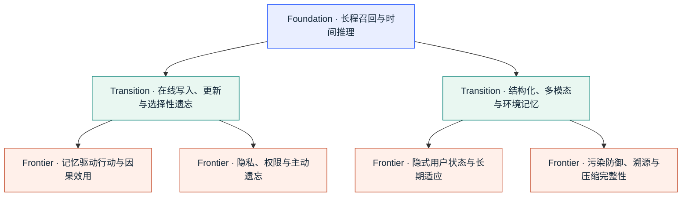
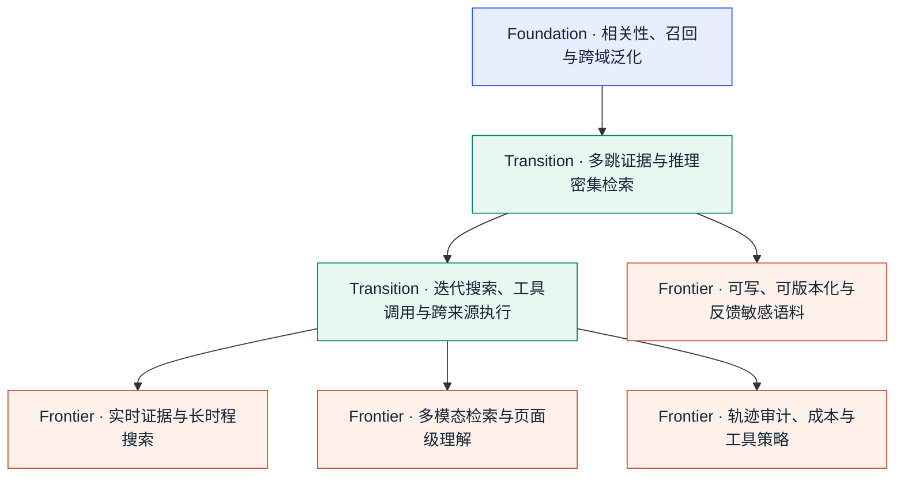
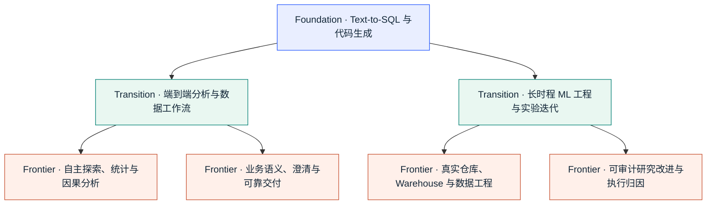

<!-- ONBOARDING:START -->

<h1>Agent Benchmark Radar</h1>

<strong>从 Benchmark 看见当前能力、成绩空间与下一步研究。</strong>

覆盖 <b>Agent Memory</b> · <b>RAG / Agentic Retrieval</b> · <b>Data Agents</b> 
沿着 <b>Benchmark → Results → Opportunity → Frontier</b> 追踪评测版图：找到最新 Repo，查看当前方法成绩，组合研究评测，并发现下一坐标。

<strong>中文</strong> · <a href="README.en.md">English</a>

<a href="https://h20zhang.github.io/Agent-Benchmark-Radar/zh/"><strong>打开 Evaluation Frontier 网站 →</strong></a> 
网站提供完整交互版本；README 保留可快速浏览、引用和版本审阅的研究地图。

## 从这里开始

| 研究动作 | 网站入口 | 直接获得 |
|---|---|---|
| **Pick** | [Benchmark Explorer](https://h20zhang.github.io/Agent-Benchmark-Radar/zh/benchmarks/) | 按能力、环境、评测目标、结果状态和参考空间筛选最新 Benchmark。 |
| **Build** | [评测组合生成器](https://h20zhang.github.io/Agent-Benchmark-Radar/zh/evaluate/) | 从研究 claim 组合 Core / Complement，并导出 Markdown。 |
| **Discover** | [评测机会地图](https://h20zhang.github.io/Agent-Benchmark-Radar/zh/opportunities/) | 从当前证据进入下一测量坐标和可执行评测设计。 |
| **Track** | [Evaluation Frontier](https://h20zhang.github.io/Agent-Benchmark-Radar/zh/frontier/) | 联合查看新发布、结构化成绩、参考空间、前沿变化与 Benchmark 谱系。 |

**先选你的研究方向。** 每个方向都提供独立的演化脉络、Evaluation Recipes 和完整 Benchmark 列表。

| 方向 | 研究主张 | 先看脉络 | 配一套评测 | 查看列表 |
|---|---|---|---|---|
| **Agent Memory** | 长期记忆的正确召回、在线更新、行动效用、多模态能力、安全和治理。 | [Memory Map](#benchmark-memory) | [Memory Recipes](#recipe-memory) | [Memory Benchmark](#registry-memory) |
| **RAG / Agentic Retrieval** | 正确证据、复杂搜索，以及动态语料和长轨迹下的持续可靠性。 | [Retrieval Map](#benchmark-rag) | [Retrieval Recipes](#recipe-rag) | [Retrieval Benchmark](#registry-rag) |
| **Data Agents** | SQL、分析、数据科学与 ML engineering 的端到端可核验交付。 | [Data Agent Map](#benchmark-data) | [Data Agent Recipes](#recipe-data) | [Data Agent Benchmark](#registry-data) |

**跨领域探索：** [按 claim 配一套 Evaluation Recipe](#evaluation-recipes) · [看近 30 天的变化](#frontier-signals) · [看最近半年新 Benchmark](#release-timeline)

_收录标准：Registry 以可复用的 benchmark / evaluation contribution 为收录单元。详见 [Curation](CURATION.md)。_

---
<!-- ONBOARDING:END -->

<!-- EVALUATION-RECIPES:START -->

## Evaluation Recipes：按你的 claim 配 Benchmark

有效的评测组合从论文或系统想支持的 **claim** 出发：`Core` 衡量主对象，`Complement` 扩展相邻的 validity 维度，最后一列标明下一步验证目标。这套框架可按具体 claim 和 protocol 调整。

### Agent Memory

| 你想证明 | Core | Complement | 下一步验证 |
|---|---|---|---|
| **长期对话记忆与时间推理** | [LoCoMo](https://aclanthology.org/2024.acl-long.747/) | [LongMemEval](https://arxiv.org/abs/2410.10813) | 结合行动导向评测，验证历史经验对后续行动的改善。 |
| **状态更新与过期信息处理** | [StateMemBench](https://arxiv.org/abs/2608.19652) | [LongMemEval](https://arxiv.org/abs/2410.10813) · [membench (staleness)](https://github.com/Ps23102004/membench) | 通过组件级消融定位 write、update 与 retrieval 的贡献。 |
| **记忆是否改善后续行动** | [MemoryArena](https://arxiv.org/abs/2602.16313) | [PAST-Bench](https://arxiv.org/abs/2608.04003) · [Mem2ActBench](https://aclanthology.org/2026.acl-long.370/) | 在大规模个人长期历史上验证通用 memory quality。 |
| **多模态长期记忆** | [MemEye](https://arxiv.org/abs/2605.15128) | [Mem-Gallery](https://aclanthology.org/2026.acl-long.1892/) · [WorldMemArena](https://arxiv.org/abs/2605.29341) | 补充权限、污染与压缩等完整 memory lifecycle 评测。 |
| **Memory 安全与生命周期治理** | [InjecMEM](https://arxiv.org/abs/2608.23471) | [Utility Under Attack](https://arxiv.org/abs/2608.21230) · [GateMem](https://arxiv.org/abs/2606.18829) · [The Compaction Cliff](https://arxiv.org/abs/2608.22752) | 结合一般 utility、recall 与 reasoning 评测。 |

### RAG / Agentic Retrieval

| 你想证明 | Core | Complement | 下一步验证 |
|---|---|---|---|
| **推理密集型 Retrieval 质量** | [BRIGHT](https://arxiv.org/abs/2407.12883) | [BEIR](https://arxiv.org/abs/2104.08663) · [Bright-Pro](https://aclanthology.org/2026.acl-long.1705/) | 结合 live、迭代式 web search 评测。 |
| **Deep / long-horizon web search** | [BrowseComp](https://arxiv.org/abs/2504.12516) | [LiveBrowseComp](https://arxiv.org/abs/2605.28721) · [LoHoSearch](https://arxiv.org/abs/2606.12837) | 加入轨迹级诊断，定位搜索过程中的关键失效阶段。 |
| **搜索轨迹诊断与工具策略** | [SearchAuditBench](https://arxiv.org/abs/2608.05212) | [AgenticRAGTracer](https://arxiv.org/abs/2602.19127) · [VAKRA](https://arxiv.org/abs/2608.12282) | 补充广覆盖 live-web retrieval 与 corpus robustness 评测。 |
| **动态、可写、会反馈的语料** | [KBGym](https://arxiv.org/abs/2608.21829) | [Snapshot Compatibility Audit](https://arxiv.org/abs/2608.22856) · [RAG Collapse](https://arxiv.org/abs/2608.22118) | 结合传统静态 corpus 上的 retrieval-quality 评测。 |
| **多模态搜索与视觉文档 Retrieval** | [VisDocAgentBench](https://arxiv.org/abs/2608.17889) | [MC-Search](https://arxiv.org/abs/2603.00873) · [MERRIN](https://arxiv.org/abs/2604.13418) | 按 modality 与 tool interface 分层报告，建立可比的 headline score。 |

### Data Agents

| 你想证明 | Core | Complement | 下一步验证 |
|---|---|---|---|
| **Text-to-SQL / Warehouse 任务能力** | [Spider 2.0](https://arxiv.org/abs/2411.07763) | [Spider](https://aclanthology.org/D18-1425/) · [WarehouseReliabilityBench](https://arxiv.org/abs/2608.09254) | 扩展到完整的数据理解、分析与交付工作流。 |
| **端到端 Data Science Agent** | [DataSpace](https://arxiv.org/abs/2608.03451) | [DSAgentBench](https://arxiv.org/abs/2608.10366) · [DataClawBench](https://arxiv.org/abs/2605.02503) | 通过组件级评测验证统计建模质量。 |
| **数据理解与自主探索** | [Data Exploration Benchmark](https://arxiv.org/abs/2608.16045) | [DataClawBench](https://arxiv.org/abs/2605.02503) · [AgenticDataBench](https://arxiv.org/abs/2607.01647) | 结合下游模型、因果结论与业务决策质量评测。 |
| **统计与因果分析** | [CausalDS](https://arxiv.org/abs/2607.08093) | [StatABench](https://arxiv.org/abs/2606.22977) | 扩展到真实 warehouse、repo 与数据工程约束。 |
| **长时程 ML Engineering / Research Improvement** | [MLE-bench](https://arxiv.org/abs/2410.07095) | [DeltaML-Bench](https://arxiv.org/abs/2608.19653) · [AI4AI-Bench](https://arxiv.org/abs/2608.20318) | 结合 BI、warehouse semantics 与一般数据分析能力评测。 |

> **使用原则：** Recipe 让实验组合与论文 claim 对齐。实验设计同时对齐每个 Benchmark 的 protocol、公平比较条件与 claim 支持范围。

---
<!-- EVALUATION-RECIPES:END -->

## 近 30 天：三个变化

<!-- FRONTIER-SIGNALS:START -->
| 方向 | 真正变化 | 代表 Benchmark |
|---|---|---|
| **Agent Memory** | 安全评价从“是否记住正确内容”扩展到**持久记忆整个生命周期的完整性**：InjecMEM 测恶意写入到后续检索与生成，Utility Under Attack 同时计算防御造成的良性 utility 损失，The Compaction Cliff 则测规则在反复压缩后是否仍能约束行动。 | [InjecMEM](https://arxiv.org/abs/2608.23471) · [Utility Under Attack](https://arxiv.org/abs/2608.21230) · [The Compaction Cliff](https://arxiv.org/abs/2608.22752) |
| **RAG / Agentic Retrieval** | 语料成为**可训练、可版本化且会形成反馈回路的状态对象**。KBGym 冻结并按 coverage 审计被 curator 修改的 store；Snapshot Compatibility Audit 测 corpus growth 引发的稳定答案翻转；RAG Collapse 则隔离 self-authored source 的递归反馈。 | [KBGym](https://arxiv.org/abs/2608.21829) · [Snapshot Compatibility Audit](https://arxiv.org/abs/2608.22856) · [RAG Collapse](https://arxiv.org/abs/2608.22118) |
| **Data Agents** | 评价对象继续从“SQL / code 能跑”推到**真实仓库中的长时程 ML 改进，同时收紧分数归因**。AI4AI-Bench 用 proxy exploration → source patch → clean-start final run 隔离学习算法修改；DeltaML-Bench 则把 published-baseline improvement 与 anti-gaming audit 放进同一执行协议。 | [AI4AI-Bench](https://arxiv.org/abs/2608.20318) · [DeltaML-Bench](https://arxiv.org/abs/2608.19653) · [data-eng-bench](https://github.com/Snowflake-Labs/data-eng-bench) |
<!-- FRONTIER-SIGNALS:END -->

最后更新：**2026-08-28**

### 当前成绩追踪

网站已为 12 个 Benchmark 建立来源核验的结构化结果轨道；每项成绩都绑定 task、split、protocol、metric、方向、日期与原始来源。

| Benchmark | 当前已核验坐标 | 当前最佳 | 研究入口 |
|---|---|---:|---|
| **SCALE-QA** | 128K Full Context accuracy | 29.8% | [查看成绩与 70.2% 参考空间](https://h20zhang.github.io/Agent-Benchmark-Radar/zh/benchmarks/scale-qa/#results) |
| **StateMemBench** | Same-backbone state-maintenance score | 36.3% | [查看方法对比](https://h20zhang.github.io/Agent-Benchmark-Radar/zh/benchmarks/statemembench/#results) |
| **DeltaML-Bench** | 4×6h per-run success | 33.9% | [查看长时程改进空间](https://h20zhang.github.io/Agent-Benchmark-Radar/zh/benchmarks/deltaml-bench/#results) |
| **DSAgentBench** | Complete data-science task success | 56.7% | [查看端到端结果](https://h20zhang.github.io/Agent-Benchmark-Radar/zh/benchmarks/dsagentbench/#results) |
| **DataSpace** | End-to-end table-delivery accuracy | 66.34% | [查看多源工作区结果](https://h20zhang.github.io/Agent-Benchmark-Radar/zh/benchmarks/dataspace/#results) |
| **The Compaction Cliff** | Five-round constraint recall | 96% | [查看压缩方法对比](https://h20zhang.github.io/Agent-Benchmark-Radar/zh/benchmarks/compaction-cliff/#results) |

## 最近半年 Benchmark 时间线

<!-- TABLE-FIRST:RECENT:START -->

| 时间 | 方向 | Benchmark | 考察内容 |
|---|---|---|---|
| 2026-08-26 | Agent Memory | [SCALE-QA](https://arxiv.org/abs/2608.25655) <!-- benchmark-id:scale-qa --> | 在无 session/topic 边界的混合长对话中，测系统能否重建真正约束当前任务的早期 episode，而非只看到或检索到相关证据。 |
| 2026-08-24 | Agent Memory | [The Compaction Cliff](https://arxiv.org/abs/2608.22752) <!-- benchmark-id:compaction-cliff --> | 在反复压缩、分解与检索中测安全约束的精确保留、作用域覆盖及下游行动遵从。 |
| 2026-08-24 | RAG | [Snapshot Compatibility Audit](https://arxiv.org/abs/2608.22856) <!-- benchmark-id:snapshot-compatibility-audit --> | 在减去同 snapshot 随机差异后，测 corpus 增长是否造成稳定答案翻转。 |
| 2026-08-24 | Agent Memory | [InjecMEM](https://arxiv.org/abs/2608.23471) <!-- benchmark-id:injecmem --> | 测一次普通交互写入的恶意记忆，是否在漂移后被相关查询检索并定向操纵生成。 |
| 2026-08-22 | RAG | [RAG Collapse](https://arxiv.org/abs/2608.22118) <!-- benchmark-id:rag-collapse --> | 在固定模型的递归检索模拟中，测 self-authored sources 是否逐轮挤出独立证据。 |
| 2026-08-22 | Agent Memory | [membench (staleness)](https://github.com/Ps23102004/membench) <!-- benchmark-id:membench-staleness --> | 用 current-vs-stale 排序、弃答与泄露防护诊断 memory store 的更新和冲突处理。 |
| 2026-08-22 | RAG | [KBGym / Training a Knowledge Base](https://arxiv.org/abs/2608.21829) <!-- benchmark-id:kbgym --> | 冻结由监督 curator 编辑的知识库，再按 answer-key coverage 测独立 reader 的准确率与行动成本。 |
| 2026-08-22 | Agent Memory | [Agent Memory Bench (coding agents)](https://github.com/GiulioDER/agent-memory-bench) <!-- benchmark-id:agent-memory-bench-coding --> | 在真实仓库任务中用 neutral feed、proof-of-treatment 与隐藏执行 oracle 测跨任务记忆是否改善编码行动。 |
| 2026-08-21 | Agent Memory | [Utility Under Attack](https://arxiv.org/abs/2608.21230) <!-- benchmark-id:utility-under-attack --> | 测少量虚假记忆造成的良性 utility 损失，以及筛查和 provenance ranking 的防御代价。 |
| 2026-08-21 | Agent Memory | [Agent Memory Bakeoff](https://github.com/JaysonRawlins/agent-memory-bakeoff) <!-- benchmark-id:agent-memory-bakeoff --> | 交叉比较检索策略与写入时 enrichment，测合成组织记忆中的跨词汇检索。 |
| 2026-08-21 | Agent Memory | [DreamBench-SWE](https://arxiv.org/abs/2608.20664) <!-- benchmark-id:dreambench-swe --> | 用隐藏可执行 oracle 的多会话编码陷阱，测记忆保持、过期/覆盖、作用域、权威冲突、组合、source-of-truth、错误经验拒绝与弃答。 |
| 2026-08-20 | Agent Memory | [StateMemBench](https://arxiv.org/abs/2608.19652) <!-- benchmark-id:statemembench --> | 在多会话修订中区分当前状态、已被替代状态与其他错误，并用可执行 replay 隔离 state drift。 |
| 2026-08-20 | Agent Memory | [MemTrapBench](https://arxiv.org/abs/2608.20202) <!-- benchmark-id:memtrapbench --> | 用同题 memory/no-memory 对照检验正确检索到的历史记忆是否引发 reasoning fixation 或 belief distortion。 |
| 2026-08-20 | Data Agent | [DeltaML-Bench](https://arxiv.org/abs/2608.19653) <!-- benchmark-id:deltaml-bench --> | 在真实研究仓库中修复训练管线、迭代实验、超过论文基线，并通过多层 anti-gaming audit。 |
| 2026-08-20 | Data Agent | [AI4AI-Bench](https://arxiv.org/abs/2608.20318) <!-- benchmark-id:ai4ai-bench --> | 在冻结训练仓库中诊断并修改学习算法，以 proxy 探索、源码交付和 clean-start 正式运行隔离最终成绩。 |
| 2026-08-18 | RAG | [VisDocAgentBench](https://arxiv.org/abs/2608.17889) <!-- benchmark-id:visdocagentbench --> | 在统一页面排序协议下比较静态 ranker 与迭代视觉/OCR agent 的视觉文档检索基准。 |
| 2026-08-18 | RAG | [BrowseComp-Plus_CM](https://arxiv.org/abs/2608.20317) <!-- benchmark-id:browsecomp-plus-cm --> | 在同题、同 agent 与同 BM25 接口下，把检索换到独立构建的 5.53 亿文档语料并测答案、证据 recall 和调用成本。 |
| 2026-08-17 | RAG | [The Commercial Tax](https://arxiv.org/abs/2608.16096) <!-- benchmark-id:commercial-tax --> | 把原始 embedder 分数绑定到许可、query format、索引构造与部署成本的检索复现性审计。 |
| 2026-08-17 | Agent Memory | [SP-Mem Privacy-Aware Memory Benchmark](https://arxiv.org/abs/2608.16551) <!-- benchmark-id:sp-mem --> | 联合测量回答质量、个性化、同意处理、精确值暴露与成本的隐私感知记忆基准。 |
| 2026-08-17 | Data Agent | [Data Exploration Benchmark](https://arxiv.org/abs/2608.16045) <!-- benchmark-id:data-exploration-benchmark --> | 在下游分析前，构建包含逻辑表、列语义、键关系和质量信号的结构化数据理解产物。 |
| 2026-08-10 | Data Agent | [WarehouseReliabilityBench](https://arxiv.org/abs/2608.09254) <!-- benchmark-id:warehouse-reliability-bench --> | 面对语义歧义、不可回答、模式漂移和对抗输入时，返回业务真值或正确地澄清、弃答、拒答。 |
| 2026-08-10 | RAG | [The Recall Trap](https://arxiv.org/abs/2608.14838) <!-- benchmark-id:recall-trap --> | 有效性审计：在固定槽位代码检索协议下，更高 file recall 可能降低下游修复成功率。 |
| 2026-08-07 | RAG | [DAS-Bench / DAS-Eval](https://arxiv.org/abs/2608.18034) <!-- benchmark-id:das-bench --> | 对文献覆盖、taxonomy、claim、citation、discourse 与渲染成品质量评分的学术综述基准及评测器。 |
| 2026-08-05 | RAG | [SearchAuditBench](https://arxiv.org/abs/2608.05212) <!-- benchmark-id:searchauditbench --> | 考察审计模型能否在超长搜索轨迹中定位错误、归因根因并生成可执行修复。 |
| 2026-08-04 | Agent Memory | [PAST-Bench](https://arxiv.org/abs/2608.04003) <!-- benchmark-id:past-bench --> | 通过配对持久状态控制，检验跨 episode 经验是否因果改善后续可执行工作的基准。 |
| 2026-08-04 | RAG | [MAPLE](https://arxiv.org/abs/2608.15624) <!-- benchmark-id:maple --> | 测量同一论文能否在动机、方法与结果等多个 aspect 下持续被找回的科学检索基准。 |
| 2026-08 | RAG | [VAKRA](https://arxiv.org/abs/2608.12282) <!-- benchmark-id:vakra --> | 组合调用 API、检索文档、完成多跳推理，并遵守工具策略。 |
| 2026-08 | Data Agent | [DSAgentBench](https://arxiv.org/abs/2608.10366) <!-- benchmark-id:dsagentbench --> | 使用笔记本、IDE、终端、浏览器和数据库完成完整数据科学工作流。 |
| 2026-08 | Data Agent | [DataSpace](https://arxiv.org/abs/2608.03451) <!-- benchmark-id:dataspace --> | 在混合数据库、文件、文档和多媒体的工作区中完成可验证分析。 |
| 2026-07-29 | Data Agent | [data-eng-bench](https://github.com/Snowflake-Labs/data-eng-bench) <!-- benchmark-id:data-eng-bench --> | 面向仓库规模 dbt 转换的可执行数据工程基准，在 DuckDB 与 Snowflake 上做隐藏行级核验。 |
| 2026-07-27 | Agent Memory | [InMind](https://arxiv.org/abs/2607.24368) <!-- benchmark-id:inmind --> | 旧事实与新问题词义相远、只有借助常识才能建立联系时，记忆能否被正确调出并应用。 |
| 2026-07-21 | Agent Memory | [MemFuseBench](https://arxiv.org/abs/2608.18704) <!-- benchmark-id:memfusebench --> | 跨异构事件流的来源连接、因果融合、冲突裁决与溯源记忆基准。 |
| 2026-07-14 | RAG | [WANDR](https://arxiv.org/abs/2608.14747) <!-- benchmark-id:wandr --> | 面向实时网页 wide-and-deep 记录收集的基准，包含分层任务和无需穷举金标的逐条核验。 |
| 2026-07-09 | Data Agent | [CausalDS](https://arxiv.org/abs/2607.08093) <!-- benchmark-id:causalds --> | 在可执行数据科学环境中覆盖因果预测、识别、效应估计、反事实、不确定性与弃答。 |
| 2026-07-01 | RAG | [LitReview Arena / LitReviewBench / LitJudge](https://arxiv.org/abs/2608.21374) <!-- benchmark-id:litreview-arena --> | 用领域专家 pairwise preference 评价文献综述五个维度，并校准自动 judge。 |
| 2026-07 | Agent Memory | [PerMemSafe](https://aclanthology.org/2026.findings-acl.320/) <!-- benchmark-id:permemsafe --> | 能否从长期历史中识别隐含的个体风险，并在风险缓解后及时更新判断。 |
| 2026-07 | Agent Memory | [Mem2ActBench](https://aclanthology.org/2026.acl-long.370/) <!-- benchmark-id:mem2actbench --> | 长期记忆是否会影响工具选择和参数填写。 |
| 2026-07 | Agent Memory | [Mem-Gallery](https://aclanthology.org/2026.acl-long.1892/) <!-- benchmark-id:mem-gallery --> | 多模态长期对话中的记忆抽取、适应、推理和知识管理。 |
| 2026-07 | Agent Memory | [LoCoMo-Plus](https://aclanthology.org/2026.acl-long.1150/) <!-- benchmark-id:locomo-plus --> | 在后续问题省略旧约束时，评测智能体持续应用潜在用户约束的能力。 |
| 2026-07 | Data Agent | [AgenticDataBench](https://arxiv.org/abs/2607.01647) <!-- benchmark-id:agenticdatabench --> | 用细粒度技能分类检查真实数据科学工作流的覆盖情况。 |
| 2026-06-23 | Agent Memory | [MEMPROBE](https://arxiv.org/abs/2606.24595) <!-- benchmark-id:memprobe --> | 普通协助结束后，能否从智能体留下的记忆产物中恢复隐藏的用户状态。 |
| 2026-06-22 | Data Agent | [StatABench](https://arxiv.org/abs/2606.22977) <!-- benchmark-id:statabench --> | 同时评估统计知识、工具选择与参数设置，以及开放式建模和报告。 |
| 2026-06-22 | Agent Memory | [DynamicMem](https://arxiv.org/abs/2606.22877) <!-- benchmark-id:dynamicmem --> | 从十五个月、多个应用的零散行为中推断并更新用户属性、习惯和偏好。 |
| 2026-06-17 | Agent Memory | [GateMem](https://arxiv.org/abs/2606.18829) <!-- benchmark-id:gatemem --> | 多人共享记忆能否同时保持可用、阻止越权泄露并执行删除请求。 |
| 2026-06-13 | Data Agent | [IRTS-ToolBench](https://arxiv.org/abs/2606.15107) <!-- benchmark-id:irts-toolbench --> | 在异步、缺失且采样频率不一的非规则时间序列上选择工具并完成可核验问答。 |
| 2026-06-11 | RAG | [LoHoSearch](https://arxiv.org/abs/2606.12837) <!-- benchmark-id:lohosearch --> | 考察超大候选空间、复杂约束结构、长程搜索和上下文管理。 |
| 2026-06-11 | RAG | [EvoBrowseComp](https://arxiv.org/abs/2606.13120) <!-- benchmark-id:evobrowsecomp --> | 考察英语和中文智能体对持续变化网络知识的广度搜索与多步推理。 |
| 2026-06-03 | Agent Memory | [MPBench](https://arxiv.org/abs/2606.04329) <!-- benchmark-id:mpbench --> | 跨写入与后续查询会话，测六类 persistent-memory poisoning 的写入成功与条件检索成功。 |
| 2026-06 | Agent Memory | [LifeSide](https://arxiv.org/abs/2606.04660) <!-- benchmark-id:lifeside --> | 跨会话记忆、用户理解、隐私控制，以及情绪与环境的互动。 |
| 2026-05-28 | Agent Memory | [WorldMemArena](https://arxiv.org/abs/2605.29341) <!-- benchmark-id:worldmemarena --> | 从多模态观察、行动和反馈中写入、维护、检索并使用不断变化的世界状态。 |
| 2026-05-27 | RAG | [LiveBrowseComp](https://arxiv.org/abs/2605.28721) <!-- benchmark-id:livebrowsecomp --> | 考察智能体能否检索近期、低显著性的网络事实，而非只验证模型已有知识。 |
| 2026-05-19 | RAG | [ScholarQuest](https://arxiv.org/abs/2606.20235) <!-- benchmark-id:scholarquest --> | 考察智能体按研究意图迭代检索论文、扩展引文和控制结果范围。 |
| 2026-05-18 | Agent Memory | [EvoMemBench](https://arxiv.org/abs/2605.18421) <!-- benchmark-id:evomembench --> | 在回合内与跨回合、知识型与执行型两条轴上统一比较记忆系统。 |
| 2026-05-14 | Agent Memory | [MEMLENS](https://arxiv.org/abs/2605.14906) <!-- benchmark-id:memlens --> | 在 32K 到 256K 的多模态多会话历史中进行提取、更新、时间推理和拒答。 |
| 2026-05-14 | Agent Memory | [MemEye](https://arxiv.org/abs/2605.15128) <!-- benchmark-id:memeye --> | 细粒度视觉证据、视觉状态变化，以及纯文本捷径检查。 |
| 2026-05-14 | Agent Memory | [GroupMemBench](https://arxiv.org/abs/2605.14498) <!-- benchmark-id:groupmembench --> | 多人群聊中的说话者信念、群体动态、术语差异和面向不同受众的表达。 |
| 2026-05-12 | Agent Memory | [MedMemoryBench](https://arxiv.org/abs/2605.11814) <!-- benchmark-id:medmemorybench --> | 在持续增长的医疗对话中追踪病情、时间变化和复杂临床信息，并观察记忆饱和。 |
| 2026-05-04 | Data Agent | [DataClawBench](https://arxiv.org/abs/2605.02503) <!-- benchmark-id:dataclawbench --> | 在极少先验引导下，自主探索陌生、含噪、跨域金融数据并形成可验证结论。 |
| 2026-05 | RAG | [SGR-Bench](https://arxiv.org/abs/2605.22219) <!-- benchmark-id:sgr-bench --> | 在证据受站点筛选、层级、范围或视图状态控制时完成搜索。 |
| 2026-05 | Agent Memory | [LongMemEval-V2](https://arxiv.org/abs/2605.12493) <!-- benchmark-id:longmemeval-v2 --> | 大量网页智能体轨迹中的环境状态、操作流程和易错点。 |
| 2026-04-30 | RAG | [Bright-Pro](https://aclanthology.org/2026.acl-long.1705/) <!-- benchmark-id:bright-pro --> | 考察推理密集型检索、推理要点覆盖，以及检索器在静态与智能体搜索中的实际效用。 |
| 2026-04-19 | RAG | [MuDABench](https://aclanthology.org/2026.findings-acl.341/) <!-- benchmark-id:mudabench --> | 考察大规模财务文档集合中的信息抽取、跨文档聚合和定量分析。 |
| 2026-04-17 | Agent Memory | [MemEvoBench](https://arxiv.org/abs/2604.15774) <!-- benchmark-id:memevobench --> | 追踪误导性记忆、噪声工具结果和偏置反馈在多轮写回中的安全性演变。 |
| 2026-04-15 | RAG | [MERRIN](https://arxiv.org/abs/2604.13418) <!-- benchmark-id:merrin --> | 考察智能体在嘈杂网络中自主选择模态、检索多模态证据并进行多跳推理。 |
| 2026-04-14 | RAG | [EnterpriseRAG-Bench](https://arxiv.org/abs/2605.05253) <!-- benchmark-id:enterpriserag-bench --> | 考察企业式知识库中的检索、多文档推理、冲突处理、完整性和无答案识别。 |
| 2026-04-09 | Agent Memory | [ImplicitMemBench](https://aclanthology.org/2026.acl-long.1301/) <!-- benchmark-id:implicitmembench --> | 干扰之后，模型能否在首次尝试中自动表现出已学程序、启动效应或条件联结。 |
| 2026-04-07 | RAG | [LeakDojo](https://aclanthology.org/2026.findings-acl.287/) <!-- benchmark-id:leakdojo --> | 考察攻击者从 RAG 数据库抽取文本内容的能力，以及不同管线和防御下的泄露风险。 |
| 2026-04-01 | RAG | [AutoResearchBench](https://arxiv.org/abs/2604.25256) <!-- benchmark-id:autoresearchbench --> | 考察科学文献中的目标论文追踪、条件约束、开放集合搜集和停止判断。 |
| 2026-03-12 | Data Agent | [AgentFuel](https://arxiv.org/abs/2603.12483) <!-- benchmark-id:agentfuel --> | 面向具体领域的时序对话智能体功能测试，重点覆盖有状态与事故型查询。 |
| 2026-03-05 | Data Agent | [TML-Bench](https://arxiv.org/abs/2603.05764) <!-- benchmark-id:tml-bench --> | 在固定时间预算和隐藏标签下，产出有效且有竞争力的表格机器学习提交。 |
| 2026-03 | Agent Memory | [LifeBench](https://arxiv.org/abs/2603.03781) <!-- benchmark-id:lifebench --> | 多源长期轨迹中的事件、语义、习惯和程序性记忆。 |
| 2026-03 | Data Agent | [Data Agent Benchmark (DAB)](https://arxiv.org/abs/2603.20576) <!-- benchmark-id:data-agent-benchmark --> | 跨多个 DBMS 完成数据集成、转换、分析和可执行核验。 |
| 2026-02-27 | Data Agent | [DARE-bench](https://arxiv.org/abs/2602.24288) <!-- benchmark-id:dare-bench --> | 用可验证真值同时评估机器学习建模效果与对指定数据科学流程的遵循。 |
| 2026-02-26 | RAG | [MTRAG-UN](https://aclanthology.org/2026.findings-acl.503/) <!-- benchmark-id:mtrag-un --> | 评测多轮 RAG 对不可回答、需要澄清、依赖上下文和含糊回复的处理。 |
| 2026-02-22 | RAG | [MC-Search](https://arxiv.org/abs/2603.00873) <!-- benchmark-id:mc-search --> | 考察多模态搜索规划、模态选择、逐跳证据检索和长链推理一致性。 |
| 2026-02-18 | Agent Memory | [MemoryArena](https://arxiv.org/abs/2602.16313) <!-- benchmark-id:memoryarena --> | 在跨会话的智能体—环境循环中，用早期行动与反馈指导后续行动。 |
| 2026-02-06 | RAG | [GISA](https://arxiv.org/abs/2602.08543) <!-- benchmark-id:gisa --> | 考察真实信息需求下的搜索规划、纵向推理、横向汇总和结构化作答。 |
| 2026-02-05 | RAG | [SAGE](https://arxiv.org/abs/2602.05975) <!-- benchmark-id:sage --> | 考察深度研究智能体在受控科学论文库中的定向找文与开放式文献搜集。 |
| 2026-02-03 | Agent Memory | [MemGUI-Bench](https://arxiv.org/abs/2602.06075) <!-- benchmark-id:memgui-bench --> | 移动端操作中的跨步骤保持、跨应用迁移、跨会话学习和失败恢复。 |
| 2026-02 | Agent Memory | [StructMemEval](https://arxiv.org/abs/2602.11243) <!-- benchmark-id:structmemeval --> | 智能体能否维护账本、列表、树等符合任务需要的记忆结构。 |
| 2026-02 | Agent Memory | [AMA-Bench](https://arxiv.org/abs/2602.22769) <!-- benchmark-id:ama-bench --> | 真实和可扩展合成的智能体—环境轨迹上的长程记忆。 |
| 2026-02 | RAG | [AgenticRAGTracer](https://arxiv.org/abs/2602.19127) <!-- benchmark-id:agenticragtracer --> | 对多步检索与推理逐跳核验，并检查步骤分配。 |<!-- TABLE-FIRST:RECENT:END -->

## Benchmark 地图

### Agent Memory
从跨会话事实召回，逐步走向在线更新、结构化记忆、多模态证据、行动、隐式用户状态与覆盖写入—检索—压缩的生命周期完整性。

<!-- CAPABILITY-MAP:agent-memory:START -->

<!-- CAPABILITY-MAP:agent-memory:END -->

**在线筛选：** [打开 Agent Memory Explorer →](https://h20zhang.github.io/Agent-Benchmark-Radar/zh/benchmarks/?area=agent-memory)

### RAG / Agentic Retrieval
从文档相关性，逐步走向多跳证据、实时搜索、跨来源执行与轨迹审计；语料本身也成为可训练、可版本化、需审计反馈的状态。

<!-- CAPABILITY-MAP:rag:START -->

<!-- CAPABILITY-MAP:rag:END -->

**在线筛选：** [打开 RAG / Agentic Retrieval Explorer →](https://h20zhang.github.io/Agent-Benchmark-Radar/zh/benchmarks/?area=rag)

### Data Agents
从 Text-to-SQL / code generation，分化为完整分析工作流与长时程 ML engineering，并继续走向探索、统计/因果分析、真实研究仓库与业务语义可靠性。

<!-- CAPABILITY-MAP:data-agent:START -->

<!-- CAPABILITY-MAP:data-agent:END -->

**在线筛选：** [打开 Data Agents Explorer →](https://h20zhang.github.io/Agent-Benchmark-Radar/zh/benchmarks/?area=data-agent)

## 按领域查看全部 Benchmark

以下是 registry 中的全部 125 个基准。README 保留完整表格作为一等阅读界面，网站同时提供可筛选、可比较的增强视图。

<!-- CITATION-META:START -->
引用数来自 Semantic Scholar，最后刷新 **2026-08-31**；`—` 标记以代码或数据为主要入口、论文匹配仍在核验的记录。引用数呈现影响力背景，阶段由测量演进判断。
<!-- CITATION-META:END -->

### Agent Memory

<!-- TABLE-FIRST:AREA:agent-memory:START -->

| 阶段 | Benchmark | 引用数 (S2) | 时间 | 考察内容 |
|---|---|---:|---:|---|
| 🌱 前身 | [Beyond Goldfish Memory](https://aclanthology.org/2022.acl-long.356/) <!-- benchmark-id:beyond-goldfish-memory --> | [379](https://www.semanticscholar.org/paper/88064de690af282dbdf222774f03ff070b9df22b) | 2022-05 | 多次真人聊天之间的开放域长期记忆与前后自洽。 |
| 🧱 基石 | [LoCoMo](https://aclanthology.org/2024.acl-long.747/) <!-- benchmark-id:locomo --> | [780](https://www.semanticscholar.org/paper/0bf3a1867f7245b8a702093901c66b08b518eafc) | 2024-08 | 超长多会话对话中的 QA、事件总结和多模态对话生成。 |
| 🧱 基石 | [LongMemEval](https://arxiv.org/abs/2410.10813) <!-- benchmark-id:longmemeval --> | [567](https://www.semanticscholar.org/paper/fd48dc6b433cfcd220b6e769c6179d8ef6fcf862) | 2024-10 | 长期助手历史中的信息抽取、跨会话推理、时间推理、知识更新和拒答。 |
| ↗ 过渡 | [MemBench](https://arxiv.org/abs/2506.21605) <!-- benchmark-id:membench --> | [81](https://www.semanticscholar.org/paper/ccdd3d4ba73aa28c538960f8ac91deba61cd670f) | 2025-06 | 事实记忆与反思记忆、参与者与观察者场景，以及效果、效率和容量。 |
| ↗ 过渡 | [MemoryAgentBench](https://arxiv.org/abs/2507.05257) <!-- benchmark-id:memoryagentbench --> | [202](https://www.semanticscholar.org/paper/dc7c687809737422a7e2ce870ad55746675d60f2) | 2025-07 | 增量多轮交互中的检索、测试时学习、长程理解和选择性遗忘。 |
| ↗ 过渡 | [BEAM](https://arxiv.org/abs/2510.27246) <!-- benchmark-id:beam --> | [45](https://www.semanticscholar.org/paper/de7d68cf4796d23ffa562bcde4c4cbc903e16923) | 2025-10 | 百万到千万 token 的连贯对话记忆。 |
| 🔭 前沿 | [RealMem](https://aclanthology.org/2026.findings-acl.703/) <!-- benchmark-id:realmem --> | [12](https://www.semanticscholar.org/paper/0ae281ed1924a8f79642f0828927790e515f0142) | 2026-01 | 跨会话、目标和产物持续变化的项目型长期记忆。 |
| 🔭 前沿 | [CAME-Bench](https://aclanthology.org/2026.findings-acl.584/) <!-- benchmark-id:came-bench --> | [5](https://www.semanticscholar.org/paper/9211f5e2e3c9bddd21a3fde10b946b9638352c4b) | 2026-01-15 | 相同实体在不同目标段反复出现时，能否找回与当前意图相符的证据。 |
| 🔭 前沿 | [AMA-Bench](https://arxiv.org/abs/2602.22769) <!-- benchmark-id:ama-bench --> | [41](https://www.semanticscholar.org/paper/9fadf4b306ecf6195cd23e59e140afbc95f9334b) | 2026-02 | 真实和可扩展合成的智能体—环境轨迹上的长程记忆。 |
| 🔭 前沿 | [StructMemEval](https://arxiv.org/abs/2602.11243) <!-- benchmark-id:structmemeval --> | [9](https://www.semanticscholar.org/paper/2891780dd30f854b2ae3d9124d64ad729f71d068) | 2026-02 | 智能体能否维护账本、列表、树等符合任务需要的记忆结构。 |
| 🔭 前沿 | [MemGUI-Bench](https://arxiv.org/abs/2602.06075) <!-- benchmark-id:memgui-bench --> | [14](https://www.semanticscholar.org/paper/5b037191c54cab52e9df3aadba62c140fdf4a51d) | 2026-02-03 | 移动端操作中的跨步骤保持、跨应用迁移、跨会话学习和失败恢复。 |
| 🔭 前沿 | [MemoryArena](https://arxiv.org/abs/2602.16313) <!-- benchmark-id:memoryarena --> | [61](https://www.semanticscholar.org/paper/001da1314eb127dd40c6c7bf1f14081ec208978c) | 2026-02-18 | 在跨会话的智能体—环境循环中，用早期行动与反馈指导后续行动。 |
| 🔭 前沿 | [LifeBench](https://arxiv.org/abs/2603.03781) <!-- benchmark-id:lifebench --> | [7](https://www.semanticscholar.org/paper/33284572e05aa5a0426c54312abdbc26738a0255) | 2026-03 | 多源长期轨迹中的事件、语义、习惯和程序性记忆。 |
| 🔭 前沿 | [ImplicitMemBench](https://aclanthology.org/2026.acl-long.1301/) <!-- benchmark-id:implicitmembench --> | [3](https://www.semanticscholar.org/paper/86a759efe844ee45c11a69226b1478fee2bf1238) | 2026-04-09 | 干扰之后，模型能否在首次尝试中自动表现出已学程序、启动效应或条件联结。 |
| 🔭 前沿 | [MemEvoBench](https://arxiv.org/abs/2604.15774) <!-- benchmark-id:memevobench --> | [0](https://www.semanticscholar.org/paper/e7fed24b1353cf82d465d68dbda87c2b7243c60a) | 2026-04-17 | 追踪误导性记忆、噪声工具结果和偏置反馈在多轮写回中的安全性演变。 |
| 🔭 前沿 | [LongMemEval-V2](https://arxiv.org/abs/2605.12493) <!-- benchmark-id:longmemeval-v2 --> | [8](https://www.semanticscholar.org/paper/0a664e226ad908e615063af230a87cfeaeee5d94) | 2026-05 | 大量网页智能体轨迹中的环境状态、操作流程和易错点。 |
| 🔭 前沿 | [MedMemoryBench](https://arxiv.org/abs/2605.11814) <!-- benchmark-id:medmemorybench --> | [1](https://www.semanticscholar.org/paper/916768bffc01cae15c7f4b913f0a0c6f66cf2fc7) | 2026-05-12 | 在持续增长的医疗对话中追踪病情、时间变化和复杂临床信息，并观察记忆饱和。 |
| 🔭 前沿 | [GroupMemBench](https://arxiv.org/abs/2605.14498) <!-- benchmark-id:groupmembench --> | [5](https://www.semanticscholar.org/paper/469cd86992948b1b4d4286d1bbf5a7e2a779ff33) | 2026-05-14 | 多人群聊中的说话者信念、群体动态、术语差异和面向不同受众的表达。 |
| 🔭 前沿 | [MemEye](https://arxiv.org/abs/2605.15128) <!-- benchmark-id:memeye --> | [9](https://www.semanticscholar.org/paper/e5766ec08844810e4772beb40fffd7c4cc3576e9) | 2026-05-14 | 细粒度视觉证据、视觉状态变化，以及纯文本捷径检查。 |
| 🔭 前沿 | [MEMLENS](https://arxiv.org/abs/2605.14906) <!-- benchmark-id:memlens --> | [1](https://www.semanticscholar.org/paper/c868704871d238746bbb3b6c3b5549979558d41b) | 2026-05-14 | 在 32K 到 256K 的多模态多会话历史中进行提取、更新、时间推理和拒答。 |
| 🔭 前沿 | [EvoMemBench](https://arxiv.org/abs/2605.18421) <!-- benchmark-id:evomembench --> | [6](https://www.semanticscholar.org/paper/7fd669266b5a08fcfbf2a5838c68e14590ac9eb0) | 2026-05-18 | 在回合内与跨回合、知识型与执行型两条轴上统一比较记忆系统。 |
| 🔭 前沿 | [WorldMemArena](https://arxiv.org/abs/2605.29341) <!-- benchmark-id:worldmemarena --> | [0](https://www.semanticscholar.org/paper/12e7f33a0cf266e4f76a57a206d76f26afda7ba3) | 2026-05-28 | 从多模态观察、行动和反馈中写入、维护、检索并使用不断变化的世界状态。 |
| 🔭 前沿 | [LifeSide](https://arxiv.org/abs/2606.04660) <!-- benchmark-id:lifeside --> | [0](https://www.semanticscholar.org/paper/4811050bc98910b84c48ee2092f959e70528de73) | 2026-06 | 跨会话记忆、用户理解、隐私控制，以及情绪与环境的互动。 |
| ↗ 过渡 | [MPBench](https://arxiv.org/abs/2606.04329) <!-- benchmark-id:mpbench --> | [16](https://www.semanticscholar.org/paper/469d4b8f7660de4bf1651a92bbc1ced997e631ec) | 2026-06-03 | 跨会话 persistent-memory poisoning 的写入成功、条件检索成功与防御 operating point。 |
| 🔭 前沿 | [GateMem](https://arxiv.org/abs/2606.18829) <!-- benchmark-id:gatemem --> | [1](https://www.semanticscholar.org/paper/a524f9cbffc89db36eb8afae61b3d4e3d33b0ccb) | 2026-06-17 | 多人共享记忆能否同时保持可用、阻止越权泄露并执行删除请求。 |
| 🔭 前沿 | [DynamicMem](https://arxiv.org/abs/2606.22877) <!-- benchmark-id:dynamicmem --> | [2](https://www.semanticscholar.org/paper/3ec6edd820d52abe3b15a6f25624be0997d2d39c) | 2026-06-22 | 从十五个月、多个应用的零散行为中推断并更新用户属性、习惯和偏好。 |
| 🔭 前沿 | [MEMPROBE](https://arxiv.org/abs/2606.24595) <!-- benchmark-id:memprobe --> | [1](https://www.semanticscholar.org/paper/dcbc83076a37f6200d84d8815b7a6ba0aa309ef4) | 2026-06-23 | 普通协助结束后，能否从智能体留下的记忆产物中恢复隐藏的用户状态。 |
| 🔭 前沿 | [LoCoMo-Plus](https://aclanthology.org/2026.acl-long.1150/) <!-- benchmark-id:locomo-plus --> | [6](https://www.semanticscholar.org/paper/301809842a80f6231a8d00883f92290b62e65d97) | 2026-07 | 在后续问题省略旧约束时，评测智能体持续应用潜在用户约束的能力。 |
| 🔭 前沿 | [Mem-Gallery](https://aclanthology.org/2026.acl-long.1892/) <!-- benchmark-id:mem-gallery --> | [35](https://www.semanticscholar.org/paper/c69c7ab705735b24903511d62fad8110699f708a) | 2026-07 | 多模态长期对话中的记忆抽取、适应、推理和知识管理。 |
| 🔭 前沿 | [Mem2ActBench](https://aclanthology.org/2026.acl-long.370/) <!-- benchmark-id:mem2actbench --> | [25](https://www.semanticscholar.org/paper/c8e2417a59515b4f74dec06f631cc0a2280cbf60) | 2026-07 | 长期记忆是否会影响工具选择和参数填写。 |
| 🔭 前沿 | [PerMemSafe](https://aclanthology.org/2026.findings-acl.320/) <!-- benchmark-id:permemsafe --> | [0](https://www.semanticscholar.org/paper/e9ceaad85060375e02926322f959a6285a891cac) | 2026-07 | 能否从长期历史中识别隐含的个体风险，并在风险缓解后及时更新判断。 |
| 🔭 前沿 | [MemFuseBench](https://arxiv.org/abs/2608.18704) <!-- benchmark-id:memfusebench --> | [0](https://www.semanticscholar.org/paper/660441819b931d4b953873222bdc9c34c7641a9b) | 2026-07-21 | 跨异构事件流的来源连接、因果融合、冲突裁决与溯源记忆基准。 |
| 🔭 前沿 | [InMind](https://arxiv.org/abs/2607.24368) <!-- benchmark-id:inmind --> | [0](https://www.semanticscholar.org/paper/1654c6adad236d9cb98d8b2d76264a3c82962515) | 2026-07-27 | 旧事实与新问题词义相远、只有借助常识才能建立联系时，记忆能否被正确调出并应用。 |
| 🔭 前沿 | [PAST-Bench](https://arxiv.org/abs/2608.04003) <!-- benchmark-id:past-bench --> | [0](https://www.semanticscholar.org/paper/86174fa6cbc829c87d1dae781e1282a751e9f6b5) | 2026-08-04 | 通过配对持久状态控制，检验跨 episode 经验是否因果改善后续可执行工作的基准。 |
| 🔭 前沿 | [SP-Mem Privacy-Aware Memory Benchmark](https://arxiv.org/abs/2608.16551) <!-- benchmark-id:sp-mem --> | [0](https://www.semanticscholar.org/paper/5e223c2c94b112dda6df62c7a869d48cddd0e9f0) | 2026-08-17 | 联合测量回答质量、个性化、同意处理、精确值暴露与成本的隐私感知记忆基准。 |
| 🔭 前沿 | [MemTrapBench](https://arxiv.org/abs/2608.20202) <!-- benchmark-id:memtrapbench --> | [0](https://www.semanticscholar.org/paper/736d61825a5afed4c85b227951a9880d01e2299f) | 2026-08-20 | 同题 memory/no-memory 对照下，相关历史记忆是否会造成 reasoning fixation 或 belief distortion。 |
| 🔭 前沿 | [StateMemBench](https://arxiv.org/abs/2608.19652) <!-- benchmark-id:statemembench --> | [0](https://www.semanticscholar.org/paper/98c0706a65d781a3b7b726811151d0176e1cefb6) | 2026-08-20 | 多会话状态修订中的 current-vs-superseded 跟踪、依赖更新与 stale-state 抵抗。 |
| 🔭 前沿 | [Agent Memory Bakeoff](https://github.com/JaysonRawlins/agent-memory-bakeoff) <!-- benchmark-id:agent-memory-bakeoff --> | — | 2026-08-21 | 交叉比较检索策略与写入时 enrichment，测合成组织记忆中的跨词汇检索。 |
| 🔭 前沿 | [DreamBench-SWE](https://arxiv.org/abs/2608.20664) <!-- benchmark-id:dreambench-swe --> | [0](https://www.semanticscholar.org/paper/b69469610ce26c20718cedca8389cc20a0b94ea8) | 2026-08-21 | 用隐藏可执行 oracle 测多会话软件 agent 的记忆保持、状态覆盖、作用域、权威冲突、组合、source-of-truth、错误经验拒绝与弃答。 |
| 🔭 前沿 | [Utility Under Attack](https://arxiv.org/abs/2608.21230) <!-- benchmark-id:utility-under-attack --> | [0](https://www.semanticscholar.org/paper/aff09b98f3ade8fd4296515e699e76b49c83406b) | 2026-08-21 | 虚假记忆下的良性 utility 保留，以及筛查与 provenance ranking 的防御代价。 |
| 🔭 前沿 | [Agent Memory Bench (coding agents)](https://github.com/GiulioDER/agent-memory-bench) <!-- benchmark-id:agent-memory-bench-coding --> | — | 2026-08-22 | 在真实仓库任务中用 neutral feed、proof-of-treatment 与隐藏执行 oracle 测跨任务记忆是否改善编码行动。 |
| 🔭 前沿 | [membench (staleness)](https://github.com/Ps23102004/membench) <!-- benchmark-id:membench-staleness --> | — | 2026-08-22 | 用 current-vs-stale 排序、弃答与泄露防护诊断 memory store 的更新和冲突处理。 |
| 🔭 前沿 | [InjecMEM](https://arxiv.org/abs/2608.23471) <!-- benchmark-id:injecmem --> | [0](https://www.semanticscholar.org/paper/09e4e85b7fadc40990563e1cf2847356d7c9fd23) | 2026-08-24 | 单次无特权交互写入后，恶意记忆的检索成功、条件生成与端到端攻击成功。 |
| 🔭 前沿 | [The Compaction Cliff](https://arxiv.org/abs/2608.22752) <!-- benchmark-id:compaction-cliff --> | [0](https://www.semanticscholar.org/paper/68cebfa9bff38539f6dbd114310629168e7d6960) | 2026-08-24 | 反复压缩、分解与检索中的安全约束精确保留及下游行动遵从。 |
| 🔭 前沿 | [SCALE-QA](https://arxiv.org/abs/2608.25655) <!-- benchmark-id:scale-qa --> | [0](https://www.semanticscholar.org/paper/c73b59d446d064835acc4f499b12ae0b33c647de) | 2026-08-26 | 无显式边界的交错长对话中，对当前任务有效的 episode、状态覆盖、跨段桥接与局部约束能否被正确重建。 |
<!-- TABLE-FIRST:AREA:agent-memory:END -->

### RAG / Agentic Retrieval

<!-- TABLE-FIRST:AREA:rag:START -->

| 阶段 | Benchmark | 引用数 (S2) | 时间 | 考察内容 |
|---|---|---:|---:|---|
| 🌱 前身 | [HotpotQA](https://aclanthology.org/D18-1259/) <!-- benchmark-id:hotpotqa --> | [5,249](https://www.semanticscholar.org/paper/22655979df781d222eaf812b0d325fa9adf11594) | 2018-10 | 从多个 Wikipedia 文档中找证据、组合推理，并标出支撑事实。 |
| 🧱 基石 | [KILT](https://arxiv.org/abs/2009.02252) <!-- benchmark-id:kilt --> | [848](https://www.semanticscholar.org/paper/3af229f3da1bd24378fd8d76c88fd393b4464058) | 2020-09 | 在同一份 Wikipedia 快照上评测多种知识密集任务，同时检查答案和证据来源。 |
| 🧱 基石 | [BEIR](https://arxiv.org/abs/2104.08663) <!-- benchmark-id:beir --> | [1,975](https://www.semanticscholar.org/paper/807600ef43073cd9c59d4208ee710e90cf14efa8) | 2021-04 | 检索器在不同领域和任务上的零样本泛化。 |
| 🧱 基石 | [RGB](https://arxiv.org/abs/2309.01431) <!-- benchmark-id:rgb --> | [643](https://www.semanticscholar.org/paper/28e2ecb4183ebc0eec504b12dddc677f8aef8745) | 2023-09 | RAG 面对噪声、不可回答问题、信息整合和反事实材料时的表现。 |
| ↗ 过渡 | [MultiHop-RAG](https://arxiv.org/abs/2401.15391) <!-- benchmark-id:multihop-rag --> | [322](https://www.semanticscholar.org/paper/4e71624e90960cb003e311a0fe3b8be4c2863239) | 2024-01 | 在 RAG 流程中检索多份支撑证据并完成多跳推理。 |
| ↗ 过渡 | [RAGTruth](https://arxiv.org/abs/2401.00396) <!-- benchmark-id:ragtruth --> | [361](https://www.semanticscholar.org/paper/cfce709a65f90312d2bdc1a6cf0380c19becf694) | 2024-01 | RAG 输出中的样例级、词级幻觉和依据错误。 |
| ↗ 过渡 | [CRAG](https://arxiv.org/abs/2406.04744) <!-- benchmark-id:crag --> | [140](https://www.semanticscholar.org/paper/ec1bec009e68a4df478aaf11e3615e5587768990) | 2024-06 | 动态事实、长尾实体，以及网页和知识图谱上的事实型 RAG。 |
| ↗ 过渡 | [BRIGHT](https://arxiv.org/abs/2407.12883) <!-- benchmark-id:bright --> | [183](https://www.semanticscholar.org/paper/d79927715a88825737d2ff44f70b1d6698e0bae9) | 2024-07 | 相关性判断本身需要推理的真实查询。 |
| ↗ 过渡 | [RAGBench](https://arxiv.org/abs/2407.11005) <!-- benchmark-id:ragbench --> | [138](https://www.semanticscholar.org/paper/1b0aba023d7aa5fb9853f9e942efb5c243dc1201) | 2024-07 | 跨行业场景的检索与生成质量标签，以及 RAG 评判器。 |
| ↗ 过渡 | [BrowseComp](https://arxiv.org/abs/2504.12516) <!-- benchmark-id:browsecomp --> | [561](https://www.semanticscholar.org/paper/41d1ea36a9af136efc42f3c85516d00cc1d13458) | 2025-04 | 为寻找隐蔽答案持续浏览实时网页、改写查询并导航。 |
| ↗ 过渡 | [T²-RAGBench](https://aclanthology.org/2026.eacl-long.8/) <!-- benchmark-id:t2-ragbench --> | [0](https://www.semanticscholar.org/paper/ddaa0ae18f1c2ae8f1e6633848ab883cb200f43e) | 2025-05-14 | 考察真实财务报告中的文本与表格检索，以及检索后的数值推理。 |
| ↗ 过渡 | [DeepResearch Bench](https://arxiv.org/abs/2506.11763) <!-- benchmark-id:deepresearch-bench --> | [219](https://www.semanticscholar.org/paper/cca73506ab839718879a49ccce389d33907aa053) | 2025-06 | 多步网页研究、证据收集、引用质量和长篇报告生成。 |
| ↗ 过渡 | [BrowseComp-Plus](https://arxiv.org/abs/2508.06600) <!-- benchmark-id:browsecomp-plus --> | [172](https://www.semanticscholar.org/paper/a1b1590452727b80805cf9c90d4a181856267794) | 2025-08 | 在固定语料上进行深度研究，并分析检索贡献和答案准确率。 |
| 🔭 前沿 | [RAGCap-Bench](https://arxiv.org/abs/2510.13910) <!-- benchmark-id:ragcap-bench --> | [5](https://www.semanticscholar.org/paper/b8aa4af01192f66c0757553dec657f457d455ab6) | 2025-10 | 分别评测 Agentic RAG 中的规划、检索和中间推理能力。 |
| 🔭 前沿 | [LIT-RAGBench](https://arxiv.org/abs/2603.06198) <!-- benchmark-id:lit-ragbench --> | [0](https://www.semanticscholar.org/paper/27b75e7545e0addc766dd10464b1350846f4188d) | 2025-10-22 | 在已给定检索上下文时，考察生成器的逻辑、整合、表格、推理与拒答能力。 |
| 🔭 前沿 | [AgenticRAGTracer](https://arxiv.org/abs/2602.19127) <!-- benchmark-id:agenticragtracer --> | [2](https://www.semanticscholar.org/paper/7ed984c9a29d00ef01dc8311601c7df7b0055949) | 2026-02 | 对多步检索与推理逐跳核验，并检查步骤分配。 |
| 🔭 前沿 | [SAGE](https://arxiv.org/abs/2602.05975) <!-- benchmark-id:sage --> | [4](https://www.semanticscholar.org/paper/9ca391c5c9e7a7f482408a405f1eeea7dd2c02b7) | 2026-02-05 | 考察深度研究智能体在受控科学论文库中的定向找文与开放式文献搜集。 |
| 🔭 前沿 | [GISA](https://arxiv.org/abs/2602.08543) <!-- benchmark-id:gisa --> | [5](https://www.semanticscholar.org/paper/85dbc02766ab1e47b63a4422e5392694fe31e49f) | 2026-02-06 | 考察真实信息需求下的搜索规划、纵向推理、横向汇总和结构化作答。 |
| 🔭 前沿 | [MC-Search](https://arxiv.org/abs/2603.00873) <!-- benchmark-id:mc-search --> | [9](https://www.semanticscholar.org/paper/45bce40ccf1997b960f08fc1f03d276ff3128c34) | 2026-02-22 | 考察多模态搜索规划、模态选择、逐跳证据检索和长链推理一致性。 |
| 🔭 前沿 | [MTRAG-UN](https://aclanthology.org/2026.findings-acl.503/) <!-- benchmark-id:mtrag-un --> | [24](https://www.semanticscholar.org/paper/f5354cb3ee53a1048c9fe60e5b50e12bcb8cdab6) | 2026-02-26 | 评测多轮 RAG 对不可回答、需要澄清、依赖上下文和含糊回复的处理。 |
| 🔭 前沿 | [AutoResearchBench](https://arxiv.org/abs/2604.25256) <!-- benchmark-id:autoresearchbench --> | [8](https://www.semanticscholar.org/paper/86f82b41dab50da936b9454d169a633e9051d361) | 2026-04-01 | 考察科学文献中的目标论文追踪、条件约束、开放集合搜集和停止判断。 |
| 🔭 前沿 | [LeakDojo](https://aclanthology.org/2026.findings-acl.287/) <!-- benchmark-id:leakdojo --> | [0](https://www.semanticscholar.org/paper/824d4b562281ab3020e716cfff9db02f7f4e61a1) | 2026-04-07 | 考察攻击者从 RAG 数据库抽取文本内容的能力，以及不同管线和防御下的泄露风险。 |
| 🔭 前沿 | [EnterpriseRAG-Bench](https://arxiv.org/abs/2605.05253) <!-- benchmark-id:enterpriserag-bench --> | [6](https://www.semanticscholar.org/paper/5d41c21f0cf12c5f0822b81cb8f77a6e3067ece6) | 2026-04-14 | 考察企业式知识库中的检索、多文档推理、冲突处理、完整性和无答案识别。 |
| 🔭 前沿 | [MERRIN](https://arxiv.org/abs/2604.13418) <!-- benchmark-id:merrin --> | [2](https://www.semanticscholar.org/paper/13ae8d5aff5aa23ecc8b704711dbfe5e3120e2ba) | 2026-04-15 | 考察智能体在嘈杂网络中自主选择模态、检索多模态证据并进行多跳推理。 |
| 🔭 前沿 | [MuDABench](https://aclanthology.org/2026.findings-acl.341/) <!-- benchmark-id:mudabench --> | [1](https://www.semanticscholar.org/paper/3f1e7620f1c192a1c730660100634772e59cfa54) | 2026-04-19 | 考察大规模财务文档集合中的信息抽取、跨文档聚合和定量分析。 |
| 🔭 前沿 | [Bright-Pro](https://aclanthology.org/2026.acl-long.1705/) <!-- benchmark-id:bright-pro --> | [1](https://www.semanticscholar.org/paper/7da6291b9b411f15ea5a37ffea1dd21a7a44c08b) | 2026-04-30 | 考察推理密集型检索、推理要点覆盖，以及检索器在静态与智能体搜索中的实际效用。 |
| 🔭 前沿 | [SGR-Bench](https://arxiv.org/abs/2605.22219) <!-- benchmark-id:sgr-bench --> | [0](https://www.semanticscholar.org/paper/3f6def10f5444e66469fd5cd5d81800344096e53) | 2026-05 | 在证据受站点筛选、层级、范围或视图状态控制时完成搜索。 |
| 🔭 前沿 | [ScholarQuest](https://arxiv.org/abs/2606.20235) <!-- benchmark-id:scholarquest --> | [0](https://www.semanticscholar.org/paper/d28ae019fc3e3d737353e14f322c658719d3789c) | 2026-05-19 | 考察智能体按研究意图迭代检索论文、扩展引文和控制结果范围。 |
| 🔭 前沿 | [LiveBrowseComp](https://arxiv.org/abs/2605.28721) <!-- benchmark-id:livebrowsecomp --> | [1](https://www.semanticscholar.org/paper/53fe805d0553478978e6d1cfc71ca904258b27bc) | 2026-05-27 | 考察智能体能否检索近期、低显著性的网络事实，而非只验证模型已有知识。 |
| 🔭 前沿 | [EvoBrowseComp](https://arxiv.org/abs/2606.13120) <!-- benchmark-id:evobrowsecomp --> | [1](https://www.semanticscholar.org/paper/8124c517b2796aa05341ba452e8964cd9c5e274d) | 2026-06-11 | 考察英语和中文智能体对持续变化网络知识的广度搜索与多步推理。 |
| 🔭 前沿 | [LoHoSearch](https://arxiv.org/abs/2606.12837) <!-- benchmark-id:lohosearch --> | [0](https://www.semanticscholar.org/paper/744f895e1aa9a6c1f919ac6d37beb03ca2424056) | 2026-06-11 | 考察超大候选空间、复杂约束结构、长程搜索和上下文管理。 |
| 🔭 前沿 | [LitReview Arena / LitReviewBench / LitJudge](https://arxiv.org/abs/2608.21374) <!-- benchmark-id:litreview-arena --> | [0](https://www.semanticscholar.org/paper/da4028dfa1824942b1d0cc86e10ad51f1af0f8d2) | 2026-07-01 | 领域专家对文献综述的覆盖、依据、结构、研究建议与总体 utility 做 pairwise 评价。 |
| 🔭 前沿 | [WANDR](https://arxiv.org/abs/2608.14747) <!-- benchmark-id:wandr --> | [1](https://www.semanticscholar.org/paper/d8c31710779e097a4aecedee399ad29f3e511334) | 2026-07-14 | 面向实时网页 wide-and-deep 记录收集的基准，包含分层任务和无需穷举金标的逐条核验。 |
| 🔭 前沿 | [VAKRA](https://arxiv.org/abs/2608.12282) <!-- benchmark-id:vakra --> | [0](https://www.semanticscholar.org/paper/550f6ebd4d60d5e5bb1be68330362c4314971dcd) | 2026-08 | 组合调用 API、检索文档、完成多跳推理，并遵守工具策略。 |
| 🔭 前沿 | [MAPLE](https://arxiv.org/abs/2608.15624) <!-- benchmark-id:maple --> | [0](https://www.semanticscholar.org/paper/d28f6919624b960ad5def90e854a522c55e0af51) | 2026-08-04 | 测量同一论文能否在动机、方法与结果等多个 aspect 下持续被找回的科学检索基准。 |
| 🔭 前沿 | [SearchAuditBench](https://arxiv.org/abs/2608.05212) <!-- benchmark-id:searchauditbench --> | [0](https://www.semanticscholar.org/paper/b1c420e524ff84330896886bf30bb369c8239c0b) | 2026-08-05 | 考察审计模型能否在超长搜索轨迹中定位错误、归因根因并生成可执行修复。 |
| 🔭 前沿 | [DAS-Bench / DAS-Eval](https://arxiv.org/abs/2608.18034) <!-- benchmark-id:das-bench --> | [0](https://www.semanticscholar.org/paper/7501a0a02474c5bff9be48510878ed1560ad4ca8) | 2026-08-07 | 对文献覆盖、taxonomy、claim、citation、discourse 与渲染成品质量评分的学术综述基准及评测器。 |
| 🔭 前沿 | [The Recall Trap](https://arxiv.org/abs/2608.14838) <!-- benchmark-id:recall-trap --> | [0](https://www.semanticscholar.org/paper/c52dfaa3162a810616024f6fa153c5bd3de28d0d) | 2026-08-10 | 有效性审计：在固定槽位代码检索协议下，更高 file recall 可能降低下游修复成功率。 |
| 🔭 前沿 | [The Commercial Tax](https://arxiv.org/abs/2608.16096) <!-- benchmark-id:commercial-tax --> | [0](https://www.semanticscholar.org/paper/dbf7381f90bc0603aa5f16c8e6ebb3c30f5fc8be) | 2026-08-17 | 把原始 embedder 分数绑定到许可、query format、索引构造与部署成本的检索复现性审计。 |
| 🔭 前沿 | [BrowseComp-Plus_CM](https://arxiv.org/abs/2608.20317) <!-- benchmark-id:browsecomp-plus-cm --> | [0](https://www.semanticscholar.org/paper/1232e0f1326e48428ed34406f8b3ba3b495f7cca) | 2026-08-18 | 在独立构建的 5.53 亿文档 ClimbMix 语料中，测多跳证据发现、答案正确率、evidence recall 与工具调用。 |
| 🔭 前沿 | [VisDocAgentBench](https://arxiv.org/abs/2608.17889) <!-- benchmark-id:visdocagentbench --> | [0](https://www.semanticscholar.org/paper/c82c8f676c2bfd0e1c39bfb7cc167a3c317b4a94) | 2026-08-18 | 在统一页面排序协议下比较静态 ranker 与迭代视觉/OCR agent 的视觉文档检索基准。 |
| 🔭 前沿 | [KBGym / Training a Knowledge Base](https://arxiv.org/abs/2608.21829) <!-- benchmark-id:kbgym --> | [0](https://www.semanticscholar.org/paper/bdbd0b93dfc71b7bee33381d78350cc841877643) | 2026-08-22 | 监督式知识库编辑在冻结后对覆盖分层问题的准确率与行动成本。 |
| 🔭 前沿 | [RAG Collapse](https://arxiv.org/abs/2608.22118) <!-- benchmark-id:rag-collapse --> | [0](https://www.semanticscholar.org/paper/eba9ce0d2a0c0accc93c7518ead27c857f6ee44a) | 2026-08-22 | 递归检索中 self-authored sources 对独立来源的挤出与反馈崩塌。 |
| 🔭 前沿 | [Snapshot Compatibility Audit](https://arxiv.org/abs/2608.22856) <!-- benchmark-id:snapshot-compatibility-audit --> | [0](https://www.semanticscholar.org/paper/b57acad4dcfb773ba69da1f92b72cdb595b36f03) | 2026-08-24 | corpus snapshot 增长造成的超额答案 churn 与稳定翻转。 |<!-- TABLE-FIRST:AREA:rag:END -->

### Data Agents

<!-- TABLE-FIRST:AREA:data-agent:START -->

| 阶段 | Benchmark | 引用数 (S2) | 时间 | 考察内容 |
|---|---|---:|---:|---|
| 🌱 前身 | [WikiSQL](https://arxiv.org/abs/1709.00103) <!-- benchmark-id:wikisql --> | [1,617](https://www.semanticscholar.org/paper/cbd569036fc72ae7ff747350b91816440282596b) | 2017-08 | 根据自然语言问题，在单个 Wikipedia 表格上生成可执行 SQL。 |
| 🧱 基石 | [Spider](https://aclanthology.org/D18-1425/) <!-- benchmark-id:spider --> | [2,090](https://www.semanticscholar.org/paper/8e773b1840b894603c06b677a0f15ebcf0f26378) | 2018-10 | 在未见过的 schema 上生成复杂的多表 SQL，并测试跨领域泛化。 |
| 🧱 基石 | [DS-1000](https://arxiv.org/abs/2211.11501) <!-- benchmark-id:ds-1000 --> | [595](https://www.semanticscholar.org/paper/8a4fc5f00cd4aca61e148e46a2125c3a406719f1) | 2022-11 | 使用七类 Python 数据科学库生成代码，并通过执行检查正确性。 |
| ↗ 过渡 | [BIRD](https://arxiv.org/abs/2305.03111) <!-- benchmark-id:bird --> | [1,139](https://www.semanticscholar.org/paper/8f831f341e959955a495730d81996e62c57cc0bd) | 2023-05 | 处理大型真实数据库中的脏值、外部知识、复杂 SQL 和执行效率。 |
| ↗ 过渡 | [MLAgentBench](https://arxiv.org/abs/2310.03302) <!-- benchmark-id:mlagentbench --> | [318](https://www.semanticscholar.org/paper/b8ee0b5322382807e687c95cc87b059d3f348495) | 2023-10 | 反复设计、运行、检查并改进机器学习实验。 |
| ↗ 过渡 | [InsightBench](https://arxiv.org/abs/2407.06423) <!-- benchmark-id:insightbench --> | [30](https://www.semanticscholar.org/paper/739526c3ba9536953b65373d66d3469138e227ef) | 2024-07 | 从提出问题、探索性分析到形成洞见和行动建议的业务分析。 |
| ↗ 过渡 | [DA-Code](https://aclanthology.org/2024.emnlp-main.748/) <!-- benchmark-id:da-code --> | [63](https://www.semanticscholar.org/paper/0e28243cc36df0dfa857770e5a0a560275b225bf) | 2024-10 | 在真实数据上完成数据整理、EDA、机器学习规划和可执行代码生成。 |
| 🧱 基石 | [MLE-bench](https://arxiv.org/abs/2410.07095) <!-- benchmark-id:mle-bench --> | [366](https://www.semanticscholar.org/paper/7c44b7fdcec2e517799f6c54f6ba42bf1a89d2e6) | 2024-10-09 | 在重建 Kaggle 环境中从零完成端到端 ML engineering，并按历史私榜 medal threshold 评分。 |
| ↗ 过渡 | [Spider 2.0](https://arxiv.org/abs/2411.07763) <!-- benchmark-id:spider-2 --> | [297](https://www.semanticscholar.org/paper/ab649ecce8e85a7ac00e1cce9c1e4b605c1d8d0a) | 2024-11 | 在巨大 schema、多种 SQL 方言、元数据、代码库和云数据库中完成企业 SQL 工作流。 |
| ↗ 过渡 | [DataSciBench](https://arxiv.org/abs/2502.13897) <!-- benchmark-id:datascibench --> | [57](https://www.semanticscholar.org/paper/c4c9f7a2e76a1edfb4ab39eb78b99ff72763111c) | 2025-02 | 覆盖多类数据科学任务，并为不同任务配置程序化指标和人工核验答案。 |
| ↗ 过渡 | [MLE-Dojo](https://arxiv.org/abs/2505.07782) <!-- benchmark-id:mle-dojo --> | [26](https://www.semanticscholar.org/paper/13b3a820b0d8cf00d20ce647761e736db5c9876c) | 2025-05-12 | 在 Gym-style 环境中用代码执行、错误与 HumanRank 反馈迭代 ML engineering 轨迹。 |
| 🔭 前沿 | [LiveSQLBench](https://livesqlbench.ai/) <!-- benchmark-id:livesqlbench --> | — | 2025-05-28 | 在持续演化的工业数据库与分层知识库上执行查询和管理类 SQL，并适应业务规则漂移。 |
| ↗ 过渡 | [KramaBench](https://arxiv.org/abs/2506.06541) <!-- benchmark-id:kramabench --> | [32](https://www.semanticscholar.org/paper/80ef8f88487dadb5573e16af7d75fec35695955b) | 2025-06-06 | 在杂乱异构数据湖上完成发现、清洗、整合、分析与建模的端到端管线。 |
| ↗ 过渡 | [DABstep](https://arxiv.org/abs/2506.23719) <!-- benchmark-id:dabstep --> | [43](https://www.semanticscholar.org/paper/7706de6db48c21e19895fb2907359aeb2c450476) | 2025-06-30 | 结合交易数据、业务文档与领域规则完成多步金融分析。 |
| 🔭 前沿 | [FDABench](https://arxiv.org/abs/2509.02473) <!-- benchmark-id:fdabench --> | [12](https://www.semanticscholar.org/paper/61f18d20ee4050500319ae16ca35257385195f08) | 2025-09 | 在结构化数据、非结构化材料、网页和多模态来源上完成多源分析。 |
| ↗ 过渡 | [AgentDS](https://arxiv.org/abs/2603.19005) <!-- benchmark-id:agentds --> | [8](https://www.semanticscholar.org/paper/c8677d78a6989da7c8fc3166083c979ece5d4cda) | 2025-10-18 | 在六个行业的领域预测任务上比较纯 AI 与人机协作方案。 |
| 🔭 前沿 | [DDR-Bench](https://arxiv.org/abs/2602.02039) <!-- benchmark-id:ddr-bench --> | [2](https://www.semanticscholar.org/paper/20866ffa5645166cb9b7a1d9688ca816d6d15f51) | 2025-11-30 | 只给实体和数据库元数据，要求智能体自主设定目标、探索、形成假设并发现可核验洞见。 |
| 🔭 前沿 | [DAComp](https://arxiv.org/abs/2512.04324) <!-- benchmark-id:dacomp --> | [14](https://www.semanticscholar.org/paper/3225bcfaed8f408d32912f1bf143bbb7fb238f3e) | 2025-12 | 代码仓库级数据工程和开放式数据分析。 |
| 🔭 前沿 | [DSAEval](https://arxiv.org/abs/2601.13591) <!-- benchmark-id:dsaeval --> | [4](https://www.semanticscholar.org/paper/4085251a5d889f7673af3bcfe0df3d35d462bbe3) | 2026-01-20 | 在表格、图像与文本数据上进行连续多轮数据科学项目，并综合评价推理、代码和结果。 |
| 🔭 前沿 | [DSGym](https://arxiv.org/abs/2601.16344) <!-- benchmark-id:dsgym --> | [13](https://www.semanticscholar.org/paper/0ec6429df3255e645bfadb7169a2a6baff6865df) | 2026-01-22 | 在统一、隔离、可执行环境中评测经捷径过滤的数据分析、预测与领域任务。 |
| 🔭 前沿 | [DARE-bench](https://arxiv.org/abs/2602.24288) <!-- benchmark-id:dare-bench --> | [2](https://www.semanticscholar.org/paper/c3a6d001f6970d3c53c4d7b21a0218e727a38ac9) | 2026-02-27 | 用可验证真值同时评估机器学习建模效果与对指定数据科学流程的遵循。 |
| 🔭 前沿 | [Data Agent Benchmark (DAB)](https://arxiv.org/abs/2603.20576) <!-- benchmark-id:data-agent-benchmark --> | [10](https://www.semanticscholar.org/paper/69ddb757f0bd296a99c4cb121780873a174a5377) | 2026-03 | 跨多个 DBMS 完成数据集成、转换、分析和可执行核验。 |
| 🔭 前沿 | [TML-Bench](https://arxiv.org/abs/2603.05764) <!-- benchmark-id:tml-bench --> | [2](https://www.semanticscholar.org/paper/83d1649c2fb9e8ea0d8d6e2eb4071a6aeceb6163) | 2026-03-05 | 在固定时间预算和隐藏标签下，产出有效且有竞争力的表格机器学习提交。 |
| 🔭 前沿 | [AgentFuel](https://arxiv.org/abs/2603.12483) <!-- benchmark-id:agentfuel --> | [1](https://www.semanticscholar.org/paper/310cc57e018fec7b41ac9ffa95ef04fe7bea432b) | 2026-03-12 | 面向具体领域的时序对话智能体功能测试，重点覆盖有状态与事故型查询。 |
| 🔭 前沿 | [DataClawBench](https://arxiv.org/abs/2605.02503) <!-- benchmark-id:dataclawbench --> | [0](https://www.semanticscholar.org/paper/52d44ba95a8044cfb8f1f798c63deabefef06855) | 2026-05-04 | 在极少先验引导下，自主探索陌生、含噪、跨域金融数据并形成可验证结论。 |
| 🔭 前沿 | [IRTS-ToolBench](https://arxiv.org/abs/2606.15107) <!-- benchmark-id:irts-toolbench --> | [0](https://www.semanticscholar.org/paper/db7f79b56c8dbb846510867063c07a20bdd29b23) | 2026-06-13 | 在异步、缺失且采样频率不一的非规则时间序列上选择工具并完成可核验问答。 |
| 🔭 前沿 | [StatABench](https://arxiv.org/abs/2606.22977) <!-- benchmark-id:statabench --> | [0](https://www.semanticscholar.org/paper/237728a651e017c40279683f250603ee1329c8cd) | 2026-06-22 | 同时评估统计知识、工具选择与参数设置，以及开放式建模和报告。 |
| 🔭 前沿 | [AgenticDataBench](https://arxiv.org/abs/2607.01647) <!-- benchmark-id:agenticdatabench --> | [4](https://www.semanticscholar.org/paper/737422a2cb857d6f59da6d51036d7ec14fc73fe6) | 2026-07 | 用细粒度技能分类检查真实数据科学工作流的覆盖情况。 |
| 🔭 前沿 | [CausalDS](https://arxiv.org/abs/2607.08093) <!-- benchmark-id:causalds --> | [0](https://www.semanticscholar.org/paper/9b3b77ebcc2bc86a07c3ae6c202aa03fddb656ab) | 2026-07-09 | 在可执行数据科学环境中覆盖因果预测、识别、效应估计、反事实、不确定性与弃答。 |
| 🔭 前沿 | [data-eng-bench](https://github.com/Snowflake-Labs/data-eng-bench) <!-- benchmark-id:data-eng-bench --> | — | 2026-07-29 | 面向仓库规模 dbt 转换的可执行数据工程基准，在 DuckDB 与 Snowflake 上做隐藏行级核验。 |
| 🔭 前沿 | [DataSpace](https://arxiv.org/abs/2608.03451) <!-- benchmark-id:dataspace --> | [1](https://www.semanticscholar.org/paper/9dc03f271a472e95ebd42d29e414e859a7235cb0) | 2026-08 | 在混合数据库、文件、文档和多媒体的工作区中完成可验证分析。 |
| 🔭 前沿 | [DSAgentBench](https://arxiv.org/abs/2608.10366) <!-- benchmark-id:dsagentbench --> | [0](https://www.semanticscholar.org/paper/17d10be4ee45da17329d978cd9836467338ec0d4) | 2026-08 | 使用笔记本、IDE、终端、浏览器和数据库完成完整数据科学工作流。 |
| 🔭 前沿 | [WarehouseReliabilityBench](https://arxiv.org/abs/2608.09254) <!-- benchmark-id:warehouse-reliability-bench --> | [0](https://www.semanticscholar.org/paper/8fa93945e0db5cce9a187f6a902f98708833ad7a) | 2026-08-10 | 面对语义歧义、不可回答、模式漂移和对抗输入时，返回业务真值或正确地澄清、弃答、拒答。 |
| 🔭 前沿 | [Data Exploration Benchmark](https://arxiv.org/abs/2608.16045) <!-- benchmark-id:data-exploration-benchmark --> | [0](https://www.semanticscholar.org/paper/31ee11d6693100b69dba5b38e1e9d2af00bdca6f) | 2026-08-17 | 在下游分析前，构建包含逻辑表、列语义、键关系和质量信号的结构化数据理解产物。 |
| 🔭 前沿 | [AI4AI-Bench](https://arxiv.org/abs/2608.20318) <!-- benchmark-id:ai4ai-bench --> | [0](https://www.semanticscholar.org/paper/3a779ef95d25521f2859c5710184e96f473a3352) | 2026-08-20 | 在冻结训练仓库中诊断并修改学习算法，以 proxy 探索、源码交付和 clean-start 正式运行隔离成绩。 |
| 🔭 前沿 | [DeltaML-Bench](https://arxiv.org/abs/2608.19653) <!-- benchmark-id:deltaml-bench --> | [0](https://www.semanticscholar.org/paper/99baa4801ba4f9018a98382c1d6a154ac66ea6a9) | 2026-08-20 | 在真实研究仓库中修复训练管线、迭代机器学习实验、提高论文基线并抵抗 specification gaming。 |<!-- TABLE-FIRST:AREA:data-agent:END -->

## 下一阶段关键评测方向

| 评测方向 | 研究目标 |
|---|---|
| **真实用户的长期效应** | 用长期交互轨迹刻画偏好漂移、项目演化和延迟后果。 |
| **不可逆操作与权限** | 把工具花费、状态改写和权限时效纳入行动质量评测。 |
| **全生命周期成本** | 统一报告建索引、写记忆、重试、控制器调用、工具延迟与信息重获取成本。 |
| **变化中的生产环境** | 在持续变化的网页、schema、工具和运行环境中测量系统可靠性。 |
| **业务语义正确性** | 以业务真值、澄清策略和拒答质量共同评估可执行 SQL 与代码。 |

## 阅读路径

| 你想理解什么 | 从这里开始 | 然后进入 |
|---|---|---|
| **记忆评测：从回忆到行动与治理** | Multi-Session Chat → LoCoMo / LongMemEval → MemoryArena / WorldMemArena → GateMem / PerMemSafe / InMind | [Agent Memory Radar](https://github.com/H20Zhang/Agent-Memory-Radar#field-map) |
| **检索评测：从相关性到实时、可审计搜索** | BEIR / BRIGHT → BrowseComp / LiveBrowseComp → Bright-Pro / LoHoSearch / SearchAuditBench / VAKRA → MAPLE / VisDocAgentBench / WANDR | [Agentic RAG Radar](https://github.com/H20Zhang/Agentic-RAG-Radar#field-map) |
| **数据智能体评测：从 SQL/代码到可靠数据工作** | Spider / DS-1000 → KramaBench / DABstep → DataClawBench / DSGym → DataSpace / DSAgentBench / WarehouseReliabilityBench | [Data Agent Radar](https://github.com/H20Zhang/Data-Agent-Radar#field-map) |

## Benchmark Library

- **[按时间、领域、演化关系和评测维度继续浏览](library/README.md)**
- [Canonical registry](data/benchmarks.json)
- [Research compactions](digests/README.md)

这里整理“测什么、为什么这样测”；三个专题 Radar 继续展开对应的方法与系统。

[English](README.en.md) · [Curation](CURATION.md) · [Schema](SCHEMA.md)
