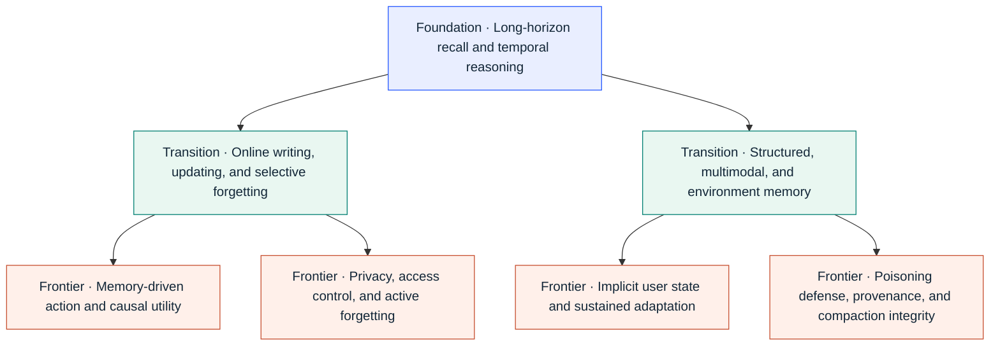
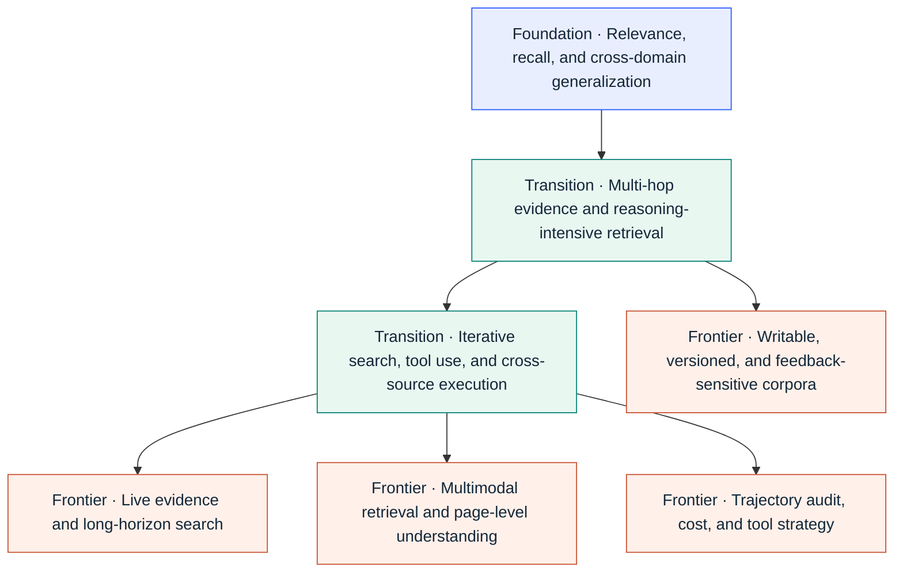
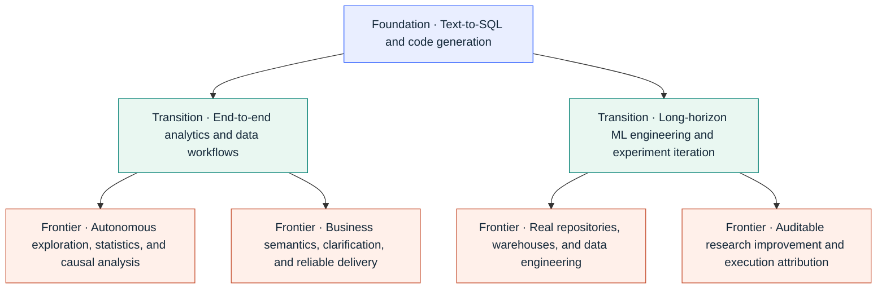

# Research observations and capability maps

[Back to the main README](../README.en.md) · [中文](reading-guide.md)

Editorial interpretations as of 2026-09-05, not a complete timeline or objective ranking. Use the main README to find benchmarks; a new entry does not by itself establish a paradigm shift.

## Editorial observations across three areas

<!-- FRONTIER-SIGNALS:START -->
| Area | What actually changed | Representative benchmarks |
|---|---|---|
| **Agent Memory** | The newest signal moves beyond whether memory content is safe to **whether memory preserves authorization/source authority and whether bad memory changes actions**. EAL-Bench separates false-authority formation from unauthorized-action propagation; The Memory Trust Gap makes stale-memory conflict with current authoritative evidence a capability-controlled experiment. | [EAL-Bench](https://arxiv.org/abs/2609.01836) · [The Memory Trust Gap](https://arxiv.org/abs/2609.01852) · [AuthMem-Bench](https://arxiv.org/abs/2608.01679) |
| **RAG / Agentic Retrieval** | The corpus is becoming **trainable, versioned state that can form feedback loops**. KBGym freezes and coverage-audits a curator-edited store; Snapshot Compatibility Audit measures stable answer flips from corpus growth; RAG Collapse isolates recursive feedback from self-authored sources. | [KBGym](https://arxiv.org/abs/2608.21829) · [Snapshot Compatibility Audit](https://arxiv.org/abs/2608.22856) · [RAG Collapse](https://arxiv.org/abs/2608.22118) |
| **Data Agents** | The target keeps moving beyond “does SQL/code run?” toward **long-horizon ML improvement in real repositories with tighter score attribution**. AI4AI-Bench isolates algorithm changes through proxy exploration → source patch → clean-start final run; DeltaML-Bench joins published-baseline improvement with anti-gaming audits. | [AI4AI-Bench](https://arxiv.org/abs/2608.20318) · [DeltaML-Bench](https://arxiv.org/abs/2608.19653) · [data-eng-bench](https://github.com/Snowflake-Labs/data-eng-bench) |
<!-- FRONTIER-SIGNALS:END -->

Observations verified through：2026-09-05

> Editorial observations, not a complete window listing; use the [timeline](../README.en.md#release-timeline) for the complete projection.

## Benchmark Map

### Agent Memory
From cross-session factual recall toward online updating, structured and multimodal memory, action, implicit user state, and lifecycle integrity across writing, retrieval, and compaction.

<!-- CAPABILITY-MAP:agent-memory:START -->

<!-- CAPABILITY-MAP:agent-memory:END -->

**Full list:** [Agent Memory Benchmarks](../README.en.md#registry-memory)

### RAG / Agentic Retrieval
From document relevance toward multi-hop evidence, live search, cross-source execution, and trajectory audit, while the corpus itself becomes trainable, versioned, feedback-sensitive state.

<!-- CAPABILITY-MAP:rag:START -->

<!-- CAPABILITY-MAP:rag:END -->

**Full list:** [RAG / Agentic Retrieval Benchmarks](../README.en.md#registry-rag)

### Data Agents
From text-to-SQL / code generation into both complete analytics workflows and long-horizon ML engineering, then toward exploration, statistical/causal analysis, real research repositories, and business-semantic reliability.

<!-- CAPABILITY-MAP:data-agent:START -->

<!-- CAPABILITY-MAP:data-agent:END -->

**Full list:** [Data Agent Benchmarks](../README.en.md#registry-data)

## Next Evaluation Frontiers

| Evaluation direction | Research objective |
|---|---|
| **Longitudinal real-user effects** | Model preference drift, project evolution, and delayed consequences through long-term interaction traces. |
| **Irreversible actions + authority** | Incorporate spending, state changes, and permission freshness into action-quality evaluation. |
| **Lifecycle cost** | Report construction, indexing, memory writing, retries, controller calls, tool latency, and information reacquisition in one cost model. |
| **Production reliability under drift** | Measure system reliability across evolving web content, schemas, tools, and runtime environments. |
| **Business-semantic correctness** | Evaluate executable SQL and code against business ground truth, clarification strategy, and abstention quality. |

