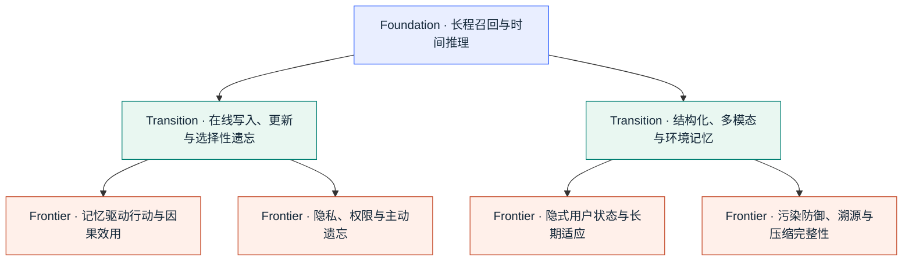
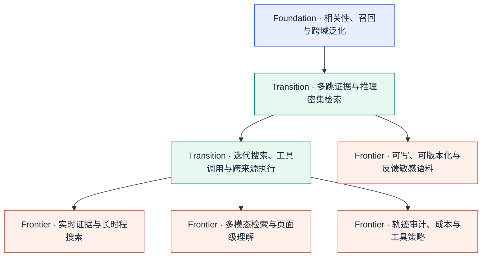
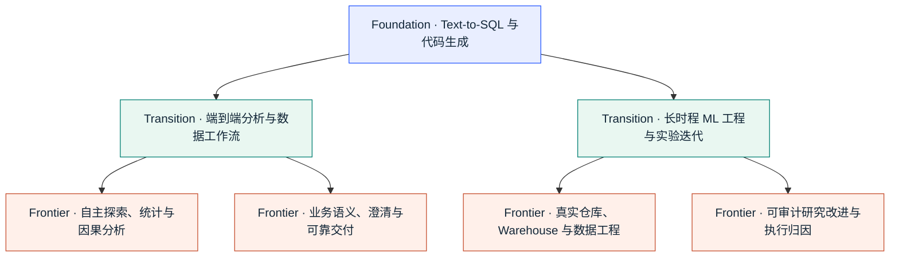

# 研究观察与能力地图

[返回主入口](../README.md) · [English](reading-guide.en.md)

以下为截至 2026-09-05 的编辑解读，不是完整时间轴或客观排名。优先查找基准请返回 README；新增内容不自动代表研究范式发生变化。

## 编辑观察：三个方向

<!-- FRONTIER-SIGNALS:START -->
| 方向 | 真正变化 | 代表 Benchmark |
|---|---|---|
| **Agent Memory** | 最新信号从“记忆内容是否安全”继续推进到**记忆是否保留授权与来源权威，以及错误记忆是否真正改变行动**。EAL-Bench 把虚假权限形成与越权传播拆开；The Memory Trust Gap 则把过期记忆与当前权威证据冲突做成能力规模受控实验。 | [EAL-Bench](https://arxiv.org/abs/2609.01836) · [The Memory Trust Gap](https://arxiv.org/abs/2609.01852) · [AuthMem-Bench](https://arxiv.org/abs/2608.01679) |
| **RAG / Agentic Retrieval** | 语料成为**可训练、可版本化且会形成反馈回路的状态对象**。KBGym 冻结并按 coverage 审计被 curator 修改的 store；Snapshot Compatibility Audit 测 corpus growth 引发的稳定答案翻转；RAG Collapse 则隔离 self-authored source 的递归反馈。 | [KBGym](https://arxiv.org/abs/2608.21829) · [Snapshot Compatibility Audit](https://arxiv.org/abs/2608.22856) · [RAG Collapse](https://arxiv.org/abs/2608.22118) |
| **Data Agents** | 评价对象继续从“SQL / code 能跑”推到**真实仓库中的长时程 ML 改进，同时收紧分数归因**。AI4AI-Bench 用 proxy exploration → source patch → clean-start final run 隔离学习算法修改；DeltaML-Bench 则把 published-baseline improvement 与 anti-gaming audit 放进同一执行协议。 | [AI4AI-Bench](https://arxiv.org/abs/2608.20318) · [DeltaML-Bench](https://arxiv.org/abs/2608.19653) · [data-eng-bench](https://github.com/Snowflake-Labs/data-eng-bench) |
<!-- FRONTIER-SIGNALS:END -->

观察核验截至：2026-09-05

> 编辑观察，不代表窗口内全部新基准；完整记录见[时间轴](../README.md#release-timeline)。

## Benchmark 地图

### Agent Memory
从跨会话事实召回，逐步走向在线更新、结构化记忆、多模态证据、行动、隐式用户状态与覆盖写入—检索—压缩的生命周期完整性。

<!-- CAPABILITY-MAP:agent-memory:START -->

<!-- CAPABILITY-MAP:agent-memory:END -->

**查看完整列表：** [Agent Memory Benchmark](../README.md#registry-memory)

### RAG / Agentic Retrieval
从文档相关性，逐步走向多跳证据、实时搜索、跨来源执行与轨迹审计；语料本身也成为可训练、可版本化、需审计反馈的状态。

<!-- CAPABILITY-MAP:rag:START -->

<!-- CAPABILITY-MAP:rag:END -->

**查看完整列表：** [RAG / Agentic Retrieval Benchmark](../README.md#registry-rag)

### Data Agents
从 Text-to-SQL / code generation，分化为完整分析工作流与长时程 ML engineering，并继续走向探索、统计/因果分析、真实研究仓库与业务语义可靠性。

<!-- CAPABILITY-MAP:data-agent:START -->

<!-- CAPABILITY-MAP:data-agent:END -->

**查看完整列表：** [Data Agents Benchmark](../README.md#registry-data)

## 下一阶段关键评测方向

| 评测方向 | 研究目标 |
|---|---|
| **真实用户的长期效应** | 用长期交互轨迹刻画偏好漂移、项目演化和延迟后果。 |
| **不可逆操作与权限** | 把工具花费、状态改写和权限时效纳入行动质量评测。 |
| **全生命周期成本** | 统一报告建索引、写记忆、重试、控制器调用、工具延迟与信息重获取成本。 |
| **变化中的生产环境** | 在持续变化的网页、schema、工具和运行环境中测量系统可靠性。 |
| **业务语义正确性** | 以业务真值、澄清策略和拒答质量共同评估可执行 SQL 与代码。 |

