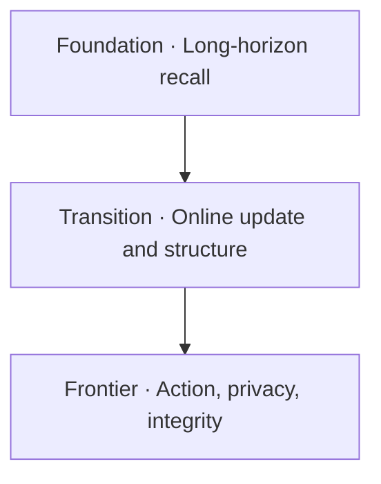

# Agent Benchmark Radar Web Implementation Plan

> **For agentic workers:** REQUIRED SUB-SKILL: Use superpowers:subagent-driven-development (recommended) or superpowers:executing-plans to implement this plan task-by-task. Steps use checkbox (`- [ ]`) syntax for tracking.

**Goal:** Ship an SEO-first Astro GitHub Pages site with instant benchmark filtering and replace README chain paragraphs with accessible capability maps.

**Architecture:** A standalone `web/` Astro build imports the root JSON registry and parses the already-complete Chinese README table descriptions at build time. Static explorer, area, methodology, and benchmark detail pages provide crawlable content; a framework-free client script enhances the pre-rendered explorer with URL-backed filters.

**Tech Stack:** Astro, `@astrojs/sitemap`, JavaScript modules with JSDoc, Node built-in test runner, Python `unittest`, Mermaid, GitHub Actions/Pages.

**Spec:** `docs/superpowers/specs/2026-09-01-benchmark-radar-web-design.md`

## Global Constraints

- `data/benchmarks.json` is the only factual benchmark registry; `web/` must import it directly.
- Public copy uses direct, positive descriptions and does not render `coverage_gap` verbatim.
- Site base path is `/Agent-Benchmark-Radar`; every explicit internal URL uses one base-aware helper.
- Routes are symmetric under `/zh/` and `/en/`; benchmark URLs use stable registry IDs.
- Explorer HTML contains all 125 benchmark cards before JavaScript runs.
- Filter query values are normalized and serialized deterministically.
- Do not create a global score ranking or imply cross-benchmark metric comparability.
- `web/dist/` is generated, ignored, and never committed.

---

### Task 1: Lock the registry and localization contracts

**Files:**
- Create: `web/package.json`
- Create: `web/src/lib/registry.mjs`
- Create: `web/src/lib/readme-localization.mjs`
- Create: `web/tests/registry.test.mjs`
- Modify: `.gitignore`

**Interfaces:**
- Consumes: `data/benchmarks.json`, the three `TABLE-FIRST` blocks in `README.md`.
- Produces: `loadRegistry(): Benchmark[]`, `loadChineseSummaries(): Map<string,string>`, `getReleasedYear(released): number`, and `getArtifactKinds(benchmark): string[]`.

- [ ] **Step 1: Add a failing registry contract test**

```js
import assert from "node:assert/strict";
import test from "node:test";
import { loadRegistry, getArtifactKinds } from "../src/lib/registry.mjs";
import { loadChineseSummaries } from "../src/lib/readme-localization.mjs";

test("registry and Chinese summaries cover the same stable ids", () => {
  const registry = loadRegistry();
  const zh = loadChineseSummaries();
  assert.equal(registry.length, 125);
  assert.deepEqual([...zh.keys()].sort(), registry.map((item) => item.id).sort());
  assert.ok(registry.every((item) => getArtifactKinds(item).includes("paper") || item.artifacts.code));
});
```

- [ ] **Step 2: Run the test and verify the missing modules fail**

Run: `cd web && node --test tests/registry.test.mjs`  
Expected: FAIL with `ERR_MODULE_NOT_FOUND`.

- [ ] **Step 3: Implement root-path resolution, JSON validation, and README extraction**

`registry.mjs` resolves the repository root from `import.meta.url`, parses JSON once, rejects duplicate IDs, and returns a frozen release-descending copy. `readme-localization.mjs` extracts each table row's `benchmark-id` comment and final description cell, strips Markdown links/emphasis, and rejects duplicate or missing IDs.

```js
export function getArtifactKinds(item) {
  return ["paper", "code", "data"].filter((kind) => Boolean(item.artifacts?.[kind]));
}

export function getReleasedYear(released) {
  const match = /^(\d{4})/.exec(released);
  if (!match) throw new Error(`Invalid released value: ${released}`);
  return Number(match[1]);
}
```

- [ ] **Step 4: Add package scripts and ignore output**

```json
{
  "private": true,
  "type": "module",
  "scripts": {
    "dev": "astro dev",
    "build": "astro build",
    "check": "astro check",
    "test": "node --test tests/*.test.mjs"
  }
}
```

Append `/web/dist/` and `/web/.astro/` to `.gitignore`.

- [ ] **Step 5: Run the contract test and commit**

Run: `cd web && node --test tests/registry.test.mjs`  
Expected: PASS.

```bash
git add .gitignore web/package.json web/src/lib web/tests/registry.test.mjs
git commit -m "feat(web): add canonical registry adapter"
```

### Task 2: Build deterministic filter state

**Files:**
- Create: `web/src/lib/filters.mjs`
- Create: `web/tests/filters.test.mjs`

**Interfaces:**
- Consumes: normalized `Benchmark` records from Task 1.
- Produces: `parseFilterState(searchParams)`, `serializeFilterState(state)`, `filterBenchmarks(items,state)`, `sortBenchmarks(items,sort)`, and `buildFacetOptions(items,key)`.

- [ ] **Step 1: Write failing tests for multi-select, search, artifact, sort, and canonical query order**

```js
test("filter state round-trips in canonical order", () => {
  const state = parseFilterState(new URLSearchParams("role=frontier&area=rag&artifact=code&area=agent-memory"));
  assert.equal(serializeFilterState(state), "area=agent-memory&area=rag&role=frontier&artifact=code");
});

test("text and facets combine with AND semantics", () => {
  const result = filterBenchmarks(fixtures, {
    query: "temporal",
    areas: ["agent-memory"],
    roles: ["foundation"],
    artifacts: ["code"],
    capabilities: [], environments: [], protocols: [], years: []
  });
  assert.deepEqual(result.map((item) => item.id), ["locomo"]);
});
```

- [ ] **Step 2: Run tests and verify missing exports fail**

Run: `cd web && node --test tests/filters.test.mjs`  
Expected: FAIL with `ERR_MODULE_NOT_FOUND`.

- [ ] **Step 3: Implement pure filter functions**

Use allow-lists for `area`, `role`, `artifact`, and `sort`; lowercase text with `toLocaleLowerCase()`; apply OR within a facet and AND across facets. Sort released values lexicographically because the registry preserves ISO-like year/month/day precision.

- [ ] **Step 4: Run both Node suites and commit**

Run: `cd web && npm test`  
Expected: PASS.

```bash
git add web/src/lib/filters.mjs web/tests/filters.test.mjs
git commit -m "feat(web): add shareable benchmark filters"
```

### Task 3: Establish the Astro shell and SEO primitives

**Files:**
- Create: `web/astro.config.mjs`
- Create: `web/jsconfig.json`
- Create: `web/src/lib/site.mjs`
- Create: `web/src/lib/i18n.mjs`
- Create: `web/src/layouts/BaseLayout.astro`
- Create: `web/src/styles/global.css`
- Create: `web/src/pages/index.astro`
- Create: `web/public/robots.txt`
- Create: `web/tests/site.test.mjs`
- Create: `web/package-lock.json`

**Interfaces:**
- Consumes: locale and page metadata.
- Produces: `sitePath(path)`, `absoluteUrl(path)`, `LOCALES`, `copyFor(lang)`, and a layout that emits canonical, hreflang, social, and JSON-LD metadata.

- [ ] **Step 1: Add failing base-path and locale tests**

```js
test("sitePath prefixes the GitHub project base exactly once", () => {
  assert.equal(sitePath("/zh/"), "/Agent-Benchmark-Radar/zh/");
  assert.equal(sitePath("/Agent-Benchmark-Radar/en/"), "/Agent-Benchmark-Radar/en/");
});
```

- [ ] **Step 2: Install pinned dependencies and verify the test fails**

Run: `cd web && npm install --save-exact astro @astrojs/sitemap @astrojs/check typescript`  
Run: `cd web && node --test tests/site.test.mjs`  
Expected: FAIL because `site.mjs` does not exist.

- [ ] **Step 3: Implement URL and locale primitives**

`sitePath()` accepts a route-only path and prefixes `BASE_PATH`. `absoluteUrl()` joins the production origin. `copyFor()` exposes positive Chinese/English UI strings, area introductions, phase labels, metadata descriptions, and methodology text.

- [ ] **Step 4: Implement `BaseLayout` and root language entry**

`BaseLayout` receives `title`, `description`, `lang`, `canonicalPath`, `alternatePath`, `robots`, and `jsonLd`. The root page sets `noindex,follow`, links to both languages, adds a meta refresh to the base-aware `/zh/` route, and retains a visible manual link.

- [ ] **Step 5: Add the visual tokens and accessibility baseline**

Define color, type, spacing, card, focus, skip-link, and reduced-motion rules in one stylesheet. Use a native system sans stack plus a system mono stack; do not depend on remote fonts.

- [ ] **Step 6: Build the shell and commit**

Run: `cd web && npm test && npm run check && npm run build`  
Expected: PASS and `dist/index.html` contains `noindex`, canonical, and the `/Agent-Benchmark-Radar/zh/` target.

```bash
git add web
git commit -m "feat(web): add SEO-ready Astro shell"
```

### Task 4: Ship the pre-rendered interactive Radar

**Files:**
- Create: `web/src/components/Header.astro`
- Create: `web/src/components/FilterPanel.astro`
- Create: `web/src/components/BenchmarkCard.astro`
- Create: `web/src/components/Explorer.astro`
- Create: `web/src/pages/[lang]/index.astro`
- Create: `web/src/scripts/explorer.mjs`
- Create: `web/tests/explorer.test.mjs`

**Interfaces:**
- Consumes: registry, localized summaries, locale copy, and Task 2 filter functions.
- Produces: 125 server-rendered cards per language and a progressive-enhancement controller that synchronizes controls, cards, result count, and query state.

- [ ] **Step 1: Add a failing production-output test**

The test runs `npm run build` once and asserts that `dist/zh/index.html` and `dist/en/index.html` each contain 125 `data-benchmark-id` attributes, a search label, canonical metadata, an accessible result-count live region, and no rendered `coverage_gap` text.

- [ ] **Step 2: Run the test and verify routes are missing**

Run: `cd web && node --test tests/explorer.test.mjs`  
Expected: FAIL because the language pages do not exist.

- [ ] **Step 3: Render the complete explorer without JavaScript**

`Explorer.astro` renders filter controls, current result count, and all cards. Each card carries normalized `data-*` values for area, role, year, artifacts, capabilities, environments, protocols, and search text.

- [ ] **Step 4: Add progressive filtering and URL synchronization**

`explorer.mjs` reads `location.search`, hydrates controls, calls the pure Task 2 functions against card metadata, toggles the `hidden` attribute, updates the live count, and uses `history.replaceState`. Form controls remain usable without a custom widget library.

- [ ] **Step 5: Verify keyboard/mobile behavior and commit**

Run: `cd web && npm test && npm run check && npm run build`  
Expected: PASS; source-order tabbing reaches search, primary facets, advanced disclosure, sort, and result links.

```bash
git add web/src web/tests/explorer.test.mjs
git commit -m "feat(web): add interactive benchmark radar"
```

### Task 5: Generate benchmark, area, and methodology pages

**Files:**
- Create: `web/src/components/BenchmarkDetail.astro`
- Create: `web/src/components/AreaOverview.astro`
- Create: `web/src/pages/[lang]/benchmarks/[id].astro`
- Create: `web/src/pages/[lang]/areas/[area].astro`
- Create: `web/src/pages/[lang]/methodology.astro`
- Create: `web/tests/generated-pages.test.mjs`

**Interfaces:**
- Consumes: the same registry, summaries, layout, URL, and locale helpers as the explorer.
- Produces: 250 benchmark pages, six area pages, two methodology pages, reciprocal language alternates, and page-type-appropriate JSON-LD.

- [ ] **Step 1: Write failing route-count and metadata tests**

After a build, enumerate `dist/{zh,en}/benchmarks/*/index.html` and assert 125 pages per language. Assert each sample page has one canonical, two language alternates plus `x-default`, a release date, last verification date, source links, and valid JSON-LD. Assert six area pages and two methodology pages exist.

- [ ] **Step 2: Run the tests and verify generated pages are missing**

Run: `cd web && node --test tests/generated-pages.test.mjs`  
Expected: FAIL with zero generated detail pages.

- [ ] **Step 3: Implement static paths and positive detail content**

Use `getStaticPaths()` for the Cartesian product of locales and registry IDs. Render summary, `measurement_strength`, capability/environment/protocol tags, scale, citation context, artifacts, area back-link, and verification metadata. Do not render `coverage_gap`.

- [ ] **Step 4: Implement area and methodology pages**

Area pages use editorial locale copy and stable links to their benchmark subset. Methodology explains inclusion, roles, release-time semantics, citation context, data provenance, and corrections using positive statements.

- [ ] **Step 5: Verify and commit**

Run: `cd web && npm test && npm run check && npm run build`  
Expected: PASS.

```bash
git add web/src web/tests/generated-pages.test.mjs
git commit -m "feat(web): publish indexable benchmark pages"
```

### Task 6: Replace README chains with accessible capability maps

**Files:**
- Modify: `README.md`
- Modify: `README.en.md`
- Modify: `scripts/validate_reading.py`
- Modify: `tests/test_table_first_readme.py`
- Modify: `tests/test_citations.py`
- Modify: `tests/test_validate_reading.py`

**Interfaces:**
- Consumes: existing `benchmark-*` and `all-benchmarks` anchors.
- Produces: three `CAPABILITY-MAP` blocks per README, one site link per area, and citation metadata adjacent to the complete registry.

- [ ] **Step 1: Run the already-written failing map and citation-location tests**

Run: `python -m unittest tests.test_table_first_readme tests.test_citations -v`  
Expected: FAIL because maps are absent and citation metadata precedes the registry.

- [ ] **Step 2: Add three top-down Mermaid maps in each language**

Each block uses this validated structure:

````markdown
<!-- CAPABILITY-MAP:agent-memory:START -->

<!-- CAPABILITY-MAP:agent-memory:END -->
````

Use compact capability labels tailored to each area, then add a base-aware absolute website link under each diagram.

- [ ] **Step 3: Move citation metadata and update the validator**

Move the existing `CITATION-META` block to immediately after `all-benchmarks`. Replace the validator's defining-chain count with marker, Mermaid, accessibility, stage-label, and site-link checks. Preserve all table markers and IDs.

- [ ] **Step 4: Run README validation and commit**

Run: `python -m unittest discover -s tests -v`  
Run: `python scripts/validate_reading.py`  
Expected: all tests pass and validator prints success.

```bash
git add README.md README.en.md scripts/validate_reading.py tests
git commit -m "docs: add accessible benchmark capability maps"
```

### Task 7: Add Pages deployment and CI integration

**Files:**
- Create: `.github/workflows/pages.yml`
- Modify: `.github/workflows/validate.yml`
- Modify: `README.md`
- Modify: `README.en.md`
- Create: `tests/test_web_contract.py`

**Interfaces:**
- Consumes: the `web/` build and existing Python validation workflow.
- Produces: validated Node/Astro CI plus a Pages artifact deployed from `main` with official GitHub/Astro actions.

- [ ] **Step 1: Write a failing workflow contract test**

```python
def test_pages_workflow_has_minimum_permissions_and_official_actions(self):
    text = (ROOT / ".github/workflows/pages.yml").read_text()
    self.assertIn("contents: read", text)
    self.assertIn("pages: write", text)
    self.assertIn("id-token: write", text)
    self.assertIn("withastro/action@", text)
    self.assertIn("actions/deploy-pages@", text)
```

- [ ] **Step 2: Run the test and verify the workflow is absent**

Run: `python -m unittest tests.test_web_contract -v`  
Expected: FAIL with `FileNotFoundError`.

- [ ] **Step 3: Add validation and deployment workflows**

`validate.yml` installs Node using `actions/setup-node`, runs `npm ci`, `npm test`, `npm run check`, and `npm run build` in `web/`. `pages.yml` triggers on pushes to `main` and manual dispatch, uses concurrency group `pages`, builds with `withastro/action`, and deploys with `actions/deploy-pages` in the `github-pages` environment.

- [ ] **Step 4: Add prominent live-site entrances**

Add the site URL near the top of both READMEs and preserve the complete registry tables as the GitHub-native fallback.

- [ ] **Step 5: Run full verification and commit**

Run: `python -m unittest discover -s tests -v`  
Run: `python scripts/validate_reading.py`  
Run: `cd web && npm ci && npm test && npm run check && npm run build`  
Expected: all Python and Node tests pass, Astro check reports zero errors, and production build completes.

```bash
git add .github README.md README.en.md tests/test_web_contract.py
git commit -m "ci: deploy benchmark radar to GitHub Pages"
```

### Task 8: Perform production-output and repository review

**Files:**
- Modify only files implicated by verification findings.

**Interfaces:**
- Consumes: complete implementation from Tasks 1–7.
- Produces: a clean, reproducible repository state ready for remote publication.

- [ ] **Step 1: Inspect generated output**

Serve `web/dist/` locally at the project base path and inspect desktop and mobile layouts, keyboard focus, filter updates, language links, detail links, missing-artifact states, and the root redirect.

- [ ] **Step 2: Verify SEO artifacts directly**

Check `dist/sitemap-index.xml`, `dist/robots.txt`, representative canonical/hreflang tags, JSON-LD parseability, and that no generated URL loses `/Agent-Benchmark-Radar`.

- [ ] **Step 3: Run the final clean-room commands**

```bash
python -m unittest discover -s tests -v
python scripts/validate_reading.py
cd web
npm ci
npm test
npm run check
npm run build
```

Expected: every command exits 0.

- [ ] **Step 4: Review the final diff and commit any verification corrections**

Run: `git diff origin/main...HEAD --check`  
Run: `git status --short`  
Expected: no whitespace errors and only intentional committed changes.

If Steps 1–3 changed files, stage exactly the paths shown by `git status --short`, review the staged diff with `git diff --cached`, and commit them with `git commit -m "fix(web): resolve production verification findings"`. Skip the final commit when verification requires no corrections.
